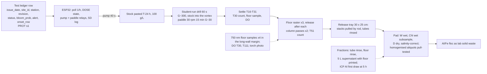

<!-- notes/DEVICE_PROTOTYPE.md. v7-final, frozen for build 2026-09-15 after two build/review loops
(builder agent; reviewers 1-3 on v1-v3, scientist verification of v4, reviewers 4-6 on v5-v7; all in
notes/device_reviews/ and notes/DEVICE_VERIFICATION.md). Design freeze for the bench program is Fri Nov 6, 2026
(Nov 13 if the culture arrives after Oct 8). Pre-registration: SCIENTIFIC_METHOD.md Phase 11, amended 2026-09-15
to match this version (bands unchanged). Companion research: notes/CLAY_RETRIEVAL_RESEARCH.md,
notes/CLAY_FLOCCULATION_RESEARCH.md, notes/AERATION_RESEARCH.md. -->

# Ledger-triggered magnetic clay flocculation with magnetic retrieval: design v8 (v7-final + Amendment A1)

Source keys: [RET] = notes/CLAY_RETRIEVAL_RESEARCH.md, [CLAY] = notes/CLAY_FLOCCULATION_RESEARCH.md, [AER] = notes/AERATION_RESEARCH.md, [PROT] = hab-bloom-predictor-narragansett/notes/PROSPECTIVE_PROTOCOL.md s1, s5, s7 plus `LEDGER_COLS` in `src/deploy/prospective_forecast.py`, [SM11] = notes/SCIENTIFIC_METHOD.md Phase 11 (lines 536-608), [R1]-[R6] = review1-6.md, [V] = verification.md, **[A]** = my assumption or calculation. Prices are reviewer-verified where tagged, otherwise **[A]**.

## 0. Changelog from v7 (freeze audit) [R6]

| Edit | What changed |
|---|---|
| C1 | s10 item 8 now starts at "Forms 1/1A/1B/3 signed by Oct 5;" so the gate line is replaced whole, not duplicated; item 9 inserts reviewer 5's three qualifications after `not "no study")`. |
| C2 | s10 item 1 "to" text adds the second-loop clause (reviews 4-6 took v4 to v7); DEVICE_PROTOTYPE.md header must change from "Frozen 2026-09-15 as v4" when v7-final is written in. |
| C3 | H11c "to" text gets a pass criterion; s10 preamble now says which bands move (none for H11a/H11b recovery; H11b plain becomes a description; H11c changes method); item 6 keeps the Yu 2016 rationale; items 3 and 5 use double quotes; H11a "(product basis; stock route S or D per the Oct 30 amendment)" and "n = 3 batches"; H11b "in the winning route's blank". |
| C4 | Release physics corrected: no steel in the frame, so no 25 kg press; inner stacks < 1 kgf on the rod, end stacks 3-5 kgf against their outer side wall (~13 kgf neighbour repulsion), that wall PTFE-lined too; tubes captured in through-slots in the wooden end rails, end-blocks screwed not glued, every block epoxied to a carrier strip; contingency is a rebuilt 8-tube frame at 30 mm centres (240 mm), blocks ordered Oct 23 for Oct 27; s6 magnet line corrected. |
| C5 | Two loose N52 blocks (pull test, settling) added; BOM $796 / $629 / $565 / $513. |
| C6 | Blanks: fraction (iii) at T111 and 07:30 the next school morning, drain and floor rinse after the second siphon; blank #2 moved to Thu Oct 15 (paste D Wed Oct 14) so all three blanks settle 17 h; 7a rewritten accordingly; s10 item 8 "to" text carries D (Oct 15), the one departure from the quoted text, forced by the move. |
| C7 | DRV5055A4 spot map at 10, 15, 20, 30 mm (saturates above ~170 mT). |
| C8 | Column cycle ~4.7 min, two cycles 9.3 of 10 min; aliquot line "56-75 mg magnetite at 37.5-50 wt%"; run days 14:15 setup to 17:30 under the agreement. |

Earlier changelogs (collapsed)

v6 to v7 [R5]: runs off Mondays with clock times and an after-hours agreement; culture ordered Sep 16-18 with a written ship date; recovery gate inverted per route; pull-test aliquots and pad-height standards; release mechanics; draws and siphons specified; culture water pasteurised; statistics (t-interval, bracketed D90, plain n = 1, index +/-20%, Lin's CCC); controller-timed, student-mixed; $8 blocks; s10 as a diff; overclaims; 7a.
v5 to v6 [R4]: within-tank resuspension index; route blanks S and D plus plain; dry blends pasted T-24 h; carboy B pilot; SEN0189/DO logging, kits, ImageJ, regrowth cut; fraction (iii) floor; ICP first draw; Version A/B arithmetic.
v4 to v5 [V]: stock-route pilot; floor measurements and four-fraction attribution; pull-test drift; partner ICP Al; field Versions A/B; board sentences; wasted-dose arithmetic; open issues.
v3 to v4 [R3]: 30-40 mm pull test; pigment blend; square tube, skids, per-pass release; DRV5055A4; pad workup; MVP; board text, H11a-c, gates.
v2 to v3 [R2]: settle-raster-column; matched jars; logistic D90; NaOH titration; PAC solids basis; controller bands dropped; counting budget.
v1 to v2 [R1]: sleeved rods; Sedgewick-Rafter and extracted Chl; NaOH; magnetite Plan B; G stated; three arms; ledger keys.

## A1. Amendment A1, 2026-09-16: simulation-optimised settings (governs over sections 1-12 where they conflict)

Applied before any bench work, from the optimisation sweep in notes/DEVICE_SIMULATION.md s4 (1,728 flocculation settings, 12 rake layouts, 36 speed/skid/magnetite combinations). Hypothesis bands H11a-c do not move; SCIENTIFIC_METHOD.md Phase 11 carries the matching dated amendment.

| Setting | v7-final | A1 | Basis (simulation) |
|---|---|---|---|
| Magnetite in the dry blend | 37.5% (15 : 18.5 : 6.5 per 40 g) | **20%: 8 g magnetite : 25.3 g EPK kaolin : 6.7 g PAC powder per 40 g** (PAC stays 5:1 on mineral solids) | capture of settled flocs >= 99% down to 10% magnetite at <= 2 cm/s and <= 6 mm skid; 20% keeps margin for flocs that incorporate little magnetite. Iron added ~29 mg/L instead of 54; aluminium unchanged at ~5 mg/L |
| Slow mix | 30 rpm paddle, G ~30, 15 min | **G ~60 for 10 min**: tank paddle motor 48-50 rpm (G scales as rpm^1.5); jar rig motors ~95-100 rpm | same settled fraction (95% vs 96%, pre-aggregated stock) in less time. Risk: breakup at G 60 is represented only by a size cap |
| Settle | 15 min | **10 min** | same settled fraction at G 60 |
| Magnet stacks | 6 (24 blocks) | **5 (20 blocks)** at 33 mm centres; frame span 163.75 mm | 4 is the model minimum; 5 keeps the per-pass pad <= 2.5 mm on 160 cm2 of pole face at 0.2 g/L |
| Floor passes | 3, lanes at 11 / 41 / 11 mm | **2: pass 1 with the outer tube against long wall A (edge 0.5 mm), pass 2 against long wall B (edge 85.75 mm)** | 100% of settled flocs with 4-7 stacks; the v7 third pass repeated lane A |
| Column passes | 2 cycles | 1 cycle | not modelled; kept as a straggler sweep |
| Rake speed | 1 cm/s | **2 cm/s** | capture unchanged to 8 cm/s; capped at 2 because resuspension is unmodelled |
| Skid | 3 mm | 3 mm | 10 mm loses flocs at speed |
| Dose screen (H11c MVP) | 0.05, 0.1, 0.2 g/L | **0.05, 0.1, 0.2, 0.4 g/L** (12 jars) | chemistry dominates; 0.4 is the robust dose if the stock flocculates poorly |
| Recovery-gate contingency | 8-tube frame at 30 mm | **diagnose first**: floc photo at T11 and a 10 mL column count at T20. Loss in the column: chemistry (dose 0.4 or other stock route). Loss on the floor: add a centre pass. Loss in the tube rinse: slow the withdrawal | the 8-tube frame needs 254 mm on a 250 mm floor, and magnet reach is not the failure mode |

**Run clock under A1** (T = minutes from dosing): T0-T1 drill; **T1-T11 paddle at G ~60**; **T11-T21 settle**, T20 count, floor sample, DO; **T21-T29 two floor passes** at 2 cm/s with release after each (~3.6 min per cycle: ~37 s travel, ~3 min lift, release, rinse, reinsert); **T29-T33 one column cycle**; T33 count and floor sample; **T93** floor sample and DO (1 h after raster). 5 h and 24 h reads unchanged. Resuspension index = T33 count / T20 count. Blanks take fraction (iii) at T93 and next school morning.

**Other quantities that change.** Pull-test aliquot of 150 mg now holds ~30 mg magnetite, inside the 5-200 mg line. Dosed magnetite per tank run 0.8 g (was 1.48 g); fraction (iii) detection floor 8 mg = 1.0% of dose, calibrated above 20 mg = 2.5%. Floor 750 nm sample tube moves to a corner (both lanes touch a long wall, so the long-wall margins no longer exist); the ~5 mm corner patch it shadows goes to fraction (ii). Count table 57 -> 60 (three 0.4 g/L jars), ~35 h. Budget: 22 N52 blocks (20 in stacks + pull-test + settling) at $8 = $176, the 8 contingency blocks are dropped, motors swapped at the same price: **buy-everything $700, $533 with five borrows**. Week-1 dry mixes use the A1 ratio; the 50 wt% re-blend fallback becomes a 37.5 wt% re-blend.

**Predicted under A1** (pre-aggregated stock, moderate stickiness): ~95% of clay settled x ~100% of settled flocs captured = ~95% magnetite-equivalent recovery, an upper bound; one tank run ~33 min to the end of the column cycle (was ~56 min under v7 including three raster cycles).

## 1. Design decision

**Choice.** A dry blend of pigment magnetite (Pigment Black 11, ~0.2 um, not classified hazardous [V1; R3]), EPK kaolin and PAC powder, 40 : 50 : 18 by mass (PAC 5:1 on mineral solids [CLAY s1; R3 C]), pasted 24 h before use in the water the pilot selects, dosed by a controller-timed pump into a student-run rapid mix, flocculated by paddle, settled, captured by square-tube NdFeB stacks rastered along the tank floor with release after every pass, then water-column passes. At the bench the trigger is a **test ledger row** ("ledger-triggered (test row)"), not a live forecast [R5 15].

**Why a blend.** The co-precipitated product is a kaolinite-magnetite mixture bridged by PAC either way [R2 finding 4]; the blend has an exactly known magnetite mass and no hot chemistry [R3 B2]. Precedent: CoMag (> 99% magnetite-ballast recovery, freshwater), Cerff 2012, Hu 2013, Fe3O4@SiO2@PAC seeds [V2; RET s1].

**Why not DAF or sunk clay.** The only saline DAF harvest (IRL, 19-20 ppt) fell to 21% Chl-a [RET s2]. Sunk clay deposits Al- and toxin-bearing floc [RET s5] and "no permitting document distinguishes removal from deposition" [RET s8]; it is the comparison arm.

**Stock preparation is a variable.** Yu 2016 and the EPA/WHOI report show PAC-clay aged in seawater makes smaller flocs (the 0.6 vs 0.2 g/L factor in [CLAY s2]) and PAC diluted first gives a 2-5x gain [V1]: hence the route pilot and dry storage [R4 B3].

**What retrieval does and does not change [V3].** "Retrieved is better for benthos" is unsupported and dissolved Al (5.1 mg/L added) is independent of retrieval; the MVP measures what retrieval does: it removes floc from the floor and may resuspend some of it. No HAB clay study has measured the recovered fraction in seawater [RET s9; V8]; flocculation at 1e4 cells/mL is 10x above the EPA/WHOI threshold [V1]; free fines are not captured by a moving raster, so magnetite-equivalent recovery measures floc incorporation [V2].

**Headline.** Recovery fraction of dosed magnetite-equivalent by pull test, with total solids and the attributed misses beside it, paired with removal at the same dose [R3 C].

## 2. System diagram

## 3. Bench prototype: the January MVP

**Clock.** T is minutes from dosing. **T0 = 14:30** on a run day (Tue-Fri), setup 14:15-14:30, DS present, run days to 17:30 under the same agreement [R6 C8]; hands-on to T56; T111 at 16:21; **5 h reads at 19:30 +/- 30 min** under a signed after-hours agreement (student, parent, DS, principal) **[A]**; **24 h reads at 14:30 +/- 2 h next day**. When the research block is booked, T0 = 10:45 puts 5 h at 15:45 and 24 h at 10:45. Blanks have no cells: fraction (iii) is drawn at T111 and again at 07:30 the next school morning (hours logged), and the drain and floor rinse follow the second siphon [R5 1; R6 C6].

**Vessels and water.** Device tank: 10 gal glass aquarium at 20 L (16 cm depth, 50 x 25 cm floor), device metrics only. Jar rig: 2 L glass jars at 1.8 L, three at a time on three identical 12 V 60 rpm gearmotors with 6 x 2 cm paddles (jar P/V 0.86x the tank's, G ~33 vs ~35 s-1 [R3 A]). Seawater: LIS water from Milford or Stratford [CLAY s7], ~220 L over the project, first 40 L collected **Sat-Sun Oct 3-4** with a parent driver, then 40-50 L on alternate weekends; **jar and tank diluent** through a 5 um filter bag by gravity into the carboy; **culture water** additionally pasteurised (2 L at 75 C for 30 min in the school water bath) or 0.2 um filtered, because wild < 5 um cells would otherwise grow through the four-week scale-up and appear in Chl and the untreated jar [R5 7]; dark cold shelf (<= 10 C **[A]**), used within two weeks; salinity S and pH per batch.

**Culture.** CCMP1332 *Skeletonema marinoi* (Milford CT isolate; axenic; NCMA recommends L1 at 14 C, range 11-30 C, so f/2 at 18-20 C is inside range [R5 2; CLAY s7]); ~1 division/day. **Ordered Wed Sep 16-Fri Sep 18 from home with the ship date in writing**: live cultures ship Wednesdays, at least two weeks out, so the earliest arrival is Thu Oct 8 and the honest planning date is Oct 21+ (grown to order) [R5 2]. Sterile 2 L f/2 in two carboys is ready before Oct 8; on arrival the tube stabilises 12 h, then half the biomass goes into fresh medium at arrival + 1 d; **carboy A** is scaled to 20 L when it reaches >= 1e6 cells/mL (target >= 5e5 cells/mL in 20 L one week later); **carboy B** supplies the pilot (1.1 L at 1e5 cells/mL) and regrows as backup [R4 B4]. Mean chain length logged with every count [R3 B13].

**Clay (dry blend).** Three 40 g dry mixes (15 g magnetite + 18.5 g EPK + 6.5 g PAC powder, 28-30% Al2O3); the third covers a 50 wt% re-blend [R4 B15]. Stock pasted **24 h before each use** on a school day (never a Sunday): tank 4 g in 40 mL, jar batch 1.1 g in 11 mL, in filtered seawater (**route S**) or DI (**route D**, IOCAS practice [V1; CLAY s1]). **Route P** (PAC dissolved in the vessel 20 min before 5 g of un-PAC'd kaolin + magnetite 35 : 15) stays in the week-1 clay-only trial unless its floc photo beats S and D [R4 B11]. Plain arm and plain blank: 30 g dry mix of 25 g EPK + 5 g PAC, same route as the winner. **Dose = total dry blend**: 0.2 g/L = 4 g per 20 L, 0.36 g per jar. Demand ~32 g blend of 120 g; plain ~5 g of 30 g.

**Co-precipitation (stretch, DS sign-off only)** [R3 B2]: two 25 g half-batches of the PJOES recipe [RET s1], 2 M NaOH teacher-prepared, titrated to pH 11.0; side panel only.

**Stock-route pilot [V1; R4].** Week 1 clay-only: routes S, D, P at 0.2 g/L in 1.8 L filtered seawater, floc photo at 15 min, detachment test on S and D. Culture pilot **Wed Oct 28** (or the first Tue-Thu after carboy B reaches 1e5 cells/mL): six jars, 1e4 cells/mL, 0.2 g/L, the routes that survived the Oct 23 recovery gate (S and/or D; P only if promoted), n = 2, two rig rounds ~16 min apart with one replicate of each route per round [R4 B10]; 3.6 mL stock pipetted into the vortex in the first 10 s of the 60 s rapid mix; 5 h counts at 19:30 plus one t0; raw RE = 1 - Ct/C0, route versus route. **Decision rule**: a route that wins by > 15 RE points (mean of two) becomes the recipe; within 15 points route S stays; decide **Fri Oct 30** and log the six counts that day. If the culture is late the pilot runs on the batch-1 day and the freeze slips one week.

**Characterisation (week 1).** (1) **Pull test** [R3 B1; R5 4]: vial glued into a >= 100 g holder on a 10 cm riser; a loose N52 block on a stand at a fixed 30-40 mm gap. Daily 5, 10, 20, 50, 100, 200 mg magnetite standards, linear fit, accepted only if r^2 >= 0.99 and the magnet-only zero drifts <= 2 mg; CSV log. **Pads are homogenised** (dried pad ground in a mortar) and **three 150 mg aliquots** are pull-tested inside the line (56-75 mg magnetite at 37.5-50 wt% [R6 C8]); one-time 0.5 and 1.0 g magnetite-in-kaolin standards at pad fill height check linearity at scale; the method reported is the aliquot mean. (2) **Seawater detachment test** [R2 finding 4a]: 1 g stock in 1 L filtered seawater at 60 rpm 15 min, held on a magnet 10 min, decanted, residue dried and weighed; S and D, fresh and 24 h-aged (4 g). (3) Gate Fri Oct 9: > 30% pull loss or > 30% non-magnetic residue on a route means re-blend at 50 wt% from the third mix.

**Dosing and mixing.** Peristaltic pump ~60 mL/min **[A]**: 40 mL in 40 s during the first 40 s of the rapid mix. **Controller-timed, student-mixed** [R5 9]: on DOSE the ESP32 fires the pump relay and the paddle relay; the student starts the hand-held drill (paint paddle, ~300 rpm, 60 s, G ~300 s-1 **[A]**) at the same moment; an unattended dose into a paddle-only tank would form the EPA "baseball" aggregates [V1; R4 B12]. Slow mix: 30 rpm, 15 cm paddle, 15 min, G ~25-35 s-1 [R1 finding 7].

**Capture hardware** [R3 B3; R5 5; R6 C4]. Six stacks of four N52 40x20x10 mm blocks, **all with the same pole down** (longest reach into the floor), each in a capped 1-1/4 in square acrylic tube (1/8 in wall, ID 25.4 mm) with 0.5 mm PTFE tape on the contact wall and, for the two end tubes, on the outer side wall as well; one pole face flat to the contact wall (capture surface 3.2 mm from the block, ~0.32 T [R1]); foam shim on the far side; 3 mm skids. Loads: there is no steel in the frame, so the ~25 kg pull-to-steel rating of a block presses nothing; adjacent same-pole stacks at 33 mm centres repel at ~12 kgf per pair and the end stacks carry ~13 kgf net outward against their outer side wall [R6 C4 model]; the pad itself pulls ~0.3 kgf. The tubes are captured in through-slots in the wooden end rails (the frame carries ~13 kgf in tension), the nylon end-blocks are screwed, not glued, and every block is epoxied to a carrier strip because the four blocks in a row also repel end-to-end. Two handles on the 228 mm frame (the 11 mm long-wall margins are unswept by design and belong to fraction (ii) [R5 12]). Each stack carries an 8 mm nylon rod through the **removable top cap**; the bottom cap is fixed. Strong pole-face area 192 cm2 per pass; a 4 g dose is 40-80 mL of pad, so each pass carries <= 2 mm and is released.

**Sequence and per-cycle budget.** T0-T1 drill; T1-T16 paddle; T16-T31 settle. **Raster cycle (~5 min)**: pass along the 50 cm floor at ~1 cm/s (50 s); lift 16 cm at < 1 cm/s (20 s); carry to the **30 x 25 cm release tray** beside the tank (10 s); caps off and each stack pulled up by its rod and T-handle against the frame (under 1 kgf for the inner stacks; 3-5 kgf for the two end stacks, which the neighbour repulsion (~13 kgf) presses against their outer side wall: PTFE-line that wall too [R6 C4]), pad drops into the tray, six stacks 90 s; tubes rinsed with 100 mL from a wash bottle into the tray (30 s); stacks reinserted and capped (60 s); return (20 s). Three raster cycles T31-T46, lanes offset 3 cm on alternate passes, until the floor shows no floc under a torch. **Column cycle (~4.7 min)**: stacks vertical, two passes at 2 cm/s (50 s), lift, release as above; two cycles use 9.3 of the 10 min T46-T56 [R6 C8]. T111 at 16:21.

**Draws and siphons (tool, position, rate, time)** [R5 6].
- Count draws (T30, T51, 5 h, 24 h): 10 mL syringe on a 5 cm silicone tube, tip at a 2 cm-below-surface mark on the long-wall margin, 10 s, into a Lugol vial.
- Floor 750 nm samples (T30, after raster 1, T51, T111): 10 mL syringe on a tube taped to the long wall with its tip 2 cm above the floor in the 11 mm margin, 10 s.
- ICP (jars, batch 2, 5 h): 50 mL syringe, first draw, 2 cm below surface, 0.45 um syringe filter into trace-metal HDPE, 2 min.
- Jar count and Chl (5 h): 5 mL pipette 2 cm below surface; then 250 mL by 60 mL syringe in five draws at the same depth, ~2 min.
- Fraction (iii), 5 L supernatant: 6 mm silicone siphon, inlet clipped 3 cm below the surface at an end wall, < 0.5 L/min (~12 min) into a 5 L carboy standing on the loose settling block (not the pull-test block); tanks at 5 h; blanks at T111 and 07:30 the next school morning (hours logged); drain and floor rinse follow the second siphon [R6 C6]; settle 24 h; decant over the block to 200 mL at < 0.5 L/min; 50 mL DI rinse of the carboy floor; dry 65 C in a tared vial; pull-test.
- Drain and floor rinse: 6 mm siphon to 1 cm depth at < 2 L/min (~10 min); 500 mL seawater and a rubber squeegee into a tared beaker; settle on the block; pull-test.
- Tube rinse: 100 mL wash bottle per cycle over the tray, ~5 cycles into one jar.

**Resuspension and floor measurements.** Resuspension index = T51 count / T30 count at the same spot (> 1 means the raster returned cells); each is a capped Poisson count (200 cells, +/-14%), so the ratio carries ~+/-20% [R5 8d]. A true 5 h tank count for jar comparability. Four 750 nm samples as the turbidity measure. DO spot-read at T30 and T111 with the probe swirled: expected change < 0.01 mg/L, a protocol control for the mesocosm, not a result [R4 B7]. Torch photo of the floor on a 5 cm grid after the last pass.

**Attribution of every recovery miss** (dosed magnetite-equivalent = pad + stranded + left on floor + never in floc + unaccounted): (i) tube rinse; (ii) floor rinse, including the 11 mm margins; (iii) 5 L supernatant, **floor printed beside the number**: 2 mg x 4 = 8 mg = 0.5% of the 1.48 g dosed, calibrated above 5 mg x 4 = 1.4%; (iv) remainder [V2; R4 B6].

**Pad workup** [R3 B5]. Tray contents settled in a tared beaker, supernatant decanted over the block; wet mass W; wet subsample by mass fraction for Chl (acetone, 664/750 nm); rest dried 65 C, mass D; solids = (D - S·W)/(1 - S); no DI rinse; dried pad homogenised and aliquot-pull-tested. The salinity correction sets a **solids floor of ~2-3% of dose** for total-solids recovery [R5 8c].

**Gating blanks [R5 3; R6 C6].** Blank #1 route S (Wed Oct 14), blank #2 route D (Thu Oct 15, paste D Wed Oct 14), plain blank (Tue Oct 20): 4 g in 20 L filtered seawater, full sequence, fraction (iii) at T111 and 07:30 the next school morning, so all three settle 17 h; drain and floor rinse after the second siphon. **Gate Fri Oct 23, each route on its own blank**: >= 70% of dosed solids and >= 80% of magnetite-equivalent **[A]** passes; a failing route leaves the pilot; if both fail, the frame is rebuilt as an 8-tube frame at 30 mm centres (240 mm; repulsion ~17 kgf per pair), the eight blocks ordered Oct 23 for delivery by Oct 27, and route S is retried Fri Oct 30 (paste Thu Oct 29) [R6 C4]; design frozen Fri Nov 6 whatever the number [R3 F]. The plain blank is n = 1 and is reported as a description with its solids floor, not an interval [R5 8c].

**Instruments.** Sedgewick-Rafter 1 mL chamber with Lugol: cells and chain length; >= 400 cells where density allows, capped at 200 cells or 500 grids at low density with the Poisson CI. Extracted Chl-a at t0 and 5 h (250 mL, GF/F), reportable only for RE <= ~70% at 1e4 [R2 finding 11]. School balance, DO meter (type recorded), spectrophotometer, water bath; DRV5055A4 spot map at 10, 15, 20, 30 mm (the A4 saturates above ~170 mT [R6 C7]); pH pen. **Aluminum** [V3; R4 B8]: partner **ICP-MS if available, else ICP-OES**, total dissolved Al on one 5 h supernatant per arm from batch 2 plus a seawater blank and a filter blank (DI through the same syringe filter); acidified to pH < 2 with the partner's HNO3 or on receipt with a 16 h hold (EPA 200.8 / 40 CFR 136); **reporting limit printed beside the number** (ICP-OES ~5-20 ug/L in diluted seawater against the 24 ug/L guideline, Golding 2015). Requested in the Sep 22 partner email; commercial fallback ~$25-30 per sample **[A]**.

**Three-arm comparison (jars).** Untreated, plain PAC-kaolinite, magnetic blend, 0.2 g/L, 1e4 cells/mL, n = 3, one replicate of each arm per batch, three batches on Tue-Thu run days. Per-vessel draws (1,800 mL): ICP 50 mL first at 5 h (batch 2); 5 h count 5 mL; 5 h Chl 250 mL; 24 h count 5 mL; total 260 mL (310 in batch 2). t0 count and Chl from the batch bottle.

**Dose screen (H11c, MVP).** Magnetic blend, 1e4 cells/mL, 0.05, 0.1, 0.2 g/L, n = 3 (9 jars, three per batch, second rig round), sharing the untreated jars.

**Statistics [R5 8].** Control-normalised RE = (1 - (Ct/C0)/(Ct,ctl/C0,ctl)) x 100 per batch [CLAY s7]. **H11a**: the three batch REs give a **t-interval** (t(2) = 4.30; half-width 12 / 25 / 37 points at SD 5 / 10 / 15), so "lower bound > 50" at a mean of 70 needs SD < 8; the **pre-registered likely reading is "consistent, underpowered"**. The magnetic-minus-plain difference uses the paired batch differences, same t. **H11c**: three dose means with t-CIs; monotonicity by ordered means (mean 0.05 <= mean 0.1 <= mean 0.2); D90 by log-linear interpolation **only when bracketed** by two adjacent means, otherwise reported as "> 0.2 g/L" or "< 0.05 g/L"; no fitted curve, no bootstrap. **H11b**: recovery over the three tank runs as mean and range; plain blank as a description. **Inter-counter agreement**: mean absolute relative difference and Lin's concordance correlation coefficient on the five duplicate pairs.

**Count table.** Pilot 7; batch t0 3; three-arm 18; dose screen 9; tanks (t0, T30, T51, 5 h, 24 h) x 3 = 15; duplicates 5; **57**, ~33 h at ~35 min, between Oct 28 and Dec 18 excluding the Thanksgiving week; the second counter is required [R3 B6].

**Bill of materials.** School provides at $0: spectrophotometer, cuvettes, 0.001 g balance, hot plate stirrer, water bath, oven, fume hood, Buchner, drill, DO meter, microscope, 90% acetone, syringes, 4 L beakers and 2 M NaOH if the stretch runs. Cultures excluded.

| Item | $ |
|---|---|
| 10 gal glass aquarium | 25 |
| 6 x 2 L glass jars | 24 |
| Jar rig: 3 x 60 rpm gearmotors, frame, paddles | 28 |
| 2 x 20 L carboys + 5 um filter bag | 28 |
| EPK kaolin 5 lb / PAC powder 1 kg / magnetite pigment 1 lb | 12 / 15 / 20 |
| Tank gearmotor + paddle | 18 |
| Square acrylic tube 6 ft, caps, epoxy, slotted wooden frame with skids and handles, PTFE tape, carrier strips, nylon rods and screwed end-blocks | 50 |
| 24 x N52 40x20x10 mm at $8 [R5 10] | 192 |
| 2 loose N52 blocks (pull test, settling) [R6 C5] | 16 |
| 8 contingency blocks for the rebuilt 8-tube frame (bought only if the Oct 23 gate fails) | 64 |
| 2 x DRV5055A4 + breakout | 6 |
| Peristaltic pump | 16 |
| ESP32, 2-ch relay, microSD + card | 22 |
| 12 V 5 A supply, fuse, box, wire | 23 |
| Sedgewick-Rafter chamber | 60 |
| Lugol's 100 mL | 12 |
| GF/F 47 mm, 25 pk | 40 |
| pH pen | 12 |
| PPE | 15 |
| f/2 medium / 20 L jug + LED | 30 / 30 |
| Pull-test holder, vials, stand clamp, riser | 10 |
| 5 x 50 mL trace-metal HDPE bottles, 0.45 um syringe filters | 8 |
| Release tray 30 x 25 cm | 8 |
| Siphon tube, wash bottle, jars, ties | 12 |
| **Buy-everything total** | **796** |
| Conditional: commercial ICP Al, 5 samples | +125-150 |
| Stretch only if DS signs off: FeCl3·6H2O 2 x 100 g + FeCl2·4H2O 100 g | +48 |

With five borrows (chamber -60, f/2 -30, LED + jug -30, PSU -23, jars -24) the purchase total is **$629**; **$565** if the contingency blocks are not needed; at a $6 block quote (26 blocks), $513. The $500 cap is not met even at $6: quote before ordering and record the shortfall [R5 10; R6 C5].

## 4. Controller

ESP32 polls hourly an HTTP endpoint on the laptop serving the newest ledger rows for the configured (`site_id`, `station`) [PROT s7; LEDGER_COLS]. **Keying** (`issue_date`, `site_id`, `station`), highest `revision` wins; a dose already given is not repeated [R1 finding 9a]. **Decision**: `status` not `ok` -> HOLD_STATUS [PROT s1]; `alert == True` (`bloom_prob >= threshold`, 0.50) AND `onset_row == True` (chl today <= station p75 [PROT s5]) AND not locked out -> DOSE: pump relay 40 s and paddle relay 15 min, with the student starting the drill on the DOSE indication (**controller-timed, student-mixed** [R5 9]). **Lockout** = skip the next distinct `issue_date` [R2 finding 7]. **VERIFY**: 24 h count < 0.3 x C0 passes; on fail one further dose at the next alerting row, then a hard stop. **Feed states**: NO_NEW_ROW idle; ENDPOINT_UNREACHABLE (three failed polls) hold; parse failure hold with the raw line logged; never doses from a cached row. Logging to microSD (`ts, issue_date, site_id, station, revision, status, bloom_prob, alert, onset_row, state, dose_g_L, pump_s, verify`) and serial; a 10-minute timer relay guards a stuck pump relay. **Gate Fri Dec 4**: pump and paddle relays fire from a test row with the student mixing; the board says "ledger-triggered (test row), controller-timed, student-mixed".

**What the trigger is [V7].** `alert` is P(station chlorophyll exceeds its own 75th percentile within 7 d) >= 0.50: a p75-exceedance trigger on the seasonal rise, never "bloom prediction". From the locked LIS test set [AER duty cycle; CLAUDE.md table]: at 0.60 ~1.2 alerts and ~0.6 wasted per station-season; at 0.50 ~2.6 and ~1.8 wasted; the lockout halves doses, not the ratio. A wasted bench dose is 4 g; in an open cell 32-360 kg and 0.8-9 kg Al, so the gate is defensible for January and a closed mesocosm only [CLAY s2; AER s4; R2 finding 7].

## 5. Field concept (concept, not performed)

The "settle, then bed-vacuum during the flood" version is dropped: flocs reach a 2 m bed in 0.5-2 h and a fresh PAC-clay layer resuspends at 0.06-0.09 Pa (Beaulieu 2005) under a 10-20 cm/s tide [V2, V5].

**Version A: closed-bottom mesocosm (student-reachable, summer 2027).** EPA Sarasota-type limnocorral (2 m diameter, 3 m deep, ~9.4 m3) hung from a dock [V5, V6]; no exchange, so pre-emption is testable. Dose 1.9 kg blend (5.7 kg at 3x [CLAY s2]) as 13-38 L of 150 g/L slurry; mixing by a ~40 m3/h submersible pump (one turnover in 15 min) or an air lift [R4 B9]; capture through a magnetic pipe or small drum at 2-3 m3/h during flocculation (~3-5 h per volume) or after settling; recovery, attribution and floor measurements as at the bench; the pen is the deposition control. Treated water (5 mg/L Al added) to a sanitary connection or trucked, never to tidal water without a discharge permit **[A; V6]**. Permits: temporary structure, no discharge, COP or GP under CGS 22a-359 plus USACE GP self-verification, 45-90 days, DEEP/UConn partner as applicant [V6; AER s7]. Two pens (blend, plain) give the sunk-versus-retrieved comparison that does not exist [RET s9 item 5].

**Version B: capture during flocculation in an open curtain cell (agency-led, 6-18 months).** Dose at slack minus 1 h; pump a 160 m3 cell at 160 m3/h through a low-intensity drum with a mid-depth intake while flocs are suspended (0.5-2 h); ~3.6 kW at 5 m head [R4 B9]. Effluent returned inside the curtain captures at most 1 - e^-1 = 63% per hour; once-through discharge outside needs an individual permit under CGS 22a-430 plus coastal permit, CWA 401, public notice and USACE authorisation [V6]. Bed-magnet sled with a pre-dose baseline and 63 um sieving **[A]** [V2]; Rhodamine WT only with DEEP sign-off [R2 finding 8]. Mass balance at 0.2 g/L: 32 kg blend, 0.8 kg Al, 8.6 kg Fe, ~0.01-0.03 kg N [V4]; no nutrient number goes on the board.

## 6. Safety and ISEF

PAC powder is an acidic aluminum coagulant: gloves, goggles, dust mask, Al floc as lab solid waste [CLAY s7]; effluent (5 mg/L Al added) bleached, diluted and disposed per school drain policy, or collected [R1 finding 14; V3]. Magnetite pigment not classified hazardous [V1]. Route D paste pH ~3-4: gloves. Stretch route: FeCl3/FeCl2 corrosive, 2 M NaOH teacher-prepared, Designated Supervisor present [R3 B2]. HNO3 by the partner or teacher only. Magnets: ~25 kg pull-to-steel per block; adjacent stacks repel at ~12 kgf [R6 C4]; blocks pinch, shatter and snap together; stacks assembled one at a time in the slotted frame; SD card and phones kept away. Electrical: everything touching water is 12 V behind a GFCI. After-hours work only under the signed agreement with the DS present. Cultures non-toxic; used culture bleached.

**ISEF paperwork** [R3 B15; R5 11]. (1) Research Plan and Form 1A; (2) Adult Sponsor completes Form 1; (3) Designated Supervisor (school chemistry teacher, named on Forms 1 and 3) and Adult Sponsor sign Form 3 for hazardous chemicals (PAC; FeCl3 and NaOH if the stretch runs), the home-built electrical device and the protist cultures (Form 3 only, no SRC pre-review); (4) student, parent and Adult Sponsor sign Form 1B; **all four by Fri Sep 25, before the first hands-on work on Mon Sep 28**; (5) forms uploaded at CSEF registration; the SRC may query.

## 7. Timeline to 2027-01-15 (2026 calendar; runs Tue-Fri only)

- Wed Sep 16-Fri Sep 18: order CCMP1332 from home with the ship date in writing; order kaolin, PAC powder, magnetite, 26 blocks (quote first), square tube, DRV5055A4, electronics, bottles, filter bag; draft Forms 1A, 1, 3, 1B. Mon Sep 21: Yom Kippur, no school work.
- Tue Sep 22: book hood, water bath, spectrophotometer, balance; partner email (ICP-MS/OES Al x5, chamber loan, counting help; DEEP/UConn nudge due Sep 28 folds in). Fri Sep 25: Forms 3 and 1B signed.
- Mon Sep 28-Fri Oct 2: ESP32 and endpoint; stacks on carrier strips, slotted frame, tray; jar rig; pull-test holder and calibration line; DRV5055 spot map; sterile 2 L f/2 x2 prepared. Sat-Sun Oct 3-4: first 40 L seawater (driver); jar diluent bag-filtered; culture water pasteurised.
- Mon Oct 5-Fri Oct 23: section 7a.
- Tue Oct 27: carboy A to 20 L (if arrived Oct 8); contingency blocks arrive if ordered. Wed Oct 28: stock-route pilot from carboy B (survivor routes). Fri Oct 30: route decision and pilot counts logged; blank retry on S with the rebuilt frame if both routes failed. Fri Nov 6: freeze; 20 L at >= 5e5 cells/mL.
- If the culture arrives Oct 21: transfer Oct 22; pilot Tue Nov 10; decision Fri Nov 13 (freeze); batch 1 Tue Nov 17.
- Thu Nov 12 (paste Wed Nov 11) or Tue Nov 17: batch 1. Thu Nov 19: batch 2 with ICP samples (first draw at 5 h). Fri Nov 20: counting checkpoint (>= 40%). Mon Nov 23-Fri Nov 27: no batch, no counting hours.
- Tue Dec 1 or Thu Dec 3: batch 3. Fri Dec 4: controller gate (pump + paddle from a test row, student mixing).
- Tue Dec 8, Thu Dec 10, Tue Dec 15: tank runs 1-3 (paste Mon, Wed, Mon); 24 h reads next day 14:30; pad workups Dec 16-18.
- Mon Dec 21-Fri Jan 8: t-intervals, dose-screen means, inter-counter statistic, mass-balance table, board panels; SM11 outcome entries. Mon Jan 11-Fri Jan 15: demo dry run; buffer. CSEF deadline Mon Feb 15, 2027.

## 7a. Day-by-day, Oct 5-23 (school 7:30-14:15; lab 14:30-17:00 with the DS, run days 14:15-17:30 under the agreement; 5 h reads under the after-hours agreement)

| Day | Planned | h | Needs |
|---|---|---|---|
| Mon Oct 5 | Three 40 g dry mixes + plain mix + 5 g un-PAC'd mix; paste S and D (1 g each for tests) | 2.5 | DS, hood |
| Tue Oct 6 | Clay-only S/D/P rig round, floc photos at 15 min | 1.5 | rig |
| Wed Oct 7 | Detachment S, D fresh; pull calibration incl. 0.5 and 1.0 g pad-height standards; residues to oven; paste S, D for the aged test | 2.5 | oven overnight (DS-approved) |
| Thu Oct 8 | Aged detachment; weigh residues; earliest culture arrival: stabilise 12 h | 2.5 | sterile medium ready |
| Fri Oct 9 | Week-1 chemistry gate; culture transfer to carboys A and B (arrival + 1 d) | 2 | DS |
| Sat-Sun Oct 10-11 | Seawater 40 L (driver); no school work | 1 | driver |
| Mon Oct 12 | Columbus Day: no school work | 0 | |
| Tue Oct 13 | Paste route S (4 g in 40 mL); ESP32 endpoint test | 1.5 | |
| Wed Oct 14 | **Blank #1 (S)**: T0 14:30, cycles to 15:26, T111 16:21 with fraction (iii) siphon to 16:35; pad W to oven; tube rinse settles; paste route D after the run | 3 | DS |
| Thu Oct 15 | 07:30 second (iii) siphon for #1, then drain and floor rinse (~40 min before school); **Blank #2 (D)** in the cleaned, refilled tank: same clock; tube rinse settles | 3.5 | DS; 20 L seawater on hand |
| Fri Oct 16 | 07:30 second (iii) siphon for #2, drain and floor rinse; #1 pad D weigh and aliquots | 2 | |
| Sat-Sun Oct 17-18 | Seawater 40 L (driver) | 1 | driver |
| Mon Oct 19 | #2 pad D weigh; #1 and #2 pull tests (aliquots, rinses, supernatants); paste plain | 2.5 | |
| Tue Oct 20 | **Plain blank**: T0 14:30, sweep to 15:26, T111 siphon; pad W; tube rinse settles | 3 | DS |
| Wed Oct 21 | 07:30 second siphon, drain and floor rinse; plain pad D weigh and aliquots; #2 rinse pull tests | 2 | |
| Thu Oct 22 | Hall spot map (10-30 mm); buffer; culture check (arrival if Oct 21) | 1.5 | |
| Fri Oct 23 | **Recovery gate**, each route on its own blank; contingency blocks ordered for Oct 27 if both fail | 1 | DS |

Load: 1.5-3.5 h on weekdays, three run days, no Sunday pasting, no holiday work; all three blanks settle 17 h before the second siphon.

## 8. Known weaknesses

1. The stock route is decided on a two-replicate pilot; each route's recovery gate is n = 1 [R5 3].
2. The blend is a physical mixture; kaolin recovery depends on PAC bridging; the detachment test is the only check [R2 finding 4; V2].
3. The raster resuspends its own floor and strands pad on every release; measured, not prevented [V2; R3 B3].
4. With three batches the H11a interval is a t(2) interval; the likely reading is "consistent, underpowered" [R5 8a].
5. Pull-test readings sit near the balance drift floor; homogenised aliquots keep them inside the line but add a grinding step [R5 4].
6. The dose screen gives three means; D90 is reported only if bracketed [R5 8b].
7. Dissolved Al is independent of retrieval; one ICP point per arm; ICP-OES may not resolve 24 ug/L [V3; R4 B8].
8. "Retrieved is better for benthos" is unsupported; bench DO is a null measurement [V3].
9. Both field versions are concepts [V5, V6].
10. The trigger wastes roughly as many doses as it justifies at test precision [V7].
11. The culture arrival date (Oct 8 or Oct 21+) sets the whole back half of the calendar; the after-hours agreement and a second counter are prerequisites [R5 1, 2].
12. Budget: $796 buy-everything, $629 with five borrows, $565 without the contingency, $513 at a $6 block quote; the $500 cap is not met [R5 10; R6 C5].
13. The end-stack release force (3-5 kgf on bare or PTFE-lined acrylic) and the ~13 kgf frame tension are modelled, not measured [R6 C4].

## 9. Board panel text

1. "In 2 L jars of filtered Long Island Sound seawater, a magnetite-kaolinite-PAC clay at 0.2 g/L removed X% [95% t-interval a-b, n = 3 batches] of *Skeletonema marinoi* cells within 5 h (control-normalised), against Y% for plain PAC-kaolinite. In three 20 L tank runs the same dose was ledger-triggered (test row), controller-timed and student-mixed."
2. "A magnet sweep of the tank floor then recovered Z% [range over n = 3 runs] of the dosed magnetite-equivalent by pull test and W% of the total dry clay; the same sweep recovered under V% of the plain clay (one blank; solids floor ~2-3%). Korean and Chinese practice leaves the floc on the seabed; no HAB clay study had measured the recovered fraction in seawater."
3. "This is a bench result for one non-toxic diatom. Bloom prevention, nitrogen or phosphorus removal from the Sound, and effects on bottom habitat were not tested."

Reject: "prevents blooms", "predicts blooms" (p75-exceedance forecast), "forecast-triggered" without "(test row)", "removes nutrients/nitrogen", "removes aluminium" (it adds 5 mg/L), "no habitat impact", "90% efficient" without n and CI, "field-ready", "scalable to LIS", "toxin-free", any nutrient-credit number.

## 10. Pre-registration: diff against SCIENTIFIC_METHOD.md Phase 11 [SM11; R5 14; R6 C1-C3]

Phase 11 was entered 2026-09-15. The replacements below (13 pairs, verbatim hard-wrapped "from" strings in `phase11_diff.json`, each occurring exactly once in the file) bring it to v7-final. The H11a and H11b recovery bands do not move; H11b's plain criterion becomes a description and H11c's D90 test changes method, both before any data; every later change is a dated amendment. When v7-final is written into notes/DEVICE_PROTOTYPE.md, its header ("Frozen 2026-09-15 as v4") changes too [R6 C2]. Line breaks in the file are shown here as spaces.

1. "Frozen design: notes/DEVICE_PROTOTYPE.md (v4)." -> "Frozen design: notes/DEVICE_PROTOTYPE.md (v7-final; a second loop of three reviewers and a freeze audit, notes/device_reviews/review4-6, took v4 to v7; frozen Fri Nov 6, 2026, or Nov 13 if the culture arrives after Oct 8)."
2. "dosed when the forecast ledger alerts" -> "dosed when a test ledger row alerts (bench: ledger-triggered, controller-timed, student-mixed)".
3. H11a "(product basis, seawater make-up)" -> "(product basis; stock route S or D per the Oct 30 amendment)".
4. H11a "n = 3 jars" -> "n = 3 batches".
5. H11a: after `reads "consistent, underpowered", not failed (verifier risk 3)` add "; the interval is a t-interval on three batch REs (t = 4.30), and "consistent, underpowered" is the pre-registered likely reading. The stock route (S or D) is logged as a dated amendment on Fri Oct 30 from the six pilot counts, before batch 1; decision rule: a route that wins by > 15 RE points (mean of two) becomes the recipe, a tie within 15 points keeps route S, route P enters the pilot only if its week-1 floc photo beats S and D".
6. H11b "recovers 75-95% of dosed magnetite-equivalent" -> "recovers 75-95% of dosed magnetite-equivalent by pull test on homogenised pad aliquots".
7. H11b "in the clay-only blank" -> "in the winning route's blank".
8. H11b "<= 10% of plain PAC-kaolin (magnetic-specificity control)" -> "<= 10% of plain PAC-kaolin (one plain tank blank, n = 1, reported as a description with its ~2-3% solids floor)".
9. H11c "rises monotonically over 0.05, 0.1, 0.2 g/L and the fitted D90 lies in 0.05-0.2 g/L; pass if the D90 CI sits within 0.025-0.4 g/L; if RE >= 90% already at 0.05 g/L, D90 is a lower bound and H11c reads "not testable"" -> "rises monotonically by ordered means over 0.05, 0.1, 0.2 g/L (three means with t-intervals); D90 by log-linear interpolation only when bracketed by two adjacent means, otherwise reported as "> 0.2 g/L" or "< 0.05 g/L". Pass: ordered means non-decreasing and, when bracketed, D90 in 0.05-0.2 g/L; an unbracketed D90 reads "not testable"".
10. "Two edits" (1), whole sentence from "Week-1" through "before the Nov 6 freeze." -> "Week-1 clay-only trial of routes S, D and P (floc photo, detachment test): the two best sources on PAC-clay in seawater (Yu et al. 2016; EPA/WHOI ECOHAB report) show that ageing and storing the stock in seawater costs floc size and dose; culture pilot on the first Tue-Thu after carboy B reaches 1e5 cells/mL (target Wed Oct 28) with the routes that passed the Oct 23 recovery gate, n = 2, six jars in two blocked rig rounds; decision Fri Oct 30 by the rule in H11a."
11. "Two edits" (2), "Tank runs log DO and turbidity 2 cm above the floor before, during and 1 h after the raster, and every recovery miss is attributed (left on floor, stranded on tube, never in floc) by torch photo and a pull test of the tank rinse" -> "Tank runs take DO spot reads at T30 and T111 (protocol control), four 750 nm floor samples in the long-wall margin, T30 and T51 counts for a within-tank resuspension index (+/-20%), and every recovery miss is attributed by tube rinse, floor rinse and a 5 L supernatant pull test with its 0.5% detection floor".
12. Gates, from "Forms 1/1A/1B/3 signed by Oct 5;" through "three tank runs by Dec 18" -> "Forms 1/1A/1B/3 signed by Sep 25; week-1 chemistry by Oct 9; route blanks S (Oct 14) and D (Oct 15) and a plain blank (Oct 20), each route passing or failing on its own blank Oct 23, retry Oct 30 on S with a rebuilt 8-tube frame; culture >= 5e5 cells/mL in 20 L by Nov 6; freeze Nov 6 (Nov 13 if the culture arrives after Oct 8); counting checkpoint Nov 20; controller gate Dec 4 (pump and paddle from a test row, student mixing); three tank runs by Dec 15" (D (Oct 15) and "rebuilt 8-tube frame" follow C6 and C4; R6's quoted text had Oct 16 and "two contingency stacks").
13. `not "no study").` -> `not "no study"), and reviewer 5's three ("ledger-triggered (test row)", "magnetite-equivalent by pull test", "were not tested").`

**Dated commit log (each a git commit on the notes, count sheets photographed the day counted):** 2026-09-15 pre-registration (entered); by Sep 25 this diff applied and the DEVICE_PROTOTYPE.md header updated; Oct 9 week-1 gate result; Oct 23 three blank results and gate decision; Oct 30 route amendment with the six pilot counts; Nov 6 (or 13) freeze; each batch's count sheets the day counted; Dec 4 controller gate; Dec 15 tank run 3; Jan 8 outcome entries against the bands.

## 11. Gates and fallbacks

| Gate | Decide by | Pass | Fallback | Board shows if it fails there |
|---|---|---|---|---|
| Forms 1/1A/1B/3 signed | Fri Sep 25 | Signed | No hands-on until signed | Unchanged |
| Culture ordered with ship date | Fri Sep 18 | Written date | Planning date Oct 21; back half of calendar shifts one week | Unchanged |
| Week-1 chemistry (pull, detachment, floc photos) | Fri Oct 9 | < 30% pull loss, < 30% residue | 50 wt% re-blend from the third mix | Unchanged |
| Route blanks S (Oct 14) and D (Oct 15); plain blank (Oct 20) | Fri Oct 23 | >= 70% solids, >= 80% magnetite-eq per route; plain blank run | Failing route leaves the pilot; both fail: rebuilt 8-tube frame at 30 mm centres (blocks ordered Oct 23 for Oct 27), retry S Oct 30; freeze Nov 6 whatever the number | The measured recovery, however low |
| Stock route | Fri Oct 30 (or Nov 13) | Route by the > 15-point rule | Tie keeps S | Route named with the pilot counts |
| Culture scale-up | Fri Nov 6 (>= 5e5 cells/mL in 20 L) | Density met | Carboy B; partner culture; if none by Nov 16, clay-only work | Recovery only; removal "not measured here" |
| Counting checkpoint | Fri Nov 20 | >= 40% of counts | Dose screen n = 2, then tank run 3 | Fewer n, wider intervals |
| Controller | Fri Dec 4 | Pump + paddle from a test row, student mixing | Manual trigger from the printed row on video | "Trigger demonstrated manually" |
| Tank runs | Tue Dec 15 | 3 runs | Report n = 2 | n on the panel |

## 12. Summer 2027 program (deferred)

1. Two-density D90 program (0.025-0.8 g/L half-log, 1e4 and 1e5, n = 3, 78 jars, ~126 counts; H11c full) [R2 finding 3]. 2. Co-precipitated clay vs blend [R3 B2]. 3. Heterosigma (CCMP452) [CLAY s2]. 4. 30 d regrowth [CLAY s2]. 5. Full Hall map [R3 B4]. 6. 1e5 Chl series [R2 finding 11]. 7. Field Version A, two pens, partner as applicant [V5, V6]. 8. Magnetite-ballast resuspension threshold and natural-magnetite baseline [V2].

## 12a. Capture before settling (addendum 2026-09-16)

**Question raised by the user:** can the clay be caught before it sinks? Yes, and it is the one operational advantage magnetic clay has over plain clay; it is the field Version B mechanism (s5) and is not in the January bench program.

**Mechanism.** Dose and rapid-mix as in s3; during the 15 min slow mix, draw the vessel through a magnetic trap (magnet-lined pipe or a rotating low-intensity drum) and return the water. Flocs carry magnetite from the first minute and are held at the trap as they pass. Industrial precedent: CoMag magnetite-ballasted clarification, magnetite recovered from a recirculated flow by a drum at > 99% [V2; RET s1].

**Why the bench uses settle-then-raster instead.** In a still 20 L tank the whole dose is on the floor within 3-9 min [R2], and a floor raster is the cheapest thing to build and measure. v1's in-line pipe was rejected because a 60 cm pipe holds ~15% of the dose [R1 finding 1]; a trap that keeps up with 20 L in 15 min needs a drum or ~10x the trap area.

**Why it matters in the field.** Settled PAC-clay floc resuspends at 0.06-0.09 Pa and leaves under a curtain on the next tide [V2, V5]; capture during the 0.5-2 h suspended window avoids that. Version B is sized on it: 160 m3 through a drum in 1 h, 63% cap per pass if the effluent returns inside the cell [R4 B9].

**Trade-off, unmeasured anywhere.** Flocs are still growing during the window, so early capture takes smaller, weaker flocs; pump shear can break them into < 50 um fragments that consume oxygen [RET s5].

**Summer 2027 test (added to s12).** Same 20 L tank, same dose and culture: a pumped loop (~4 L/min, 7 turnovers in 30 min) through a magnetic trap sized on pole-face area during T1-T31, scored exactly as s3 (magnetite-equivalent recovery, four miss fractions, resuspension index, floc photo), against the January settle-and-raster result. Pre-register: recovery within 15 points of the raster result and floc photo D50 >= 50 um at capture; if recovery falls > 15 points below, the shear cost is real and Version B needs a gentler intake.

## 13. Open issues (cannot be resolved without data)

*Simulation, 2026-09-16 (notes/DEVICE_SIMULATION.md):* predicted floor-raster recovery 94-96% with good flocculation, 54-72% with poor; the magnets are not the limit; pass 3 repeats lane A and adds nothing; the 8-tube 30 mm contingency frame does not fit 31.75 mm tubes on a 250 mm floor and targets the wrong failure mode. Applied 2026-09-16 as Amendment A1 (top of this document).

1. Which stock route flocculates best at 0.2 g/L in this matrix [V1]: the pilot.
2. 24 h-aged versus freshly pasted stock: untested [R4 B3].
3. Ms and coercivity of the pigment grade bought [V1]; the same powder calibrates the pull test.
4. The effect of ~37-45 wt% magnetite on floc formation [V1].
5. Whether a hand raster at 6-8 mm pole-to-floc reaches 70% and how much it resuspends [V2]: blanks #1 and #2.
6. Plain-clay tank recovery rests on one blank [R4 B2].
7. Whether the pull-test line holds for homogenised pad aliquots and the pad-height standards [R5 4].
8. Whether the end-stack release (3-5 kgf) and the slotted frame (~13 kgf tension) behave as modelled; a stuck stack costs the cycle budget [R5 5; R6 C4].
9. Route D's DI stock under controller timing; route P cannot be automated **[A]**.
10. Residual dissolved Al at pH ~8 and whether the partner has ICP-MS [V3; R4 B8].
11. The school DO meter type; bench DO is a null measurement either way [R4 B7].
12. Magnetite-ballast resuspension threshold; natural magnetite on any candidate bed; 63 um sieving [V2].
13. Chain-length dependence of removal and count bias [V1; R3 B13].
14. Copepod and larval bycatch [V3].
15. DEEP permit category for a research discharge; partner as applicant for Version A [V6].
16. Partner reply (ICP, chamber, counting): pending; NCMA ship date: pending until ordered.
17. Milford Harbor N load and any enclosed embayment for pre-emption [V4, V7].
18. The after-hours agreement and the research-block T0 option: not yet granted.
19. Magnet quote ($6-12 per block, 26 blocks) and whether the rebuilt 8-tube frame is needed; the $500 cap is not met at any quoted price [R5 10; R6 C5].
