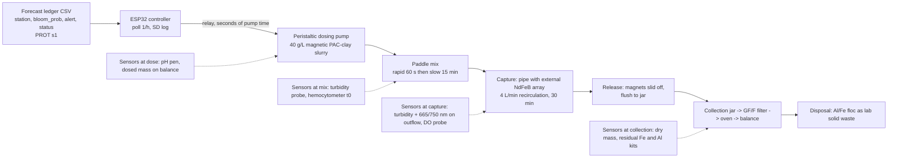

# Forecast-triggered magnetic clay flocculation with magnetic retrieval: design v1

Source keys: [RET] = notes/CLAY_RETRIEVAL_RESEARCH.md, [CLAY] = notes/CLAY_FLOCCULATION_RESEARCH.md, [AER] = notes/AERATION_RESEARCH.md, [PROT] = hab-bloom-predictor-narragansett/notes/PROSPECTIVE_PROTOCOL.md sections 1 and 7 (ledger columns from `LEDGER_COLS` in `src/deploy/prospective_forecast.py`). Anything tagged **[A]** is my assumption, including every price (2026 US retail guesses; none of the notes price bench parts).

## 1. Design decision: magnetic PAC-kaolinite + low-gradient magnetic capture (no flotation)

**Choice.** Kaolinite made magnetic by Fe3O4 co-precipitation (PJOES 2026 recipe), then PAC-modified at 5:1 (IOCAS recipe), dosed into the tank, flocculated by slow paddle mixing, and captured by pumping the tank through a clear pipe lined externally with NdFeB magnets. Captured floc is flushed off into a jar, dried, weighed.

**Why not DAF flotation + skim.** The only saline harvest trial (AECOM IRL, 19-20 ppt) fell to 21% Chl-a and 0% TN removal because "high salinity reduces air saturation as well as the mobility of bubbles and flocs" and waves carried the float blanket back into the effluent [RET s2]. LIS stations sit at 20-30 ppt with tides and fetch, so a surface float blanket is the wrong retrieval surface for this water. Flotation also needs 45% recycle in brackish water vs 20-30% fresh [RET s2], i.e. more energy for less removal. A magnetic hold works in the water column, is indifferent to salinity's effect on bubbles, and can be released on demand.

**Why not plain PAC-kaolinite that sinks.** That is the Korea/China/Mote practice [CLAY s3], but it deposits Al and toxin-bearing floc on the bottom [RET s5] and "no permitting document distinguishes removal from deposition" [RET s8]; the project's premise is that nothing is deposited.

**Why magnetic clay is the right risk.** No magnetic clay has been tested in seawater, on a marine species, or beyond a beaker, and no HAB study has measured the recovered fraction after magnetic capture (PJOES measured settling) [RET s9 items 1-2, 7]. Those are exactly the numbers a 38 L tank can produce. Seawater precedents show magnetic separation itself works at 20-35 ppt: magnetic sphalerite on Chattonella at 1-2 g/L, naked Fe3O4 at 120 mg/L on Nannochloropsis in 4 min, Cerff 2012 HGMS >95% on marine cultures [RET s1]. The warnings I design against: ionic strength cuts magnetic-flocculant efficiency (Liu 2009) and seawater make-up needs ~3x the clay dose (0.6 vs 0.2 g/L for 80%) [CLAY s2], so the dose series goes to 1 g/L; floc D50 is 65-68 um vs 2.4 um cells [RET s1], so capture geometry is sized for ~70 um flocs held at a wall, not for free particles; tidal shear breaks flocs into <50 um oxygen-demanding flocculi [RET s5], so the capture pass is slow-flow and immediately follows flocculation; magnetite strips off flocs at ~1,500 Oe or 1,500-2,000 g [RET s1], so flocs are held at low pipe velocity rather than centrifuged.

**Hybrid fallback.** If capture recovers <50% of dosed mass, the same runs still yield settling removal (the PJOES metric), so the project cannot produce zero.

## 2. System diagram

## 3. Bench prototype (38 L glass tank, school lab)

**Tank and water.** 10-gallon glass aquarium, 30 L working volume, on a tray. Water: LIS seawater collected at Milford or Stratford (filtered seawater "preferred over artificial (ionic strength matters)" [CLAY s7]), passed through a 5 um cartridge, held dark and cold; salinity and pH recorded per batch. Failure mode: natural seawater carries wild phytoplankton and bacteria that add to counts; a filtered-seawater blank run controls for it.

**Culture.** CCMP1332 *Skeletonema marinoi* first: isolated at Milford CT, f/2, 14 C [CLAY s7]; low-motility chain diatoms "readily form flocs and can be easily removed" [CLAY s2]; LIS summer diatom blooms are the favourable case [CLAY s2 inferred]. 14 C fits an unheated January room or a wine cooler **[A]**. Non-toxic, so no toxin handling. CCMP452 *Heterosigma* (hardest, 60% at 0.2 g/L [CLAY s2]) is the stretch second strain; CCMP696 *Prorocentrum* is toxic and deferred. Scale-up: 250 mL -> 2 L -> 20 L carboy, 20-50 umol photons/m2/s, 12:12 [CLAY s7]. Failure mode: culture crash before run day; keep two carboys staggered by a week.

**Clay preparation, one 30 L run at 0.6 g/L (18 g).** Scale PJOES x10 [RET s1]: 10 g kaolinite (pottery EPK kaolin, 200 mesh equivalent **[A]**) in 1 L distilled water, stirred 10 min (PJOES sonicated; I substitute magnetic stirring **[A]**); add 19.6 g FeCl3·6H2O + 9.0 g FeCl2·4H2O, stir 10 min; raise to pH 10-11 with household ammonia in a fume hood; hold 60 C for 3 h on a hot-plate stirrer; hold product against a magnet, decant, wash 3x with 70% ethanol/water; dry at 65 C. Yield ~18 g (theoretical ~0.84 g Fe3O4 per g clay) [RET s1]. Then PAC modification per IOCAS: 18 g magnetic kaolinite + 3.6 g PAC (5:1 by mass), stirred, aged 24 h, made up as a 40 g/L stock in filtered seawater [CLAY s1]. **[A]**: PAC on magnetic kaolinite is untested; PJOES used CPAM at pH 2, which seawater cannot reach, so PAC is the marine-compatible modifier from [CLAY s1]. Failure mode: PAC dissolves surface Fe3O4 (acidic) and the clay loses magnetism; test by holding a magnet to the stock before each run.

**Dosing.** 12 V peristaltic pump, ~60 mL/min **[A]**, pumps 450 mL of 40 g/L stock for 18 g. Chosen over hand-pouring because the controller must drive it. Failure: stock settles in the reservoir; a small aquarium air stone keeps it suspended.

**Mixing.** 12 V 30 rpm gearmotor with a 15 cm acrylic paddle. Rapid mix at pump-jet velocity for 60 s, then 30 rpm for 15 min: PJOES optimum 12.9 min at 170 rpm in 50 mL beakers [RET s1]; rpm does not scale from 50 mL to 30 L, so 30 rpm is my choice to keep paddle tip speed near a 50 mL beaker at 170 rpm **[A]**. Failure: over-shear breaks flocs to <50 um [RET s5]; record floc size by photographing a 1 mL sample on a ruler slide.

**Capture geometry.** Clear 1.5 in PVC pipe, 60 cm, mounted horizontally; 8 N52 NdFeB blocks 40x20x10 mm (surface field ~0.5 T per catalog values **[A]**, no gaussmeter) in an alternating-pole line along the underside, 3 mm from the flow. Tank recirculated at 4 L/min with a 12 V diaphragm pump: pipe velocity ~6 cm/s, 7.5 tank turnovers in 30 min **[A]**. Low-gradient separation was chosen over HGMS because it is what the cost figures in [RET s1] favour (0.05-0.1 kWh/m3, $0.13/m3 at 300 mg/L) and it needs no steel wool matrix that would clog with 70 um floc. Failure: flocs shear off the wall at 6 cm/s; the fix is a ball valve to halve the flow.

**Collection vessel.** After capture, valve closed, magnets slid off, pipe flushed with 500 mL filtered seawater into a 1 L jar. Whole jar filtered onto pre-weighed GF/F filters (or settled, decanted and dried in a tared beaker), oven-dried 65 C, weighed.

**Instruments.** Hemocytometer + Lugol's for cells [CLAY s7]; school spectrophotometer at 665/750 nm as the Chl proxy [CLAY s7]; DFRobot turbidity probe on the pipe outflow logged by the ESP32; school 0.001 g balance; API iron kit and a Hanna/LaMotte aluminum kit (gap 7, "residual Fe/Al measurements after magnetic-clay treatment" [RET s9]); DO pen meter. In-vivo fluorometer is the IOCAS dose key [CLAY s7] but is out of budget; 665/750 absorbance substitutes **[A]**.

**Run protocol.** T-24 h: PAC-age the clay. T-1 h: fill 30 L seawater, add culture to 1e4 or 1e5 cells/mL, count (C0), read turbidity, 665/750, DO, pH. T0: controller reads a test ledger row with `alert=True`, dose pump runs 7.5 min. T0-T1 min: rapid mix. T1-T16: slow mix. T16-T46: recirculate through magnet pipe; log turbidity every 10 s. T46: stop, sample just below surface [CLAY s7] for count, absorbance, DO, Fe, Al. Sample again at 2, 5 and 24 h (settling arm). Release and collect floc; dry overnight; weigh. Regrowth check at 7 d on a 1 L aliquot [CLAY s7]. One run is ~2 h hands-on plus a day of drying; jar tests (2 L, 5 doses x 2 densities x 2 replicates) precede tank runs.

**The three numbers.** (1) Removal efficiency RE = (1 - Ct/C0) x 100, control-normalised [CLAY s7], at T46 and 5 h, split into "magnetically captured" and "settled". (2) Recovery fraction = dry mass on filter / (18 g clay + algal dry mass from a GF/F filter of the T0 culture); also Chl on captured floc vs remaining in tank. (3) D90: the dose at which RE >= 90% from the 5-point series at 1e4 and 1e5 cells/mL, the direct test that earlier treatment saves clay [CLAY s8].

**Bill of materials** (school supplies spectrophotometer, 0.001 g balance, hot-plate stirrer, microscope, drying oven, fume hood at $0; cultures excluded; all prices **[A]**):

| Item | $ |
|---|---|
| 10 gal glass aquarium | 25 |
| Seawater buckets + 5 um filter cartridge | 15 |
| EPK kaolin 5 lb | 12 |
| FeCl3·6H2O 100 g / FeCl2·4H2O 100 g | 15 / 18 |
| Household ammonia 10%, 1 L / ethanol 70%, 1 L | 5 / 6 |
| PAC liquid ~30%, 1 L | 20 |
| 12 V 30 rpm gearmotor + paddle | 18 |
| 12 V diaphragm pump 4 L/min | 18 |
| Clear PVC 1.5 in, fittings, ball valve | 12 |
| 8 x N52 40x20x10 mm blocks | 30 |
| 12 V peristaltic pump | 16 |
| ESP32 / 2-ch relay / microSD module + card | 8 / 6 / 8 |
| 12 V 5 A supply, fuse, wire, box | 23 |
| Turbidity probe (DFRobot SEN0189) | 12 |
| DO pen meter | 45 |
| Hemocytometer + coverslips / Lugol's | 25 / 12 |
| Cuvettes / GF/F 25 mm + syringe holder | 10 / 30 |
| Fe test kit / Al test kit | 12 / 45 |
| pH pen | 12 |
| Gloves, goggles, apron | 15 |
| Jars, tubing, ties, mesh | 15 |
| **Total** | **488** |

## 4. Controller

ESP32 (Wi-Fi built in, cheaper than a Pi, 3.3 V logic away from the water) polls once an hour an HTTP endpoint on the laptop that serves the latest `data/prospective/ledger.csv` row for the configured `station` [PROT s7, LEDGER_COLS]. Fields consumed: `issue_date`, `station`, `status`, `days_old`, `bloom_prob`, `threshold`, `alert`. Logic:

- `status` not `ok` (`stale`, `warmup`, `feed_down` per [PROT s1]) -> no dose, amber LED, row logged.
- `status == ok` and `alert == True` (`bloom_prob >= 0.50`, the shipped threshold [PROT s1]) -> dose. Probability-to-dose map **[A]**, anchored on the protocol's 0.50 and the LIS model's 0.60 operating point (CLAUDE.md): 0.50-0.59 -> 0.2 g/L; 0.60-0.79 -> 0.4 g/L; >= 0.80 -> 0.6 g/L, capped at the jar-test D90. Pump seconds = dose x volume / (40 g/L x pump rate).
- One dose per `issue_date`; a repeat row is ignored. Stale feed: if no successful poll in 24 h, or `days_old > 3` (the protocol's stale rule), the controller holds and flashes; it never doses on an old row.
- Every poll and action is appended to microSD as CSV (`ts, station, status, bloom_prob, alert, dose_g_L, pump_s, turbidity, do`) and echoed on serial.

On the bench the endpoint is a hand-written test ledger so a run can be triggered on demand. Field version keeps the same firmware. Failure modes: Wi-Fi loss (hold), relay stuck on (a hardware 10-minute pump timeout on a second relay), corrupted CSV (parse failure -> hold).

## 5. Field concept (0.1-1 ha marina slip or oyster cove, 2 m deep)

**Frame.** Dock-mounted, seasonal, removable rig on an existing finger pier: the same host [AER s2, s7] chose for aeration, under DEEP COP/GP and USACE GP-41 GP 1 temporary-structure self-verification [AER s7]. Slurry tank: 1,000 L IBC tote on the dock with an air-lift agitator; slurry pump 12 V diaphragm 20 L/min, later a 120 V trash pump. Boom: a full-depth turbidity curtain (skirt to 2 m, weighted chain hem, top float) enclosing a 0.1 ha cell **[A]**. Capture unit: the pipe array scaled to a rotating magnetic drum (mining-style low-gradient separator, [RET s1] energy 0.05-0.1 kWh/m3) fed by a 160 m3/h pump (the IRL barge's 700 gpm [RET s2]); a scraper blade wipes floc into a 1 m3 sludge tote. Power: shore 120 V at the marina, or 2 x 100 W solar + 100 Ah LiFePO4 for the controller and dosing only **[A]**.

**Tides and waves.** IRL lost its float blanket to waves and its bubbles to salinity [RET s2]. Here nothing is retrieved at the surface: flocs are pulled through a drum below the waterline, so wave action only affects the curtain. The curtain is dosed at slack water and pumped through the drum during the same slack, because "bottom water re-anoxifies within one tidal cycle" and exchange defeats any enclosure [AER s4]; a leaky curtain is treated as a loss term measured by a dye tracer **[A]**.

**Throughput vs volume.** 0.1 ha x 2 m = 2,000 m3 -> 12.5 h at 160 m3/h, longer than a slack. So the practical cell is ~0.03 ha (600 m3, ~4 h) unless two drums run; 1 ha (20,000 m3) is out of reach for a single unit and would need the mesocosm-scale answer first. Residence for flocculation 2-5 h [CLAY s2] fits a slack-to-slack window only for the small cell.

**Mass balance, one treatment at 0.2 g/L, 2,000 m3.** Clay 0.4 t (1.2 t if the 3x seawater factor holds [CLAY s2]). Algae at a low-density trigger: 1e4 cells/mL Skeletonema, ~50 pg dry/cell **[A]** = 0.5 mg/L -> ~1 kg dry algae; at 20 ug Chl/L bloom biomass ~2 mg/L dry -> 4 kg. Wet floc at DAF-like 8% solids [RET s6]: 0.4 t clay + 4 kg -> ~5 t wet sludge (25 t if 3x clay). N exported at 3.1% of ash-free dry mass [RET s6]: 0.12 kg from 4 kg algae, plus clay-adsorbed TN (44-72% of dissolved TN for S. costatum [CLAY s2]) of order 0.5 kg. So ~0.5 kg N per treatment against 0.4-1.2 t of clay handled: the export is tiny, and the honest field claim is toxin/biomass removal without deposition, not nutrient credit ("no case found where harvested N or P was credited" [RET s6]).

**Permits.** DEEP LWRD structures/dredge/fill COP or GP, USACE GP-41 GP 1, plus the notes' inference that a clay release is a discharge under CGS 22a-430 needing its own permit [CLAY s6, AER s7]; Florida precedents required an NPDES-type permit for returned water [RET s8]. Student scope stays bench or contained mesocosm [CLAY s6].

## 6. Safety

PAC is an acidic aluminum coagulant: gloves, goggles, ventilation, Al floc as lab waste [CLAY s7]. Fe3O4 synthesis: FeCl3 and FeCl2 are corrosive and hygroscopic; ammonia at pH 10-11 gives fumes, so the step runs in a fume hood with a teacher present; 60 C water bath, not open flame; ethanol wash away from the hot plate; particle is micron-scale co-precipitate on clay, not a free nanopowder, but dried product is handled damp to avoid dust **[A]**. Electrical: everything touching water is 12 V from a fused supply behind a GFCI outlet; the 120 V hot plate stays on a separate bench. Cultures: Skeletonema is non-toxic; Prorocentrum (CCMP696, toxic [CLAY s7]) is not ordered in this phase; used culture is bleached before drain.

## 7. Timeline to 2027-01-15

- Sep 21: order CCMP1332, chemicals, magnets, electronics; ask the school for hood, spectrophotometer, balance time. ISEF forms with the counselor (2026-09-13 meeting done).
- Sep 28: culture arrives; start 250 mL; build the ESP32 + relay + SD + test ledger endpoint.
- Oct 5: first magnetic kaolinite batch (10 g); magnet check; tank, pipe, paddle assembled; seawater collected.
- Oct 12: PAC-modify; 2 L jar tests on filtered seawater blank (turbidity removal of clay alone, recovery fraction of clay with no algae).
- Oct 19-26: scale culture to 20 L; jar tests at 1e4 cells/mL, 5 doses x 2 reps.
- Nov 2-9: jar tests at 1e5; D90 at both densities.
- Nov 16-23: tank runs 1-2 at chosen dose, full instrument set, video.
- Nov 30-Dec 7: tank runs 3-4 (replicates), residual Fe/Al, DO, 7 d regrowth.
- Dec 14: Heterosigma attempt if culture ordered by Nov 1; otherwise a shear-sensitivity run (60 rpm vs 30 rpm).
- Dec 21-Jan 4: analysis, error bars, recovered-mass jars labelled, board figures.
- Jan 11-15: dry run of the demo; buffer.

Board: 60 s tank video (dose, floc, capture, release), the dried recovered-floc jar beside the dosed-clay jar, and the three numbers with n and CI; SCIENTIFIC_METHOD.md updated each session.

## 8. Known weaknesses

1. PAC on magnetic kaolinite is untested; acid may strip Fe3O4. Mitigation is a magnet check, but a failed batch costs a week.
2. Seawater ionic strength reduces magnetic-flocculant efficiency (Liu 2009) and triples clay dose [CLAY s2]; at 0.6 g/L the Fe loading is ~0.28 g/L magnetite, so residual Fe may be high and the Al/Fe kits may be off-range.
3. Wall field of ~0.5 T exceeds the ~1,500 Oe at which magnetite detaches from flocs [RET s1]; capture may strip magnetite and leave nonmagnetic algae-clay in the water. I measure it (Chl in captured vs remaining) but cannot tune the field without a gaussmeter.
4. 30 rpm paddle and 6 cm/s pipe velocity are guesses; no G value.
5. n is small (4 tank runs); species one; 665/750 absorbance is a weak Chl proxy at 1e4 cells/mL.
6. Field mass balance shows ~0.5 kg N per 0.4-1.2 t clay; the field concept is justified by non-deposition, not nutrients, and the curtain leak term is unmeasured.
7. Dose map is arbitrary above the 0.50 threshold; the ledger is a Narragansett-trained model on stations in the prospective protocol, not the LIS stations in CLAUDE.md, so the station named in the controller must be chosen at build time.
8. The 14 C culture requirement in a heated school in December.
