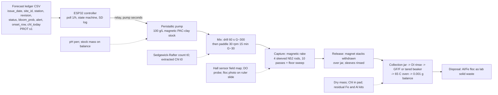

# Forecast-triggered magnetic clay flocculation with magnetic retrieval: design v2

Source keys: [RET] = notes/CLAY_RETRIEVAL_RESEARCH.md, [CLAY] = notes/CLAY_FLOCCULATION_RESEARCH.md, [AER] = notes/AERATION_RESEARCH.md, [PROT] = hab-bloom-predictor-narragansett/notes/PROSPECTIVE_PROTOCOL.md sections 1 and 7 plus `LEDGER_COLS` in `src/deploy/prospective_forecast.py`, [R1] = reviewer 1 report (review1.md) and its sources, **[A]** = my assumption. All prices are [R1] where reviewer 1 verified them, otherwise **[A]**.

## 0. Changelog from v1

| # | Finding | What changed |
|---|---|---|
| 1 | Pipe cannot hold the dose | Pipe dropped; capture is a hand-drawn "magnetic rake" of four sleeved NdFeB rods (~520 cm2 face area) plus a floor sweep; release by withdrawing the stacks over a jar; Hall sensor maps the field. |
| 2 | Numbers unmeasurable at 1e4 | Sedgewick-Rafter counts (>= 400 cells); acetone-extracted Chl-a on GF/F, 664/750 nm, 87.67 L/g/cm; turbidity probe deleted; DI rinse removes sea salt from the pad before weighing. |
| 3 | Tide ignored | Cell defined at low-water slack; floating curtain, 4.5 m skirt; slurry 150 g/L in 3 IBCs; 5 x 1 m3 sludge totes. |
| 4 | "1,500 Oe strips magnetite" wrong | Frame dropped; Chl-in-pad vs remaining kept; SS49E Hall sensor and balance pull test added. |
| 5 | Ammonia volume, batch count | NaOH replaces household ammonia; one 50 g-clay batch (~90 g product) in a 5 L bucket; 2 x 100 g FeCl3. |
| 6 | PAC may attack Fe3O4 | Week-1 1 g pilot with pull test; PAC paste in seawater, ageing stopped at pH >= 5; 500 g magnetite powder as Plan B. |
| 7 | Mixing numbers | 30 rpm stated as G ~25-35 s-1, Gt ~2-3e4 [R1]; 60 s drill rapid mix; 2 min dosing from a 100 g/L stock. |
| 8 | No control arms | Untreated, plain PAC-kaolinite, magnetic PAC-kaolinite arms in every jar test and tank run. |
| 9 | Controller contract | Keys on (issue_date, site_id, station, max revision); gates on onset_row; ENDPOINT_UNREACHABLE vs NO_NEW_ROW; probability go/no-go only; dose by chl_today band; 7 d lockout; verification flag. |
| 10 | BOM light | Recomputed with [R1] prices: buy-everything $652; $489 after four named borrows. |
| 11 | Timeline, temperature | Culture arrival ~Oct 6 [R1]; 18-20 C room temperature; wine cooler dropped. |
| 12 | Dose accounting | Dose = total dry product (magnetic kaolinite + PAC). |
| 13 | Skeletonema mass | 1e4 cells/mL = ~4 ug Chl/L, ~0.5 mg dry/L, used consistently. |
| 14 | Safety gaps | Spacer holder for magnets, SD/phone distance, Al drain policy, ISEF Form 3. |
| 15 | Weakness list | Rewritten to lead with what could zero the project. |

## 1. Design decision: magnetic PAC-kaolinite + in-tank magnetic rake (no flotation)

**Choice.** Kaolinite made magnetic by Fe3O4 co-precipitation (PJOES 2026 recipe [RET s1]), then PAC-modified at 5:1 (IOCAS recipe [CLAY s1]), dosed by a controller-driven pump, flocculated by paddle mixing, and captured by drawing sleeved NdFeB rods through the tank so every floc passes within ~5 mm of a magnet face [R1 finding 1]. Captured floc is released by pulling the magnet stacks out of the sleeves over a jar, then dried and weighed.

**Why not DAF flotation + skim.** The only saline harvest trial (AECOM IRL, 19-20 ppt) fell to 21% Chl-a and 0% TN because "high salinity reduces air saturation as well as the mobility of bubbles and flocs" and waves carried the float blanket into the effluent, at 45% recycle vs 20-30% in fresh water [RET s2]. LIS stations sit at 20-30 ppt with tides and fetch; a surface blanket is the wrong retrieval surface. A magnetic hold works in the water column.

**Why not plain PAC-kaolinite that sinks.** Korea/China/Mote practice [CLAY s3] deposits Al- and toxin-bearing floc on the bottom [RET s5], and "no permitting document distinguishes removal from deposition" [RET s8]. It is kept as a control arm.

**Why magnetic clay is the right risk.** No magnetic clay has been tested in seawater, on a marine species, or beyond a beaker, and no HAB study has measured the recovered fraction after magnetic capture [RET s9 items 1-2, 7]. Magnetic separation itself works at 20-35 ppt: magnetic sphalerite on Chattonella at 1-2 g/L, naked Fe3O4 at 120 mg/L on Nannochloropsis, Cerff 2012 HGMS >95% [RET s1]. Designed-against warnings: ionic strength cuts efficiency (Liu 2009 [RET s1]) and seawater make-up needs ~3x the dose (0.6 vs 0.2 g/L for 80% [CLAY s2]), so the series runs to 1 g/L; floc D50 65-68 um [RET s1] settling ~0.3-1 mm/s [R1], so capture includes a floor sweep; tidal shear makes <50 um oxygen-demanding flocculi [RET s5], so capture follows flocculation directly at G <= 35 s-1. The magnetite is co-precipitated on the clay, so the whole particle is magnetic; the only stripping risk is shear, ~0.01 Pa here, an order below floc break-up [R1 finding 4].

**Fallbacks.** If the rake recovers <50% of dosed mass, the runs still yield settling removal (the PJOES metric [RET s1]) and the plain-clay arm still gives the dose-density curve. If PAC destroys the magnetism, Plan B is plain PAC-kaolinite co-dosed with 120 mg/L magnetite powder (Hu 2013 [RET s1]) [R1 finding 6].

## 2. System diagram

## 3. Bench prototype (20 L working volume, school lab)

**Tank and water.** One 10-gallon glass aquarium at 20 L (16 cm depth) for the magnetic arm; two 2 L glass jars at the same ~15 cm depth for the untreated and plain PAC-kaolinite arms [R1 finding 8]. Water: LIS seawater from Milford or Stratford (filtered seawater "preferred over artificial (ionic strength matters)" [CLAY s7]) through a 5 um cartridge, held dark and cold; salinity and pH per batch. Failure mode: wild cells in the seawater; a filtered-seawater blank run with clay and no culture measures clay-only turbidity and clay-only recovery.

**Culture.** CCMP1332 *Skeletonema marinoi* first: Milford CT isolate, f/2 [CLAY s7], non-toxic; low-motility chain diatoms "readily form flocs and can be easily removed" [CLAY s2]. Grown at 18-20 C under a cool LED [R1 finding 11], 250 mL -> 2 L -> 20 L over ~3 weeks [R1], two carboys staggered a week. CCMP452 *Heterosigma* (hardest, 60% at 0.2 g/L [CLAY s2]) is the stretch strain; CCMP696 *Prorocentrum* is toxic and deferred.

**Clay preparation, one batch for the whole project.** PJOES x50 [RET s1] in a 5 L bucket in a hot-water bath: 50 g kaolinite (pottery EPK kaolin, 200 mesh equivalent **[A]**) in 5 L distilled water, stirred 10 min (PJOES sonicated **[A]**); add 98 g FeCl3·6H2O + 45 g FeCl2·4H2O, stir 10 min; add 80 g NaOH in 200 mL water to pH 11 by pH pen [R1 finding 5]; 60 C for 3 h stirring; settle on a magnet, decant, wash 3x ethanol/water; dry 65 C. Expected ~90 g (theoretical ~0.84 g Fe3O4 per g clay [RET s1]; some maghemite is acceptable [R1]). Demand: jar tests ~15 g, four tank runs at 12 g, blanks ~10 g = ~75 g. **PAC modification**: magnetic kaolinite + PAC 5:1 by mass [CLAY s1], pasted in filtered seawater, aged 24 h or until pH >= 5 [R1 finding 6], made up as a 100 g/L stock and kept suspended. **Dose = total dry product** (clay + PAC) [R1 finding 12]: 0.6 g/L = 12 g per 20 L. **Week-1 pilot**: 1 g PAC-treated, balance pull test (magnet on the pan, sample at a fixed 10 mm gap, mass change read) before and after [R1 finding 4]; >30% loss of pull triggers Plan B. Failure modes: Fe loss in the paste (pilot catches it); NaOH exotherm (add slowly).

**Dosing.** 12 V peristaltic pump, ~60 mL/min **[A]**, delivers 120 mL of 100 g/L stock in 2 min for 12 g [R1 finding 7]. Controller-driven. Failure: stock settles; a small air stone in the reservoir.

**Mixing.** Rapid: school cordless drill with a paint paddle, 60 s at ~300 rpm immediately after dosing (G ~300 s-1 **[A]**, replacing v1's pump-jet claim [R1 finding 7]). Slow: 12 V 30 rpm gearmotor with a 15 cm paddle for 15 min, G ~25-35 s-1 and Gt ~2-3e4 [R1 finding 7], inside the 20-70 s-1 and 1e4-1e5 design window [R1]; the PJOES optimum time was 12.9 min [RET s1]. Failure: over-shear to <50 um flocculi [RET s5]; floc size logged by photographing 1 mL on a ruler slide.

**Capture: the magnetic rake.** Four N52 stacks (4 blocks 40x20x10 mm, 16 cm long, matching the 16 cm water depth) inside capped 3/4 in PVC sleeves (~26 mm OD), 6 cm apart in a wooden frame with spacers so stacks cannot snap together [R1 finding 14]. Face area ~4 x 2.6 cm x pi x 16 cm = ~520 cm2; the 12 g dose at 5-10% solids is 120-240 mL of pad, 2-4 mm deep, within the useful field (~0.3 T at the sleeve face, ~0.17 T at 10 mm by the block-magnet formula [R1 finding 1]). Procedure: paddle off; rake drawn the tank length at ~2 cm/s, 10 passes, frame offset 3 cm on alternate passes so the 5 mm capture shells cover the width; then laid on the tank floor 5 min for settled floc [R1]; lifted out. Two SS49E Hall sensors on the ESP32 map the field at 0, 5, 10, 20 mm from a sleeve before the first run [R1 finding 4]. Chosen over the flat tray because rods use both faces of every block, need no pump, and make release trivial. Failure: poor pickup on video; fallback is the 60 x 10 cm acrylic tray, blocks under a 2-3 mm floor, 5 mm sheet flow from a floor intake [R1 finding 1].

**Release and collection.** Rake over a 1 L jar; stacks withdrawn; floc drops; sleeves rinsed with 200 mL filtered seawater. Pad rinsed with 50 mL DI water to remove ~3.6 g of sea salt that would inflate a 12 g mass by 30% **[A]**; dried 65 C in tared beakers or on pre-weighed 47 mm GF/F; weighed on the school 0.001 g balance.

**Instruments.** Sedgewick-Rafter 1 mL chamber with Lugol, >= 400 cells [R1 finding 2; CLAY s7]; extracted Chl-a: 250 mL (t0) to 1,000 mL (post-treatment) on 47 mm GF/F, 5 mL 90% acetone, 664/750 nm on the school spectrophotometer, 87.67 L/g/cm [R1 finding 2]; school 0.001 g balance and DO meter; API iron kit and LaMotte 3569-01 aluminum kit (0-0.5 ppm, diluted [R1 finding 10]; gap 7 in [RET s9]); pH pen; Hall sensors. In-vivo fluorescence is the IOCAS dose key [CLAY s7] but out of budget; turbidity probe deleted as unquantitative [R1 finding 2].

**Run protocol (three arms per run).** T-24 h: PAC-age the clay; 24 L of culture-in-seawater at target density split 20 L tank + 2 x 2 L jars. T-1 h: count (C0), 250 mL Chl filter, DO, pH, salinity, all arms. T0: controller reads a test ledger row (alert and onset_row true), pump runs 2 min into the tank; PAC-kaolinite jar gets 1.2 g plain product; untreated jar gets 12 mL seawater. T0-T1: drill mix (tank), hand-stir (jars). T1-T16: paddle 30 rpm (tank), magnetic stirrer at matched tip speed (jars **[A]**). T16-T26: rake passes and floor sweep (tank only). T26: sample all arms just below the surface [CLAY s7]: count, 1 L Chl filter, DO, Fe, Al; repeat at 2, 5 and 24 h (settling arm). Release, collect, dry, weigh; Chl on a pad subsample. Regrowth at 7 d on 1 L per arm [CLAY s7]. Jar tests precede tank runs: 2 L, doses 0.1, 0.2, 0.4, 0.6, 1.0 g/L x 2 densities x 2 replicates x 3 arms.

**The three numbers and how each is measured at 1e4 cells/mL.**
1. Removal efficiency, control-normalised, RE = (1 - (Ct/C0)/(Ct,control/C0,control)) x 100 [CLAY s7; R1 finding 8]. Primary metric is the Sedgewick-Rafter count: 1e4 cells/mL gives ~1e4 cells per chamber and still ~1e3 at 90% removal, so >= 400 cells are countable at every point. Secondary is extracted Chl: 1e4 cells/mL is ~4 ug/L (0.4 pg/cell [R1]); 1 L on GF/F into 5 mL acetone gives A ~0.07 at t0 and ~0.007 at 90% removal, the latter at the noise floor, so Chl is reported only where A >= 0.02.
2. Recovery fraction = dry, DI-rinsed pad mass / (12 g product + algal dry mass). Algal dry mass at 1e4 cells/mL is ~0.5 mg/L x 20 L = 10 mg, so recovery is effectively a clay balance readable to 0.01% on a 0.001 g balance; the algal share of retrieval is reported separately as Chl in the pad / Chl at t0.
3. D90 at 1e4 vs 1e5: from the five-dose jar series, log-linear interpolation of the dose at which count-based RE reaches 90% at 5 h, each density, each clay arm, with the 2-replicate spread as the error bar; this is the direct test that earlier treatment saves clay [CLAY s8].

**Bill of materials.** Prices [R1] where verified, else **[A]**. School provides at $0: spectrophotometer, cuvettes, 0.001 g balance, hot plate stirrer, water bath, drying oven, fume hood, Buchner funnel + vacuum, cordless drill, DO meter, microscope, NaOH, 90% acetone, 70% ethanol. Cultures excluded.

| Item | $ |
|---|---|
| 10 gal glass aquarium | 25 |
| 2 x 2 L glass jars (control arms) | 10 |
| Seawater carboys + 5 um cartridge | 15 |
| EPK kaolin 5 lb | 12 |
| FeCl3·6H2O 2 x 100 g | 30 |
| FeCl2·4H2O 100 g | 18 |
| PAC ~30% liquid 1 L | 20 |
| Magnetite powder 500 g (Plan B) | 20 |
| 12 V 30 rpm gearmotor + paddle | 18 |
| 3/4 in PVC sleeves, caps, wooden frame | 15 |
| 16 x N52 40x20x10 mm ($4 each) | 64 |
| 2 x SS49E Hall sensors | 3 |
| 12 V peristaltic pump | 16 |
| ESP32, 2-ch relay, microSD module + card | 22 |
| 12 V 5 A supply, fuse, box, wire | 23 |
| Sedgewick-Rafter chamber | 60 |
| Lugol's 100 mL | 12 |
| GF/F 47 mm, 2 x 25 pk | 80 |
| Fe test kit | 12 |
| LaMotte Al kit 3569-01 | 80 |
| pH pen | 12 |
| Gloves, goggles, apron | 15 |
| f/2 premixed medium | 30 |
| 20 L culture jug + LED light | 30 |
| Jars, tubing, ties | 10 |
| **Buy-everything total** | **652** |

Honest total is $652 [R1 finding 10]. To reach the $500 cap, four named borrows: the Al kit from the DEEP/UConn partner or the school's Hach kit (-80), a 12 V 5 A brick from scrap (-23), LED light and a 5 gal water jug from the school (-30), and f/2 from the partner lab (-30): **$489**. If the Al kit cannot be borrowed, the alternative is six samples to a university ICP-OES service at ~$15 each (**[A]**), which also gives Fe and drops the Fe kit, for a $567 total.

## 4. Controller

ESP32 (Wi-Fi built in, 3.3 V, cheaper than a Pi) polls hourly an HTTP endpoint on the laptop serving the newest ledger rows for the configured (`site_id`, `station`) [PROT s7; LEDGER_COLS]. Fields consumed: `issue_date`, `site_id`, `station`, `revision`, `status`, `chl_today`, `chl_p75_site`, `bloom_prob`, `threshold`, `alert`, `onset_row`, `horizon_days`.

**Keying** [R1 finding 9a]: a row is (`issue_date`, `site_id`, `station`); only the highest `revision` counts, and a later revision supersedes the earlier decision (a dose already given is not repeated; a withdrawn alert is logged).

**Decision** on each new key or revision:
- `status` not `ok` (`stale`, `warmup`, `feed_down` [PROT s1]) -> HOLD_STATUS, amber LED, no dose (`days_old > 3` is already `stale` [PROT s1]).
- `alert == True` (`bloom_prob >= threshold`, 0.50 [PROT s1]) AND `onset_row == True` (chl today <= station p75, the protocol's primary stratum, so the dose is pre-emptive [R1 finding 9b; PROT s5]) AND no dose within `horizon_days` (7 d lockout [R1 finding 9e]) -> DOSE.
- Probability is go/no-go only [R1 finding 9d]. Dose = jar-test D90 for the density band implied by `chl_today`: `chl_today <= 0.5 x chl_p75_site` -> low-density D90; otherwise high-density D90 **[A]**. Pump seconds = dose x volume / (stock g/L x pump mL/s).
- Post-dose verification: a VERIFY flag 24 h after dosing; on the bench a manual count and Chl sample, in the field an in-situ fluorometer **[A]**.

**Feed states** [R1 finding 9c]: NO_NEW_ROW (endpoint reachable, key unchanged; normal six days a week) is green idle; ENDPOINT_UNREACHABLE (three failed polls, ~3 h) is red and hold; a parse failure holds with the raw line logged. The controller never doses from a cached row.

**Logging**: every poll and action to microSD as CSV (`ts, issue_date, site_id, station, revision, status, bloom_prob, alert, onset_row, chl_today, state, dose_g_L, pump_s`), echoed on serial. A second relay with a 10-minute timer in series with the pump guards a stuck relay. On the bench the endpoint serves a hand-written test ledger; the field version keeps the same firmware. The ledger's stations are the protocol's 20 [PROT s1], so the configured station must be one of those.

## 5. Field concept (0.1 ha marina slip or oyster cove)

**Cell and tide stage** [R1 finding 3]. Milford Harbor mean range is ~2.0-2.4 m [R1], comparable to slip depth. The cell is defined at **low-water slack**: 0.1 ha x 2 m = 2,000 m3 (4,200 m3 at high water). Curtain: a floating turbidity curtain (float log, PVC-coated skirt, chain ballast) with a 4.5 m skirt that folds on the bottom at low water and reaches the bed at high water **[A]**. Dosing starts one hour before low-water slack; the enclosure is treated as leaky and exchange is measured by dye tracer **[A]**. No surface blanket exists, so waves act only on the curtain (the IRL failure [RET s2]), and timing works with the tide ("re-anoxifies within one tidal cycle" [AER s4]).

**Frame and dosing.** Dock-mounted, seasonal, removable rig on a finger pier, the host [AER s2, s7] chose for aeration, under DEEP COP/GP and USACE GP-41 GP 1 [AER s7]. Slurry at 150 g/L [R1] in IBC totes with air-lift agitation: 400 kg product = 2.7 m3 = 3 IBCs by a 60 L/min trash pump in ~45 min; at the 3x seawater factor [CLAY s2], 1,200 kg = 8 IBCs and ~2.2 h, the honest logistics ceiling for a dock rig.

**Capture.** The rake scaled to a rotating low-intensity magnetic drum (0.05-0.1 kWh/m3 [RET s1]) fed by a 160 m3/h pump (the IRL barge's 700 gpm [RET s2]) from a floor-level intake; a scraper wipes floc into five 1 m3 sludge totes [R1 finding 3]. 2,000 m3 takes 12.5 h, longer than a slack window, so the drum runs across the flood and exchange loss is reported; a 0.03 ha cell (600 m3, ~4 h) is where one drum finishes within a window. Flocculation residence 2-5 h [CLAY s2]. Power: marina shore 120 V; 2 x 100 W solar + 100 Ah LiFePO4 for controller and dosing only **[A]**.

**Mass balance, one treatment at 0.2 g/L, 2,000 m3.** Product 0.4 t (1.2 t at 3x). Algae at 1e4 cells/mL and ~50 pg dry/cell [R1 finding 13] = 1 kg dry; at a 20 ug Chl/L bloom ~4 kg. Wet floc at 8% solids [RET s6]: ~5 t (25 t at 3x), hence five totes. N at 3.1% of ash-free dry mass [RET s6]: 0.03-0.12 kg from algae, plus clay-adsorbed dissolved TN (44-72% for S. costatum [CLAY s2]) of order 0.5 kg. So ~0.5 kg N per 0.4-1.2 t clay: the honest field claim is toxin and biomass removal without deposition, not nutrient credit ("no case found where harvested N or P was credited" [RET s6]).

**Permits.** DEEP LWRD COP or GP; USACE GP-41 GP 1; a clay release is inferred to be a discharge under CGS 22a-430 needing its own permit [CLAY s6; AER s7]; Florida precedents needed an NPDES-type permit and a permitted area [RET s8]. Student scope stays bench or contained mesocosm [CLAY s6].

## 6. Safety

PAC is an acidic aluminum coagulant: gloves, goggles, ventilation, Al floc as lab solid waste [CLAY s7]; tank effluent carries dissolved Al and is bleached, diluted and disposed per the school drain policy, or collected [R1 finding 14]. Fe3O4 synthesis: FeCl3 and FeCl2 are corrosive; NaOH is caustic and exothermic, added slowly in the fume hood with a teacher present; 60 C water bath, no flame; ethanol wash away from the hot plate; product handled damp to avoid dust **[A]**. Magnets: N52 blocks pinch, shatter and snap together; assembled in a spacer holder one stack at a time, SD card and phones kept away [R1 finding 14]. Electrical: everything touching water is 12 V from a fused supply behind a GFCI; the 120 V hot plate and drill stay on a separate bench. Cultures: Skeletonema is non-toxic; toxic CCMP696 [CLAY s7] is not ordered; used culture is bleached. ISEF: Form 3 for hazardous chemicals and the home-built electrical device; protist exemption confirmed with the SRC [R1 finding 14].

## 7. Timeline to 2027-01-15

- Sep 21: order CCMP1332 (NCMA "at least two weeks", overnight, no Friday [R1]), chemicals, magnetite powder, magnets, electronics; book hood, spectrophotometer, balance; ISEF Form 3 and SRC questions with the counselor.
- Sep 28: ESP32 state machine, relay, SD, test-ledger endpoint; rake frame; Hall-sensor field map of one stack.
- Oct 5: culture arrives ~Oct 6, 250 mL started. Week-1 chemistry pilot: 1 g magnetic kaolinite, PAC pilot, pull test; Plan B decision.
- Oct 12: the 50 g batch; PAC-modify; seawater collected; clay-only blank in the tank (rake recovery with no algae, salt-rinse check).
- Oct 19-26: culture to 2 L then 20 L; controller dry runs.
- Nov 2-9: jar tests at 1e4, 5 doses x 2 reps x 3 arms; counts and Chl cross-validated at t0.
- Nov 16-23: jar tests at 1e5; D90 at both densities, both clays.
- Nov 30-Dec 7: tank runs 1-2, three arms, full instruments, video.
- Dec 14: tank runs 3-4; residual Fe/Al; DO; 7 d regrowth from run 2.
- Dec 21-Jan 4: Heterosigma if ordered by Nov 1, else a shear run (60 vs 30 rpm); analysis, error bars, jars labelled, board figures.
- Jan 11-15: demo dry run; buffer.

Board: 60 s tank video (dose, floc, rake passes, magnet withdrawal, floc drop), the dried recovered-floc jar beside the dosed-product and untreated-control jars, the Hall-sensor field map, and the three numbers with n and spread; SCIENTIFIC_METHOD.md updated each session.

## 8. Known weaknesses

1. Rake pickup is unproven: that 10 passes at 2 cm/s bring most 70 um flocs within 5 mm of a rod is geometry, not data; the clay-only blank in week 4 is the first hard test, and the tray is the fallback [R1 finding 1].
2. At 1e4 cells/mL removal rests on counts alone; extracted Chl is at the noise floor after 90% removal even with 1 L filtered [R1 finding 2].
3. PAC on magnetic kaolinite is untested; Plan B (magnetite co-dose) is a different material whose numbers would not transfer to the "magnetic clay" claim [R1 finding 6].
4. Seawater ionic strength reduces efficiency (Liu 2009 [RET s1]) and triples the dose [CLAY s2]; at 0.6 g/L product the Fe loading is ~0.25 g/L magnetite, so residual Fe may exceed the kit range, and the Al kit is interference-prone [R1 finding 10].
5. G values for paddle and drill are calculated, not measured; jar arms on a magnetic stirrer are not the tank's mixing regime [R1 finding 7].
6. n = 4 tank runs, one species, controls in 2 L jars rather than a second 20 L tank [R1 finding 8].
7. The field cell has no fixed volume over a tide; exchange is a measured loss, not a solved problem, and 3-8 IBCs of slurry per treatment is at the edge of a dock rig [R1 finding 3].
8. ~0.5 kg N per 0.4-1.2 t clay; the field case rests on non-deposition, and no study compares bottom DO after sunk vs harvested floc [RET s9 item 5].
9. The controller's chl_today density bands are uncalibrated assumptions on a ledger whose stations are the Narragansett protocol's, not LIS [R1 finding 9].
10. Budget meets $500 only with four borrows; without the Al kit borrow the total is $567.
