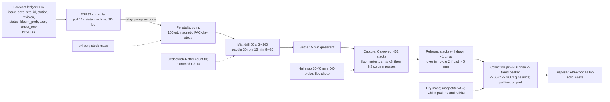

# Forecast-triggered magnetic clay flocculation with magnetic retrieval: design v3

Source keys: [RET] = notes/CLAY_RETRIEVAL_RESEARCH.md, [CLAY] = notes/CLAY_FLOCCULATION_RESEARCH.md, [AER] = notes/AERATION_RESEARCH.md, [PROT] = hab-bloom-predictor-narragansett/notes/PROSPECTIVE_PROTOCOL.md s1, s5, s7 plus `LEDGER_COLS` in `src/deploy/prospective_forecast.py`, [R1] = review1.md, [R2] = review2.md and its sources, **[A]** = my assumption or calculation. Prices are [R1]/[R2] where verified, otherwise **[A]**.

## 0. Changelog from v2

| # | Finding [R2] | What changed |
|---|---|---|
| 1 | Rake chases settled flocs; 3/4 in sleeve too small | Settle 15 min, floor raster (pole faces down, 1 cm/s, x3), then 2-3 column passes, withdrawal <1 cm/s. 1 in Sch 40 sleeves, blocks shimmed to one wall (pole face 3.4 mm from surface). Six stacks; capacity on pole-face area (192 cm2); two cycles at 12 g. Clay-only blank gates culture dosing. |
| 2 | Arms unmatched; jar draws impossible | Three arms in nine 2 L jars on one three-station rig (G matched by P/V, ~65 rpm); draw table sums to 510 of 1,800 mL. Tank is device metrics only. |
| 3 | D90 unresolvable at n = 2 | 0.025-0.8 g/L half-log, n = 3, logistic fit, 1,000x bootstrap D90; counts t0 and 5 h only; counting budget and cut order. |
| 4 | Mixture, not composite; NaOH over-specified | NaOH titrated to pH 11.0 (62 g stoichiometric); seawater detachment test before/after PAC; pull test calibrated to magnetite powder; acid-digest Fe; recovery reported as total and as magnetite fraction. |
| 5 | Pull test, Hall map flawed | Riser-based pull test, magnet on a stand; Hall map 10-40 mm, formula fitted to the face. |
| 6 | PAC basis | PAC powder, 5:1 on solids; dose = magnetic kaolinite + PAC powder. |
| 7 | Bands cannot fire; lockout; VERIFY; pre-emption | Bands dropped; lockout = skip next issue_date; VERIFY = 24 h count < 0.3 C0; enclosed-cell paragraph. |
| 8 | Curtain practice; deposition | One-slack 600 m3 cell; 0.3-0.6 m bed clearance; bed-vacuum intake; bed-magnet sled inside/outside; metric = fraction of dosed magnetite recovered; Rhodamine WT with DEEP sign-off. |
| 9 | Counting time | ~75 h budget, two counters, agreement check, low-density counts capped. |
| 10-13 | ISEF; Chl threshold; wake; vessel | Forms 1/1A/1B/3 and Designated Supervisor; Chl cannot report 90% at 1e4; raster first, column last; borosilicate/HDPE, NaOH over 10 min. |
| B | Review-1 items not landed | Closed: pole-face capacity (R1#1), matched G (R1#7), matched vessels (R1#8), instruments (R1#4), NaOH titration (R1#5), lockout (R1#9e), PAC basis (R1#12), Designated Supervisor and 1B (R1#14). |

Changelog v1 to v2 (collapsed)

| # [R1] | Change in v2 |
|---|---|
| 1 | Pipe dropped for sleeved rods; Hall sensor. |
| 2 | Sedgewick-Rafter counts; extracted Chl; turbidity probe deleted; DI rinse. |
| 3 | Low-water cell; floating curtain; slurry 150 g/L; sludge totes. |
| 4 | 1,500 Oe frame dropped; pull test added. |
| 5 | NaOH; one 50 g batch. |
| 6 | PAC pilot; magnetite Plan B. |
| 7 | G stated; drill rapid mix. |
| 8 | Three control arms. |
| 9 | Ledger keys, onset_row gate, feed states, lockout, VERIFY. |
| 10-15 | BOM $652/$489; timeline; dose basis; safety; weaknesses. |

## 1. Design decision: magnetic PAC-kaolinite + in-tank magnetic rake (no flotation)

**Choice.** Kaolinite co-precipitated with Fe3O4 (PJOES 2026 recipe [RET s1]), PAC-modified at 5:1 solids (IOCAS [CLAY s1]), dosed by a controller-driven pump, flocculated by paddle mixing, allowed to settle, then captured by sleeved NdFeB stacks rastered along the tank floor and passed through the water column, and released by withdrawing the stacks over a jar [R2 finding 1].

**Why not DAF flotation + skim.** The only saline harvest trial (AECOM IRL, 19-20 ppt) fell to 21% Chl-a and 0% TN because "high salinity reduces air saturation as well as the mobility of bubbles and flocs" and waves carried the float blanket into the effluent [RET s2]. LIS is 20-30 ppt with tides and fetch; a surface blanket is the wrong retrieval surface.

**Why not plain PAC-kaolinite that sinks.** Korea/China/Mote practice [CLAY s3] deposits Al- and toxin-bearing floc on the bed [RET s5]; "no permitting document distinguishes removal from deposition" [RET s8]. Kept as the comparison arm.

**Why magnetic clay is the right risk.** No magnetic clay has been tested in seawater, on a marine species, or beyond a beaker, and no HAB study has measured the recovered fraction after magnetic capture [RET s9 items 1-2, 7]. Magnetic separation works at 20-35 ppt (magnetic sphalerite on Chattonella; naked Fe3O4 on Nannochloropsis; Cerff 2012 HGMS [RET s1]). The force budget holds: a 70 um floc carries 13-44 ng magnetite; at Ms 60-80 A m2/kg and ~25 T/m the magnetic force (2-6e-8 N) exceeds Stokes drag at 2 cm/s (1.3e-8 N) and buoyant weight by 100x, giving a 5-10 mm capture shell in front of a pole face [R2 finding 1, C]. Designed-against: ionic strength cuts efficiency (Liu 2009 [RET s1]) and seawater make-up needs ~3x the dose [CLAY s2], so jars run to 0.8 g/L; flocs settle at 0.3-1 mm/s and cross 16 cm in 3-9 min [R2], so the floor is where the dose is and the raster comes first; tidal shear makes <50 um oxygen-demanding flocculi [RET s5], so capture follows flocculation directly.

**What the product is.** Co-precipitated magnetic kaolinite in the literature has composite Ms as low as 6 emu/g against 60-80 for the particles, because much of the Fe3O4 nucleates free; the magnet-decant keeps free magnetite, so the product is kaolinite plus magnetite aggregates that PAC bridges into one floc in seawater [R2 finding 4]. Recovery is therefore reported two ways: total dry product, and magnetite fraction by pull test, so a low total recovery is not misread as rake failure.

**Fallbacks.** If the clay-only blank recovers <70%, add stacks or switch to the flat magnetic tray [R1 finding 1] before any culture is dosed. If PAC destroys the magnetism, Plan B is plain PAC-kaolinite co-dosed with 120 mg/L magnetite powder (Hu 2013 [RET s1]) [R1 finding 6]; the runs always yield settling removal (the PJOES metric [RET s1]).

## 2. System diagram

## 3. Bench prototype (school lab)

**Vessels.** (a) Device tank: 10 gal glass aquarium at 20 L (16 cm depth, 50 x 25 cm floor), used only for device metrics: recovery fraction, magnetite fraction, Chl in pad, cycles needed, video [R2 finding 2]. (b) Jar rig: nine 2 L glass jars filled to 1.8 L, run three at a time on a three-station rig: three identical 12 V 60 rpm gearmotors on one 12 V rail, identical 6 x 2 cm paddles, rpm checked with a phone tachometer app. G is matched to the tank by power per volume, not tip speed: tank paddle 75 cm2 at 0.24 m/s in 20 L gives G ~25-35 s-1 [R1 finding 7]; a 12 cm2 paddle in 1.8 L needs ~0.2 m/s tip speed, i.e. ~65 rpm on a 6 cm paddle, to match P/V **[A, calculation]**. Water: LIS seawater from Milford or Stratford (filtered seawater "preferred over artificial (ionic strength matters)" [CLAY s7]) through a 5 um cartridge, dark and cold; salinity and pH per batch; a filtered-seawater blank with clay and no culture is run first.

**Culture.** CCMP1332 *Skeletonema marinoi*: Milford CT isolate, f/2 [CLAY s7], non-toxic; chain diatoms "readily form flocs and can be easily removed" [CLAY s2]; 18-20 C under a cool LED [R1 finding 11]; 250 mL -> 2 L -> 20 L over ~3 weeks [R1]; two carboys staggered. CCMP452 *Heterosigma* is the stretch strain; CCMP696 is toxic and deferred.

**Clay preparation, one batch.** PJOES x50 [RET s1] in a 5 L borosilicate beaker or HDPE pail in a hot-water bath [R2 finding 13]: 50 g EPK kaolin (200 mesh equivalent **[A]**) in 5 L distilled water, stirred 10 min; 98 g FeCl3·6H2O + 45 g FeCl2·4H2O, stirred 10 min; 10 M NaOH added over 10 min while stirring and **titrated by pH pen to 11.0** (stoichiometric demand 1.54 mol = 62 g; weighing in 80 g would give pH ~12.9 [R2 finding 4]); 60 C for 3 h; settle on a magnet, decant, wash 3x ethanol/water; dry 65 C. Expected ~90 g; Fe3+ limits Fe3O4 to ~42 g (~46 wt%) [R2]. Demand ~75 g (jars ~20 g, tank runs 4 x <= 12 g, blanks 12 g). **PAC modification**: magnetic kaolinite + PAC powder (28-30% Al2O3) 5:1 **on a solids basis** [CLAY s1; R2 finding 6], pasted in filtered seawater, aged 24 h or until pH >= 5 [R1 finding 6], made up as a 100 g/L stock. **Dose = dry magnetic kaolinite + PAC powder mass** [R1 finding 12; R2 finding 6]. Plain-clay arm: EPK kaolin + PAC powder 5:1, same ageing.

**Material characterisation (before any culture).** (1) Pull test, riser-based: sample in a vial on the pan on a 10 cm plastic riser, an N52 block on a lab stand above at a fixed 10 mm gap, tare with the magnet in place and an empty vial, read the apparent mass change [R2 finding 5]; calibrated with 0.1, 0.2, 0.5 g of the Plan B magnetite powder to give a line of pull vs g magnetite, so any sample or pad reads out as g magnetite-equivalent [R2 finding 4b]. (2) Seawater detachment test: 1 g product in 1 L filtered seawater on the jar rig at G ~30 for 15 min, held on a magnet 10 min, decanted; the non-magnetic residue dried and weighed; run before and after PAC [R2 finding 4a]. (3) Acid digest: 0.1 g in 10 mL 1:1 HCl (school), diluted, Fe by kit, for total Fe wt% [R2 finding 4c]. (4) Week-1 1 g PAC pilot: pull test before and after; >30% loss of pull or >30% non-magnetic residue triggers Plan B [R1 finding 6].

**Dosing.** 12 V peristaltic pump, ~60 mL/min **[A]**: 120 mL of 100 g/L stock in 2 min for 12 g. Tank dose = 2 x the jar D90 at the run density, capped at 0.6 g/L **[A]**. Failure: stock settles; air stone in the reservoir.

**Mixing.** Rapid: school cordless drill with a paint paddle, 60 s at ~300 rpm (G ~300 s-1 **[A]**). Slow: 12 V 30 rpm gearmotor, 15 cm paddle, 15 min, G ~25-35 s-1, Gt ~2-3e4 [R1 finding 7], near the PJOES optimum of 12.9 min [RET s1]. Failure: over-shear to <50 um flocculi [RET s5]; floc size logged by photographing 1 mL on a ruler slide.

**Capture: sleeves, capacity, sequence.** Six stacks of four N52 blocks 40x20x10 mm (16 cm) in capped 1 in Sch 40 PVC sleeves (ID 26.6, OD 33.4 mm; the 22.4 mm block diagonal does not fit 3/4 in [R2 finding 1]). Each block is foam-shimmed against one wall so one pole face sits 3.4 mm (the wall) from the capture surface, ~0.3 T by the block formula [R1 finding 1]; the far face is ~20 mm away and does not count. Usable pad area = strong pole faces: 6 x 4 x 8 cm2 = 192 cm2 **[A, per R2's rule]**. A 12 g dose at 5-10% solids is 120-240 mL of pad, 6-12 mm on 192 cm2, but holding force equals drag at 8-14 mm from the pole [R2 finding 1], so the design is **two capture cycles** of <= ~100 mL (~5 mm) each, with cycles-to-clear a reported output; a 4 g dose (0.2 g/L) fits one cycle. Sequence after the paddle stops at T16 [R2 findings 1, 12]: T16-T31 quiescent settle; T31-T41 **floor raster**, stacks horizontal in a frame, pole faces down, dragged along the bottom at ~1 cm/s in overlapping 3 cm lanes, three rasters; T41-T46 two to three water-column passes, stacks vertical at 2 cm/s (rod Re ~550 sheds a wake, so the column pass comes last); withdrawal at <1 cm/s; release over a jar (stacks pulled, sleeves rinsed with 200 mL filtered seawater); second cycle if the pad exceeds ~5 mm or the floor still shows floc under a torch. Hall map: two SS49E sensors on the ESP32 read 10-40 mm from a sleeve in 5 mm steps (SS49E saturates near 0.1 T [R2 finding 5]); the block formula [R1] is fitted with Br free and extrapolated to the face. **Gating test**: the clay-only blank (12 g in 20 L filtered seawater, full sequence) must recover >= 70% of dosed dry mass and >= 80% of dosed magnetite-equivalent **[A, thresholds]** before any culture is dosed; otherwise stacks are added or the tray [R1 finding 1] is built.

**Collection.** Pad rinsed with 50 mL DI water to strip ~3.6 g of sea salt from a 12 g mass **[A]**; dried 65 C in tared beakers; weighed on the school 0.001 g balance; pull test on the dried pad for magnetite fraction; a 0.5 g subsample extracted for Chl.

**Instruments.** Sedgewick-Rafter 1 mL chamber with Lugol [R1 finding 2; CLAY s7]: >= 400 cells where density allows, capped at 200 cells or 500 grids at low density with the Poisson CI reported [R2 finding 9]. Extracted Chl-a: 250 mL on 47 mm GF/F, 5 mL 90% acetone, 664/750 nm, 87.67 L/g/cm [R1 finding 2]; **Chl cannot report the 90% endpoint at 1e4** (A >= 0.02 corresponds to RE <= ~70% [R2 finding 11]), so Chl is the primary metric only for the 1e5 series. School balance, DO meter, spectrophotometer; API Fe kit; LaMotte 3569-01 Al kit, diluted [R1 finding 10] (gap 7 in [RET s9]); pH pen; Hall sensors.

**Three-arm comparison (jar rig, matched vessels).** Arms: untreated, plain PAC-kaolinite, magnetic PAC-kaolinite, at the chosen dose and 1e4 cells/mL, n = 3, one replicate of each arm per batch (paired by culture batch), three batches. Per-vessel draw table (1,800 mL working volume) [R2 finding 2]:

| Draw | Volume | When |
|---|---|---|
| t0 count (from the common batch bottle before splitting) | 5 mL | T-1 h |
| 5 h count | 5 mL | 5 h |
| 5 h Chl | 250 mL | 5 h |
| Fe and Al (treated arms only) | 50 mL | 5 h |
| 24 h count | 5 mL | 24 h |
| Regrowth aliquot transferred to a flask | 200 mL | 24 h |
| **Total** | **510 mL** | |

DO and pH are read in situ with the probe in the jar. Samples are drawn by pipette 2 cm below the surface [CLAY s7] without disturbing the settled layer.

**Dose series (jar rig).** Doses 0.025, 0.05, 0.1, 0.2, 0.4, 0.8 g/L (half-log; kaolinite-PAC removed 100% of *A. minutum* at every dose from 0.1 g/L at 1e4-2e4 cells/mL, so the 1e4 D90 may sit below 0.1 [R2 finding 3]); densities 1e4 and 1e5; n = 3; arms magnetic and plain, plus three untreated per density: 6 x 2 x 3 x 2 + 6 = 78 jars. Counts at t0 (one per batch) and 5 h only; Chl at 5 h for the 1e5 series. Analysis: control-normalised RE = (1 - (Ct/C0)/(Ct,ctl/C0,ctl)) x 100 [CLAY s7; R1 finding 8]; two-parameter logistic RE = 100/(1 + exp(-k(log10 D - log10 D50))) fitted per density and arm with scipy in the base env; D90 from the fit; 1,000 bootstrap resamples of replicates for the D90 CI and the 1e4/1e5 ratio CI; with SD(log10 D90) ~0.12 at n = 3, power ~0.8 for a 2x ratio at alpha 0.05 [R2 finding 3].

**Counting budget** [R2 finding 9]: 78 dose-series jars + 27 three-arm counts + 8 tank counts + 13 batch t0 counts = ~126 counts. High-density counts ~15 min; low-density counts capped at 500 grids, ~45 min; mean ~35 min -> ~75 h. Two counters (student plus a classmate or the partner lab) at 6 h/week each from Nov 2 to Dec 18 = 84 h; ten samples counted by both, inter-counter agreement reported. **Cut order if short**: (1) plain PAC-kaolinite arm at 1e4 (Chl works at 1e5, where it stays), -18 jars; (2) tank runs 3-4; (3) n = 2 at 0.025 and 0.8 g/L at 1e5.

**Tank run protocol (device metrics, four runs).** T-24 h age clay; T-1 h fill 20 L culture at the run density, count, Chl 250 mL, DO, pH, salinity. T0 controller reads a test ledger row (alert and onset_row true), pump 2 min. T0-T1 drill. T1-T16 paddle. T16-T31 settle. T31-T46 raster then column passes; cycle 2 if needed. T46: count, Chl 250 mL (1e5 runs), DO, Fe, Al from 2 cm below surface; 24 h count; release, rinse, dry, weigh, pull test, pad Chl; regrowth at 7 d on 1 L [CLAY s7].

**The three numbers.** (1) Removal efficiency at 5 h, control-normalised, from Sedgewick-Rafter counts (1e4 cells/mL gives ~1e4 cells per chamber, ~1e3 at 90% removal, countable); extracted Chl secondary at 1e5 only. (2) Recovery fraction from the tank runs: total = dry DI-rinsed pad / (product dosed + algal dry mass, ~10 mg at 1e4 [R1 finding 13]); magnetite fraction = pull-test magnetite-equivalent in pad / magnetite-equivalent dosed; algal share = Chl in pad / Chl at t0. (3) D90 at 1e4 vs 1e5 from the logistic fits with bootstrap CIs, the direct test that earlier treatment saves clay [CLAY s8].

**Bill of materials.** School provides at $0: spectrophotometer, cuvettes, 0.001 g balance, hot plate stirrer, water bath, 5 L borosilicate beaker, oven, fume hood, Buchner + vacuum, drill, DO meter, microscope, NaOH, HCl, 90% acetone, ethanol. Cultures excluded.

| Item | $ |
|---|---|
| 10 gal glass aquarium | 25 |
| 9 x 2 L glass jars | 36 |
| Jar rig: 3 x 60 rpm gearmotors, frame, paddles | 28 |
| Seawater carboys + 5 um cartridge | 15 |
| EPK kaolin 5 lb | 12 |
| FeCl3·6H2O 2 x 100 g / FeCl2·4H2O 100 g | 30 / 18 |
| PAC powder 1 kg | 15 |
| Magnetite powder 500 g (Plan B and calibration) | 20 |
| Tank gearmotor + paddle | 18 |
| 1 in Sch 40 PVC, caps, foam shims, raster frame | 18 |
| 24 x N52 40x20x10 mm ($4) | 96 |
| 2 x SS49E Hall sensors | 3 |
| Peristaltic pump | 16 |
| ESP32, 2-ch relay, microSD + card | 22 |
| 12 V 5 A supply, fuse, box, wire | 23 |
| Sedgewick-Rafter chamber | 60 |
| Lugol's 100 mL | 12 |
| GF/F 47 mm, 2 x 25 | 80 |
| Fe kit / LaMotte Al kit 3569-01 | 12 / 80 |
| pH pen | 12 |
| PPE | 15 |
| f/2 medium / 20 L jug + LED | 30 / 30 |
| Riser, vials, stand clamp | 8 |
| Jars, tubing, ties | 10 |
| **Buy-everything total** | **744** |

Honest buy-everything total **$744**. With six named borrows the purchase total is **$485**: Al kit from the DEEP/UConn partner or school Hach kit (-80), Sedgewick-Rafter chamber from the partner lab (-60), 2 L jars from school chemistry stock (-36), f/2 from the partner lab (-30), LED + jug from school (-30), 12 V brick from scrap (-23). If only the four v2 borrows are available the total is $581.

## 4. Controller

ESP32 polls hourly an HTTP endpoint on the laptop serving the newest ledger rows for the configured (`site_id`, `station`) [PROT s7; LEDGER_COLS]. Fields: `issue_date`, `site_id`, `station`, `revision`, `status`, `bloom_prob`, `threshold`, `alert`, `onset_row`, `chl_today`, `chl_p75_site`.

**Keying** [R1 finding 9a]: (`issue_date`, `site_id`, `station`), highest `revision` wins; a later revision supersedes the decision but a dose already given is not repeated.

**Decision** on a new key or revision:
- `status` not `ok` (`stale`, `warmup`, `feed_down` [PROT s1]) -> HOLD_STATUS.
- `alert == True` (`bloom_prob >= threshold`, 0.50 [PROT s1]) AND `onset_row == True` (chl today <= station p75, the protocol's primary stratum [PROT s5; R1 finding 9b]) AND not locked out -> DOSE at a single dose = 2 x the jar D90 at 1e4, capped at 0.6 g/L. Density bands are dropped: both v2 bands sat under the onset gate, so the 1e5 D90 could never fire; the 1e5 series is the board's counterfactual, not a controller input [R2 finding 7]. Probability is go/no-go only [R1 finding 9d].
- **Lockout** = skip the next distinct `issue_date` after a dose; eligible again at the second issuance [R2 finding 7].
- **VERIFY**: 24 h after a dose, a count (bench: manual; field: in-situ fluorometer, **[A]**) is entered; pass = count < 0.3 x C0. On fail the lockout is lifted for one further dose at the next alerting row, then a hard stop pending human review.

**Feed states** [R1 finding 9c]: NO_NEW_ROW (reachable, key unchanged) is green idle; ENDPOINT_UNREACHABLE (three failed polls) is red and hold; parse failure holds with the raw line logged. Never doses from a cached row. Logging: every poll and action to microSD (`ts, issue_date, site_id, station, revision, status, bloom_prob, alert, onset_row, state, dose_g_L, pump_s, verify`), echoed on serial; a second 10-minute timer relay in series guards a stuck relay. The configured station must be one of the protocol's 20 [PROT s1].

**Why pre-emption is an enclosed-cell concept.** The claim behind the onset gate is that removing cells at ~1e4 cells/mL today prevents the exceedance the model forecasts within 7 days. Regrowth suppression of 30-80 d is a beaker result [CLAY s2]; in a marina slip that exchanges its water every tide ("re-anoxifies within one tidal cycle" [AER s4]) the seed population is replaced from outside, so a pre-emptive dose in a slip removes cells without changing the forecast outcome [R2 finding 7]. Pre-emption is therefore defensible only where exchange is restricted: a salt pond, a sluiced embayment, an oyster upweller basin or a mesocosm. In a slip the device demonstrates removal without deposition, and the forecast's value is timing and dose, not prevention.

## 5. Field concept (one-slack 600 m3 cell)

**Cell and curtain** [R2 finding 8]. Cell 0.03 ha x 2 m at mean low water = 600 m3, the volume one drum finishes within a slack window at 160 m3/h (the IRL barge's 700 gpm [RET s2]). Curtain: a floating turbidity curtain per DOT practice with the skirt ending 0.3-0.6 m above the bed at MLW and never touching it; curtains "slow water movement, not stop it" [R2 finding 8]. So the cell is open-bottomed by design and the whole outcome rides on the bed metric below. Dosing begins one hour before low-water slack at Milford Harbor (mean range 2.0-2.4 m [R1]).

**Rig.** Dock-mounted, seasonal, removable, on a finger pier, the host [AER s2, s7] chose for aeration, under DEEP COP/GP and USACE GP-41 GP 1 [AER s7]. Slurry at 150 g/L [R1] in one IBC (120 kg product = 0.8 m3; 3 IBCs at the 3x seawater factor [CLAY s2]), 60 L/min trash pump. Flocs reach a 2 m bed in 0.5-2 h [R2], so the intake is a bed-vacuum head towed over the bed inside the cell, feeding a rotating low-intensity magnetic drum (<0.3 T, 0.05-0.1 kWh/m3 [RET s1; R2]) that scrapes into two 1 m3 sludge totes (five at 3x). Power: marina shore 120 V; solar + LiFePO4 for controller and dosing only **[A]**.

**Deposition survey and metric** [R2 finding 8]. A bed-magnet sled (three sleeved N52 stacks on a weighted frame) is dragged along fixed transects inside and outside the curtain before dosing and after the ebb; magnetic material per metre is dried and pull-tested. The field metric is **fraction of dosed magnetite recovered** = (magnetite in drum sludge + on sled inside) / magnetite dosed; sled mass outside the curtain is reported as escaped deposition.

**Tracer** [R2 finding 8]. Rhodamine WT at ~10 ppb (6 g in 600 m3), a fluorometer borrowed from the partner or DEEP (0.1 ppb detection), pre-dye background, inside and outside samples over >= 2 tidal cycles; dye is a discharge, so it is written into the DEEP application and released only with DEEP sign-off.

**Mass balance, 0.2 g/L, 600 m3.** Product 120 kg (360 kg at 3x). Algae at 1e4 cells/mL and ~50 pg dry/cell [R1 finding 13] = 0.3 kg; at 20 ug Chl/L ~1.2 kg. Wet floc at 8% solids [RET s6] ~1.5 t (4.5 t). N at 3.1% of ash-free dry mass [RET s6]: 0.01-0.04 kg from algae plus adsorbed dissolved TN (44-72% for S. costatum [CLAY s2]) of order 0.15 kg. The honest claim is removal without deposition, measured by the sled, not nutrient credit ("no case found where harvested N or P was credited" [RET s6]).

**Permits.** DEEP LWRD COP or GP; USACE GP-41 GP 1; clay and dye releases inferred to be discharges under CGS 22a-430 [CLAY s6; AER s7]; Florida precedents needed an NPDES-type permit and a permitted area [RET s8]. Student scope stays bench or contained mesocosm [CLAY s6].

## 6. Safety and ISEF

PAC powder is an acidic aluminum coagulant: gloves, goggles, dust mask, Al floc as lab solid waste [CLAY s7]; tank and jar effluent carries dissolved Al and is bleached, diluted and disposed per school drain policy, or collected [R1 finding 14]. Synthesis: FeCl3 and FeCl2 corrosive; 10 M NaOH caustic and exothermic, added over 10 min into borosilicate or HDPE, never a thin plastic bucket [R2 finding 13], in the fume hood with the Designated Supervisor present; 60 C water bath; ethanol wash away from the hot plate; product handled damp. HCl digest in the hood. Magnets: N52 blocks pinch, shatter and snap together; assembled in a spacer holder one stack at a time; SD card and phones kept away [R1 finding 14]. Electrical: everything touching water is 12 V behind a GFCI; the hot plate and drill on a separate bench. Cultures: Skeletonema non-toxic; toxic CCMP696 not ordered; used culture bleached.

**ISEF paperwork** [R2 finding 10]. Form 1 (Checklist for Adult Sponsor), Form 1A (Student Checklist and Research Plan), Form 1B (Approval Form), Form 3 (Risk Assessment) for hazardous chemicals (FeCl3, NaOH, HCl, PAC), the home-built electrical device, and the protist cultures (exempt from SRC pre-review but Form 3 required). Designated Supervisor: the school chemistry teacher, named on Form 1 and Form 3. Order: the Adult Sponsor completes Form 1 and reviews the Research Plan on 1A; the Designated Supervisor and Adult Sponsor complete and sign Form 3; the student and parent sign Form 1B, then the Adult Sponsor signs 1B, all **before** the first synthesis on Oct 5; the SRC reviews the packet at the fair **[A on sequence beyond R2]**.

## 7. Timeline to 2027-01-15

- Sep 21: order CCMP1332 (arrival ~Oct 6 [R1]), chemicals, PAC powder, magnetite powder, 24 blocks, electronics; book hood, spectrophotometer, balance; Forms 1, 1A, 3, 1B started with the counselor.
- Sep 28: ESP32 state machine, relay, SD, test-ledger endpoint; sleeves, raster frame, jar rig; Hall map 10-40 mm and formula fit; pull-test rig and magnetite calibration line.
- Oct 5: all signatures on 1B before synthesis. Week-1 chemistry: 1 g pilot, PAC pilot, pull test before and after, detachment test; Plan B decision. Culture arrives, 250 mL started.
- Oct 12: the 50 g batch (titrated NaOH); PAC-modify; acid-digest Fe; seawater collected.
- Oct 19: **gating test**: clay-only blank in the tank, full sequence, >= 70% total and >= 80% magnetite recovery; fix stacks or build the tray if it fails. Culture to 2 L.
- Oct 26: culture to 20 L; jar-rig rpm check; three-arm dry run with clay only.
- Nov 2-20: dose series at 1e4 (39 jars, ~13 per week); counting starts; second counter trained.
- Nov 23-Dec 11: dose series at 1e5 (39 jars, Chl primary); three-arm comparison at the chosen dose (9 jars over three batches).
- Dec 7-18: tank runs 1-4 (device metrics), Fe/Al, DO, regrowth from run 2.
- Dec 21-Jan 8: logistic fits, bootstrap D90 and ratio, inter-counter agreement, jars labelled, board figures; SCIENTIFIC_METHOD.md updated.
- Jan 11-15: demo dry run; buffer.

Board: 60 s tank video (dose, floc, settle, floor raster, column pass, magnet withdrawal, floc drop), the dried recovered-floc jar beside the dosed-product and untreated-control jars, the Hall-map fit, the logistic curves at two densities with bootstrap D90 bands, and the three numbers with n and CI.

## 8. Known weaknesses

1. Capture capacity is 192 cm2 of strong pole face, so two cycles are needed at 0.6 g/L; the far pole face is wasted in a round sleeve, and the raster relies on flocs staying put between lanes [R2 finding 1].
2. The product is a kaolinite-magnetite mixture; a large non-magnetic fraction in the detachment test turns "clay retrieval" into "magnetite retrieval" [R2 finding 4].
3. At 1e4 cells/mL removal rests on counts alone, capped at 200 cells at low density; Chl cannot report the 90% endpoint there [R2 findings 9, 11].
4. If the 1e4 D90 lies below 0.025 g/L the ratio test reports a lower bound only [R2 finding 3].
5. Counting is ~75 h against ~84 h available; a culture crash consumes the margin.
6. Tank-to-jar G matching is calculated, not measured; it affects the dose transfer, not the three-arm comparison [R2 finding 2].
7. Pre-emption is not credible in a flushed slip; the open-bottomed 600 m3 cell loses an unknown floc fraction under the skirt, which the sled measures but cannot prevent [R2 findings 7, 8].
8. Seawater triples the dose [CLAY s2] and cuts magnetic-flocculant efficiency (Liu 2009 [RET s1]); residual Fe may exceed the kit range; the Al kit is interference-prone [R1 finding 10].
9. n = 4 tank runs, one species; regrowth checked at 7 d, not 30-80 d [CLAY s2].
10. Budget meets $500 only with six borrows; buy-everything is $744.
