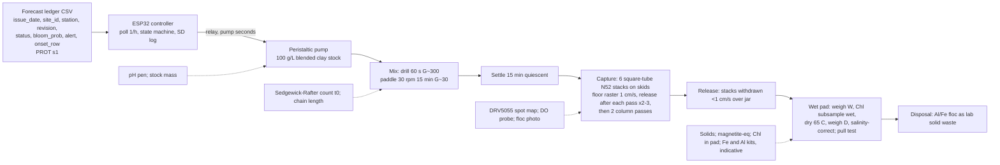

# Forecast-triggered magnetic clay flocculation with magnetic retrieval: design v4 (freeze candidate)

Source keys: [RET] = notes/CLAY_RETRIEVAL_RESEARCH.md, [CLAY] = notes/CLAY_FLOCCULATION_RESEARCH.md, [AER] = notes/AERATION_RESEARCH.md, [PROT] = hab-bloom-predictor-narragansett/notes/PROSPECTIVE_PROTOCOL.md s1, s5, s7 plus `LEDGER_COLS` in `src/deploy/prospective_forecast.py`, [R1]/[R2]/[R3] = review1/2/3.md and their sources, **[A]** = my assumption or calculation. Prices are [R1]/[R2]/[R3] where verified, otherwise **[A]**.

## 0. Changelog from v3

| # | Finding [R3] | What changed |
|---|---|---|
| B1 | Pull test lifts the sample | Gap 30-40 mm (0.02-0.03 T, ~1.5 T/m); vial glued into a >= 100 g holder; calibration 20/50/100/200 mg magnetite; magnet-only zero before and after each reading, drift <= 2 mg. |
| B2 | Synthesis will not pass the DS | Primary route is a **blend**: pigment Fe3O4 : EPK kaolin : PAC powder 40 : 50 : 18 by mass, pasted in seawater, aged 24 h. Co-precipitation kept only as a stretch with DS sign-off: two 25 g half-batches in 4 L beakers on hot-plate stirrers, 2 M NaOH (770 mL) teacher-prepared the day before in an ice bath, titrated to pH 11.0. |
| B3 | Round sleeve sagitta; raster scrapes pad | 1-1/4 in square acrylic tube, 1/8 in wall (ID 25.4 mm, flat face 3.2 mm from the block, ~0.32 T); 3 mm skids; frame locks six stacks 33 mm apart; release into the jar after every raster pass (<= 2 mm pad per pass); tray kept as fallback. |
| B4 | Hall map saturates | DRV5055A4 (+/-169 mT at 5 V); MVP spot map at 5, 10, 20 mm; full 5-40 mm map deferred. |
| B5 | Pad workup loses clay, destroys Chl | No DI rinse. Wet mass W, dry mass D, solids = (D - S·W)/(1 - S) with batch salinity S; Chl subsample taken wet by mass fraction before drying. |
| B6, C | Counting over budget; MVP | January build is the MVP: blended clay, clay-only blank x2, three-arm comparison at 0.2 g/L and 1e4 n = 3, tank runs x3, dose screen 0.05/0.1/0.2 at 1e4. Headline = recovery fraction paired with removal. Two-density D90 program, co-precipitated clay, Heterosigma, 30 d regrowth, full Hall map, 1e5 Chl series and the field concept moved to "Summer 2027 program". |
| B7-B15 | Minors | Draw table 510 per vessel with t0 from the batch bottle; clay demand recomputed for the MVP (~25 g of ~54 g blend); count table by time point (~47 counts); "60 rpm" for the jar rig; 600 m3 = 3.75 h, so two slack windows or a 250 m3 cell, all of s5 "concept, not performed"; seawater ~180 L for the MVP (~260 L full program), 40-50 L/week, dark cold shelf; count unit = cells with mean chain length logged; Fe/Al kits "indicative"; ISEF wording per Society for Science rules. |
| D, E, F | Board, hypotheses, failure tree | Carried verbatim into new sections 9, 10, 11. |

Earlier changelogs (collapsed)

v2 to v3 [R2]: settle-raster-column sequence and 1 in sleeves (1); matched jar vessels and draw table (2); half-log dose series, n = 3, logistic and bootstrap D90 (3); NaOH titration, detachment test, calibrated pull test, acid digest (4); riser pull test, Hall 10-40 mm (5); PAC solids basis (6); bands dropped, lockout by issue_date, VERIFY, enclosed-cell paragraph (7); one-slack 600 m3 cell, bed sled, Rhodamine (8); counting budget (9); ISEF forms, Chl limit, raster first, borosilicate/HDPE (10-13).

v1 to v2 [R1]: pipe dropped for sleeved rods (1); Sedgewick-Rafter counts and extracted Chl (2); low-water cell and floating curtain (3); 1,500 Oe frame dropped (4); NaOH, one batch (5); PAC pilot, magnetite Plan B (6); G stated, drill rapid mix (7); three control arms (8); ledger keys, onset_row gate, feed states (9); BOM, timeline, dose basis, safety, weaknesses (10-15).

## 1. Design decision: blended magnetic PAC-kaolinite + in-tank magnetic rake (no flotation)

**Choice.** A blend of pigment-grade magnetite (Pigment Black 11, 0.2-1 um [R3]), EPK kaolin and PAC powder, 40 : 50 : 18 by mass (~45 wt% magnetite, PAC 5:1 on the mineral solids [CLAY s1; R3 C]), pasted in filtered seawater and aged 24 h; dosed by a controller-driven pump; flocculated by paddle mixing; settled; captured by square-tube NdFeB stacks rastered along the tank floor with release after each pass, then water-column passes; released by withdrawing the stacks over a jar.

**Why a blend, not co-precipitation.** Review 2 showed the co-precipitated product is a kaolinite-magnetite mixture bridged by PAC in seawater either way (composite Ms as low as 6 emu/g against 60-80 for the particles [R2 finding 4]). The blend is the same material with an exactly known magnetite mass, no FeCl3, no hot NaOH and no hood time [R3 B2]; the PJOES recipe [RET s1] is kept as a summer stretch comparison. The marine precedent for a physical magnetite blend is Suga 1982 (Fe3O4 + FeCl3 powders + flocculant on Chattonella) and Hu 2013 (naked Fe3O4 on Nannochloropsis) [RET s1].

**Why not DAF flotation + skim.** The only saline harvest trial (AECOM IRL, 19-20 ppt) fell to 21% Chl-a and 0% TN because "high salinity reduces air saturation as well as the mobility of bubbles and flocs" and waves carried the float blanket into the effluent [RET s2]. LIS is 20-30 ppt with tides and fetch; a surface blanket is the wrong retrieval surface.

**Why not plain PAC-kaolinite that sinks.** Korea/China/Mote practice [CLAY s3] deposits Al- and toxin-bearing floc on the bed [RET s5]; "no permitting document distinguishes removal from deposition" [RET s8]. Kept as the comparison arm and as the magnetic-specificity control.

**Why magnetic retrieval is the right risk.** No magnetic clay has been tested in seawater, on a marine species, or beyond a beaker, and no HAB study has measured the recovered fraction after magnetic capture [RET s9 items 1-2, 7]. The force budget holds: a 70 um floc carries 13-44 ng magnetite; at Ms 60-80 A m2/kg and ~25 T/m the magnetic force (2-6e-8 N) exceeds Stokes drag at 2 cm/s (1.3e-8 N) and buoyant weight by 100x, a 5-10 mm capture shell in front of a pole face [R2 finding 1, C]. Designed-against: ionic strength cuts magnetic-flocculant efficiency (Liu 2009 [RET s1]) and seawater make-up needs ~3x the dose [CLAY s2]; flocs settle at 0.3-1 mm/s and cross 16 cm in 3-9 min [R2], so the floor is where the dose is and the raster comes first; tidal shear makes <50 um oxygen-demanding flocculi [RET s5], so capture follows flocculation directly.

**Headline.** Recovery fraction of dosed magnetite-equivalent (with total dry product beside it), paired with removal at the same dose [R3 C]. The D90 ratio is pre-registered for summer 2027, not claimed in January.

## 2. System diagram

## 3. Bench prototype: the January MVP

**Vessels.** (a) Device tank: 10 gal glass aquarium at 20 L (16 cm depth, 50 x 25 cm floor), for device metrics only: recovery, magnetite fraction, Chl in pad, passes needed, video [R2 finding 2]. (b) Jar rig: 2 L glass jars filled to 1.8 L, three at a time on a three-station rig of identical 12 V **60 rpm** gearmotors on one rail with identical 6 x 2 cm paddles; at 60 rpm the jar P/V is 0.86x the tank's (G ~33 vs ~35 s-1) [R3 A, B10]. Water: LIS seawater from Milford or Stratford ("filtered seawater preferred over artificial (ionic strength matters)" [CLAY s7]) through a 5 um cartridge. **Logistics** [R3 B12]: MVP demand ~180 L (18 jar fills 32 L, five tank fills 100 L, culture make-up 40 L, pilots 8 L); collected 40-50 L per week in two 20 L carboys, stored dark on a cold shelf (<= 10 C **[A]**) and used within two weeks; salinity S and pH recorded per batch.

**Culture.** CCMP1332 *Skeletonema marinoi*: Milford CT isolate, f/2 [CLAY s7], non-toxic; chain diatoms "readily form flocs and can be easily removed" [CLAY s2]; 18-20 C under a cool LED [R1 finding 11]; 250 mL -> 2 L -> 20 L over ~3 weeks [R1], two carboys staggered; target >= 5e5 cells/mL in 20 L by Oct 26 [R3 F]. Heterosigma and Prorocentrum deferred.

**Clay preparation (blend, primary).** For ~54 g of product: 20 g magnetite pigment + 25 g EPK kaolin + 9 g PAC powder (28-30% Al2O3), dry-mixed, pasted in 200 mL filtered seawater, stirred, aged 24 h or until pH >= 5 [R1 finding 6], made up as a 100 g/L stock and kept suspended with an air stone. **Dose = total dry blend mass** (magnetite + kaolin + PAC powder) [R1 finding 12; R2 finding 6]; 0.2 g/L = 4 g per 20 L tank, 0.36 g per 1.8 L jar. Plain-clay arm: 25 g EPK + 5 g PAC powder, same ageing. **Demand** [R3 B8]: two clay-only blanks 8 g, three tank runs 12 g, three-arm magnetic jars 1.1 g, dose screen 1.9 g, detachment test and pilots 2 g: ~25 g of 54 g, a 2x margin; plain arm ~3 g of 30 g.

**Co-precipitation (stretch only, with Designated Supervisor sign-off)** [R3 B2]. Two 25 g half-batches of the PJOES recipe [RET s1] in 4 L beakers on hot-plate stirrers with a thermometer, no water bath: 25 g kaolin in 2.5 L distilled water; 49 g FeCl3·6H2O + 22.5 g FeCl2·4H2O; 2 M NaOH (385 mL per half-batch, 770 mL total) prepared by the teacher the day before in an ice bath; added over 10 min and titrated by pH pen to 11.0 (stoichiometric 31 g NaOH per half-batch); 60 C for 3 h; magnet-settle, decant, wash 3x, dry 65 C. Run only if the DS accepts the supervised afternoon; result reported as a side panel against the blend.

**Material characterisation (week 1, gates Plan B).** (1) **Pull test** [R3 B1]: sample vial glued into a >= 100 g holder (sand-filled plastic jar **[A]**) on the pan on a 10 cm plastic riser; an N52 block on a lab stand above at a fixed 30-40 mm gap (0.02-0.03 T, ~1.5 T/m: 0.2 gf on 0.1 g magnetite, ~3 gf on 2 g, inside a 0.001 g balance's range); calibrated with 20, 50, 100 and 200 mg of the magnetite pigment; magnet-only zero recorded before and after each reading, drift <= 2 mg. Any sample or pad reads out as g magnetite-equivalent. (2) **Seawater detachment test** [R2 finding 4a]: 1 g blend in 1 L filtered seawater on the jar rig at 60 rpm for 15 min, held on a magnet 10 min, decanted; non-magnetic residue dried and weighed; before and after PAC ageing. (3) Acid digest sent to the partner lab or dropped [R3 C]. (4) Week-1 PAC pilot: pull test before and after ageing; > 30% loss of pull or > 30% non-magnetic residue means the blend ratio is raised to 50 wt% magnetite and re-tested [R1 finding 6; R3 F].

**Dosing.** 12 V peristaltic pump, ~60 mL/min **[A]**: 40 mL of 100 g/L stock in 40 s for 4 g. Failure: stock settles; air stone in the reservoir.

**Mixing.** Rapid: school cordless drill with a paint paddle, 60 s at ~300 rpm (G ~300 s-1 **[A]**). Slow: 12 V 30 rpm gearmotor, 15 cm paddle, 15 min, G ~25-35 s-1, Gt ~2-3e4 [R1 finding 7], near the PJOES optimum of 12.9 min [RET s1]. Floc size logged by photographing 1 mL on a ruler slide.

**Capture: stacks, capacity, sequence** [R3 B3]. Six stacks of four N52 blocks 40x20x10 mm (16 cm) in capped 1-1/4 in square acrylic tube, 1/8 in wall (ID 25.4 mm), one pole face flat against a wall so the capture surface is 3.2 mm from the block, ~0.32 T by the block formula [R1 finding 1]; the far face does not count. Frame: wooden bar locking the six stacks 33 mm apart (they attract hard sideways), with 3 mm skids so the tube faces ride just above the floor. Usable pad area per pass = strong pole faces: 6 x 4 x 8 cm2 = 192 cm2. A 4 g dose at 5-10% solids is 40-80 mL of pad, 2-4 mm on 192 cm2; holding force equals drag at 8-14 mm from the pole [R2 finding 1], so each raster pass is limited to <= 2 mm of pad and the stacks are **released into the jar after every pass**. Sequence after the paddle stops at T16 [R2 findings 1, 12]: T16-T31 quiescent settle; T31-T46 floor raster, stacks horizontal, pole faces down, dragged at ~1 cm/s in overlapping 3 cm lanes, one full raster then release, two to three rasters until the floor shows no floc under a torch; T46-T51 two water-column passes, stacks vertical, 2 cm/s, then release; withdrawal always < 1 cm/s. **Hall check** [R3 B4]: one DRV5055A4 (+/-169 mT at 5 V) on the ESP32 spot-reads 5, 10 and 20 mm from a tube face before the first run and is compared with the block formula; the full 5-40 mm map is deferred. **Gating test**: clay-only blank x2 (4 g blend in 20 L filtered seawater, full sequence) must recover >= 70% of dosed solids and >= 80% of dosed magnetite-equivalent **[A, thresholds]** before any culture is dosed; failing that, +2 stacks, then the flat tray [R1 finding 1]; the design is frozen Nov 6 whatever the number [R3 F].

**Pad workup** [R3 B5]. The released pad and rinse are settled in a tared beaker, the supernatant decanted onto the magnet to check for loss, and the wet pad weighed (W). A wet subsample of known mass fraction is taken for Chl (acetone extraction, 664/750 nm [R1 finding 2]). The rest is dried at 65 C and weighed (D). Solids = (D - S·W)/(1 - S) with the batch salinity S as a mass fraction (0.028 at 28 g/L). No DI rinse: DI deflocculates kaolinite and would carry the non-magnetic fraction out with the decant. The dried pad is pull-tested for magnetite-equivalent.

**Instruments.** Sedgewick-Rafter 1 mL chamber with Lugol [R1 finding 2; CLAY s7]: count unit is cells, with mean chain length logged per sample because flocculation biases chain length [R3 B13]; >= 400 cells where density allows, capped at 200 cells or 500 grids at low density with the Poisson CI [R2 finding 9]. Extracted Chl-a at t0 and 5 h (250 mL, 47 mm GF/F): reportable only for RE <= ~70% at 1e4 [R2 finding 11], so counts are primary. School balance, DO meter, spectrophotometer. API Fe kit (freshwater kit) and LaMotte 3569-01 Al kit (ECR, Fe-interfered): both **indicative** on the board [R3 B14]. pH pen; DRV5055A4.

**Three-arm comparison (jar rig, matched vessels).** Untreated, plain PAC-kaolinite, magnetic blend, at 0.2 g/L and 1e4 cells/mL, n = 3, one replicate of each arm per weekly culture batch, three batches. Per-vessel draws (1,800 mL working volume) [R3 B7]:

| Draw | Volume | When |
|---|---|---|
| 5 h count | 5 mL | 5 h |
| 5 h Chl | 250 mL | 5 h |
| Fe and Al (treated arms only) | 50 mL | 5 h |
| 24 h count | 5 mL | 24 h |
| Regrowth aliquot to a flask (7 d) | 200 mL | 24 h |
| **Per-vessel total** | **510 mL** | |

The t0 count and t0 Chl come from the common batch bottle before splitting. DO and pH are read in situ. Draws by pipette 2 cm below the surface [CLAY s7].

**Dose screen (MVP H11c).** Magnetic blend only, 1e4 cells/mL, 0.05, 0.1, 0.2 g/L, n = 3 (9 jars, three per weekly batch, run as a second rig round from the same batch bottle), sharing the three-arm untreated jars as controls. Control-normalised RE = (1 - (Ct/C0)/(Ct,ctl/C0,ctl)) x 100 [CLAY s7; R1 finding 8]; two-parameter logistic RE = 100/(1 + exp(-k(log10 D - log10 D50))) fitted in the base env; bootstrap CI on the fitted D90; the controller dose is the lowest screened dose with mean RE >= 70%, default 0.2 g/L.

**Count table** [R3 B9]:

| Source | Counts |
|---|---|
| Batch t0 (3 batches) | 3 |
| Three-arm jars, 5 h and 24 h (9 jars) | 18 |
| Dose-screen jars, 5 h (9 jars) | 9 |
| Tank runs, t0, 5 h, 24 h (3 runs) | 9 |
| Inter-counter duplicates | 5 |
| Regrowth 7 d (three-arm, 1 per arm per batch) | 9 |
| **Total** | **~53** |

At ~35 min each, ~31 h. Calendar: Nov 9 to Dec 18 is six weeks less Thanksgiving = five, so one counter at 6 h/week covers it; a second counter (classmate trained on Skeletonema chains, or the partner lab if the DEEP/UConn reply lands) counts the five duplicates for agreement [R3 B6].

**Tank run protocol (device metrics, three runs at 1e4 and 0.2 g/L).** T-24 h age clay; T-1 h fill 20 L culture, count, Chl 250 mL, DO, pH, salinity. T0 controller reads a test ledger row (alert and onset_row true), pump 40 s. T0-T1 drill. T1-T16 paddle. T16-T31 settle. T31-T51 rasters with release, then column passes. T51: count, DO, Fe, Al from 2 cm below surface; 24 h count; pad workup; regrowth at 7 d on 1 L [CLAY s7].

**The numbers.** (1) Removal at 5 h, control-normalised, from counts, n = 3 jars, with CI; plain-clay arm beside it. (2) Recovery from the tank runs: magnetite-equivalent in pad / magnetite dosed (pull test, both known exactly for the blend); total solids recovered / product dosed (salinity-corrected); algal share = Chl in wet pad / Chl at t0; plain clay recovered by the same sweep as the specificity control. (3) MVP dose screen: RE vs dose at 1e4 with a fitted D90 and CI; the two-density D90 ratio is a summer 2027 test.

**Bill of materials (MVP).** School provides at $0: spectrophotometer, cuvettes, 0.001 g balance, hot plate stirrer, oven, fume hood, Buchner + vacuum, drill, DO meter, microscope, 90% acetone, 4 L beakers and 2 M NaOH if the stretch runs. Cultures excluded.

| Item | $ |
|---|---|
| 10 gal glass aquarium | 25 |
| 6 x 2 L glass jars | 24 |
| Jar rig: 3 x 60 rpm gearmotors, frame, paddles | 28 |
| 2 x 20 L carboys + 5 um cartridge | 25 |
| EPK kaolin 5 lb | 12 |
| PAC powder 1 kg | 15 |
| Magnetite pigment (Pigment Black 11) 500 g | 20 |
| Tank gearmotor + paddle | 18 |
| 1-1/4 in square acrylic tube 1/8 in wall, caps, epoxy, frame with skids | 35 |
| 24 x N52 40x20x10 mm ($4) | 96 |
| 2 x DRV5055A4 + breakout | 6 |
| Peristaltic pump | 16 |
| ESP32, 2-ch relay, microSD + card | 22 |
| 12 V 5 A supply, fuse, box, wire | 23 |
| Sedgewick-Rafter chamber | 60 |
| Lugol's 100 mL | 12 |
| GF/F 47 mm, 25 pk | 40 |
| Fe kit / LaMotte Al kit 3569-01 (indicative) | 12 / 80 |
| pH pen | 12 |
| PPE | 15 |
| f/2 medium / 20 L jug + LED | 30 / 30 |
| Pull-test holder, vials, stand clamp, riser | 10 |
| Jars, tubing, ties | 10 |
| **Buy-everything total (MVP)** | **676** |
| Stretch only if DS signs off: FeCl3·6H2O 2 x 100 g + FeCl2·4H2O 100 g | +48 |

With six named borrows the purchase total is **$429**: Al kit from the DEEP/UConn partner or school Hach kit (-80), Sedgewick-Rafter chamber from the partner lab (-60), f/2 from the partner lab (-30), LED + jug from school (-30), 12 V brick from scrap (-23), 2 L jars from chemistry stock (-24). With only the Al kit, f/2, LED/jug and PSU borrowed the total is $513.

## 4. Controller

ESP32 polls hourly an HTTP endpoint on the laptop serving the newest ledger rows for the configured (`site_id`, `station`) [PROT s7; LEDGER_COLS]. Fields: `issue_date`, `site_id`, `station`, `revision`, `status`, `bloom_prob`, `threshold`, `alert`, `onset_row`, `chl_today`, `chl_p75_site`.

**Keying** [R1 finding 9a]: (`issue_date`, `site_id`, `station`), highest `revision` wins; a later revision supersedes the decision but a dose already given is not repeated.

**Decision** on a new key or revision:
- `status` not `ok` (`stale`, `warmup`, `feed_down` [PROT s1]) -> HOLD_STATUS.
- `alert == True` (`bloom_prob >= threshold`, 0.50 [PROT s1]) AND `onset_row == True` (chl today <= station p75, the protocol's primary stratum [PROT s5; R1 finding 9b]) AND not locked out -> DOSE at the single controller dose from the dose screen (default 0.2 g/L, product basis). Probability is go/no-go only [R1 finding 9d]; density bands are dropped because both sat under the onset gate [R2 finding 7].
- **Lockout** = skip the next distinct `issue_date` after a dose; eligible again at the second issuance [R2 finding 7].
- **VERIFY**: 24 h after a dose a count is entered (bench: manual; field: in-situ fluorometer **[A]**); pass = count < 0.3 x C0. On fail the lockout is lifted for one further dose at the next alerting row, then a hard stop pending human review.

**Feed states** [R1 finding 9c]: NO_NEW_ROW (reachable, key unchanged) is green idle; ENDPOINT_UNREACHABLE (three failed polls) is red and hold; parse failure holds with the raw line logged. Never doses from a cached row. Logging: every poll and action to microSD (`ts, issue_date, site_id, station, revision, status, bloom_prob, alert, onset_row, state, dose_g_L, pump_s, verify`), echoed on serial; a second 10-minute timer relay in series guards a stuck relay. Gate: an unattended dose from a test ledger row by Dec 4; fallback is a manual trigger from the printed row, shown on video [R3 F]. The configured station must be one of the protocol's 20 [PROT s1].

**Why pre-emption is an enclosed-cell concept.** The claim behind the onset gate is that removing cells at ~1e4 cells/mL today prevents the exceedance the model forecasts within 7 days. Regrowth suppression of 30-80 d is a beaker result [CLAY s2]; in a marina slip that exchanges its water every tide ("re-anoxifies within one tidal cycle" [AER s4]) the seed population is replaced from outside, so a pre-emptive dose in a slip removes cells without changing the forecast outcome [R2 finding 7]. Pre-emption is defensible only where exchange is restricted: a salt pond, a sluiced embayment, an oyster upweller basin or a mesocosm. In a slip the device demonstrates removal without deposition, and the forecast's value is timing and dose, not prevention.

## 5. Field concept (concept, not performed; summer 2027 at the earliest)

**Cell and curtain** [R2 finding 8]. A floating turbidity curtain per DOT practice with the skirt ending 0.3-0.6 m above the bed at mean low water, never touching it; curtains "slow water movement, not stop it" [R2]. Cell 0.03 ha x 2 m at MLW = 600 m3; at 160 m3/h (the IRL barge's 700 gpm [RET s2]) that is 3.75 h, so either two to three slack windows or a 250 m3 cell (~1.6 h) [R3 B11]. Dosing begins one hour before low-water slack at Milford Harbor (mean range 2.0-2.4 m [R1]).

**Rig.** Dock-mounted, seasonal, removable, on a finger pier, the host [AER s2, s7] chose for aeration, under DEEP COP/GP and USACE GP-41 GP 1 [AER s7]. Slurry at 150 g/L [R1] in one IBC (120 kg product; 3 IBCs at the 3x seawater factor [CLAY s2]). Flocs reach a 2 m bed in 0.5-2 h [R2], so the intake is a bed-vacuum head towed inside the cell, feeding a rotating low-intensity magnetic drum (<0.3 T, 0.05-0.1 kWh/m3 [RET s1; R2]) scraping into two 1 m3 sludge totes (five at 3x). Power: marina shore 120 V; solar + LiFePO4 for controller and dosing only **[A]**.

**Deposition survey and metric** [R2 finding 8]. A bed-magnet sled (three square-tube stacks on a weighted frame) dragged along fixed transects inside and outside the curtain before dosing and after the ebb; magnetic material per metre dried and pull-tested. Metric: **fraction of dosed magnetite recovered** = (drum sludge + sled inside) / dosed; sled mass outside is escaped deposition.

**Tracer.** Rhodamine WT at ~10 ppb (6 g in 600 m3), fluorometer borrowed from the partner or DEEP (0.1 ppb detection), pre-dye background, inside and outside over >= 2 tidal cycles; dye is a discharge, released only with DEEP sign-off [R2 finding 8].

**Mass balance, 0.2 g/L, 600 m3.** Product 120 kg (360 kg at 3x); algae 0.3 kg dry at 1e4 cells/mL, ~1.2 kg at 20 ug Chl/L [R1 finding 13]; wet floc at 8% solids [RET s6] ~1.5 t (4.5 t); N at 3.1% of ash-free dry mass [RET s6] 0.01-0.04 kg from algae plus adsorbed dissolved TN (44-72% for S. costatum [CLAY s2]) of order 0.15 kg. No nutrient-credit number goes on the board ("no case found where harvested N or P was credited" [RET s6]).

**Permits.** DEEP LWRD COP or GP; USACE GP-41 GP 1; clay and dye releases inferred discharges under CGS 22a-430 [CLAY s6; AER s7]; Florida precedents needed an NPDES-type permit and a permitted area [RET s8]. Student scope stays bench or contained mesocosm [CLAY s6].

## 6. Safety and ISEF

PAC powder is an acidic aluminum coagulant: gloves, goggles, dust mask, Al floc as lab solid waste [CLAY s7]; effluent carries dissolved Al and is bleached, diluted and disposed per school drain policy, or collected [R1 finding 14]. Blend route: dry powders weighed under the hood with a dust mask; no hot chemistry. Stretch route only: FeCl3 and FeCl2 corrosive; 2 M NaOH prepared by the teacher in an ice bath; 60 C on a hot-plate stirrer with a thermometer, never a closed vessel, Designated Supervisor present throughout [R3 B2]. Magnets: N52 blocks pinch, shatter and snap together; stacks assembled one at a time in the locking frame; SD card and phones kept away [R1 finding 14]. Electrical: everything touching water is 12 V behind a GFCI; hot plate and drill on a separate bench. Cultures: Skeletonema non-toxic; used culture bleached.

**ISEF paperwork** [R3 B15]. Form 1 (Checklist for Adult Sponsor), Form 1A (Student Checklist and Research Plan), Form 1B (Approval Form), Form 3 (Risk Assessment) for hazardous chemicals (PAC; FeCl3 and NaOH if the stretch runs), the home-built electrical device, and the protist cultures (Form 3 only, no SRC pre-review). Designated Supervisor: the school chemistry teacher, named on Forms 1 and 3. Order: Adult Sponsor completes Form 1 and reviews 1A; Designated Supervisor and Adult Sponsor sign Form 3 **before experimentation**, with no SRC pre-approval required for hazardous chemicals or devices; student, parent and Adult Sponsor sign Form 1B before the first bench work on Oct 5; the forms are uploaded at CSEF registration (CSEF is an ISEF affiliate) and the SRC may query.

## 7. Timeline to 2027-01-15 (MVP)

- Sep 21: order CCMP1332 (arrival ~Oct 6 [R1]), kaolin, PAC powder, magnetite pigment, 24 blocks, square tube, DRV5055A4, electronics; book hood and instruments; Forms 1, 1A, 3, 1B drafted with the counselor; DS asked about the stretch synthesis.
- Sep 28: ESP32 state machine, relay, SD, test-ledger endpoint; square-tube stacks and locking frame with skids; jar rig; pull-test holder and 20-200 mg calibration line; DRV5055 spot map.
- Oct 5: Forms 3 and 1B signed. Week-1 chemistry: 54 g blend, PAC pilot with pull test before and after, detachment test; decision by Oct 9. Culture arrives, 250 mL started.
- Oct 12-19: clay-only blank #1 and #2 (gate, decide Oct 23; retry Oct 30); culture to 2 L; seawater 40-50 L/week begins.
- Oct 26: culture to 20 L, target >= 5e5 cells/mL; three-arm dry run with clay only; design frozen Nov 6.
- Nov 9, 16, 30: three weekly batches, each: three-arm jars (rig round 1) and dose-screen jars (rig round 2); counts at 5 h and 24 h; regrowth flasks.
- Nov 20: counting checkpoint (>= 40% of counts done).
- Dec 4: controller gate, unattended dose from a test ledger row.
- Dec 7-18: tank runs x3 (removal, recovery, video), Fe/Al indicative, DO, pad Chl.
- Dec 21-Jan 8: CIs, logistic fit for the dose screen, inter-counter agreement, jars labelled, board panels; SCIENTIFIC_METHOD.md Phase 11 updated with outcomes.
- Jan 11-15: demo dry run; buffer.

Board: 60 s tank video (test ledger row, dose, floc, settle, floor raster with release, column pass, magnet withdrawal, floc drop), the dried recovered-pad jar beside the dosed-blend and untreated-control jars, the pull-test calibration line, and the numbers with n and CI.

## 8. Known weaknesses

1. The blend is a physical mixture; recovery of kaolin depends on PAC bridging it to magnetite in seawater, and the detachment test is the only check [R2 finding 4; R3 B2].
2. Per-pass pad limit of ~2 mm means two to three raster-and-release cycles for 4 g; passes-to-clear is reported but adds handling loss [R3 B3].
3. At 1e4 cells/mL removal rests on counts alone (capped at 200 cells at low density); Chl reports only RE <= ~70% [R2 findings 9, 11].
4. The MVP dose screen spans 0.05-0.2 g/L at one density; if RE is already >= 90% at 0.05 g/L the fitted D90 is a lower bound and H11c (MVP) reads "not testable" [R3 E].
5. Pull-test readings of 0.2-3 gf sit near the balance's drift floor; the magnet-only zero and the 2 mg drift rule are the only protection [R3 B1].
6. n = 3 jars per arm and n = 3 tank runs; one species, one dose, 7 d regrowth only.
7. Fe and Al kits are indicative; a real Al number needs the partner lab [R3 B14].
8. Pre-emption is not credible in a flushed slip; all of section 5 is concept, not performed [R2 findings 7-8; R3 B11].
9. Seawater collection (~180 L over five weeks) and a single Sedgewick-Rafter chamber are single points of failure [R3 B6, B12].
10. Budget meets $500 only with borrows: $676 buy-everything, $429 with six borrows, $513 with four.

## 9. Board panel text

Carried verbatim from review 3 section D; X, Y, Z, W, V are filled from the January results.

1. "In 20 L of filtered Long Island Sound seawater, a magnetite-kaolinite-PAC clay dosed at 0.2 g/L when a test forecast row alerted removed X% [95% CI a-b] of *Skeletonema marinoi* cells within 5 h (n = 3 jars, control-normalised), against Y% for plain PAC-kaolinite."
2. "A magnet sweep of the tank floor then recovered Z% [range over n = 3 runs] of the dosed magnetite and W% of the total dry clay; the same sweep recovered under V% of the plain clay. Korean and Chinese practice leaves the floc on the seabed; no published study had measured the recovered fraction in seawater."
3. "This is a bench result for one non-toxic diatom. It does not show that blooms are prevented, that nitrogen or phosphorus are removed from the Sound, or that bottom habitat is unaffected; those need a permitted mesocosm."

Phrasing a judge should reject: "prevents blooms", "removes nutrients/nitrogen", "no habitat impact", "90% efficient" without n and CI, "field-ready", "scalable to LIS", "toxin-free", any nutrient-credit number from s5.

## 10. Pre-registered hypotheses (for SCIENTIFIC_METHOD.md Phase 11)

Carried verbatim from review 3 section E; to be entered before Oct 19.

**H11a (removal).** Magnetic PAC-kaolinite at 0.2 g/L (product basis, seawater make-up) removes *S. marinoi* at 1e4 cells/mL by **70-95%** at 5 h (control-normalised Sedgewick-Rafter counts), and within **+/-15 points** of plain PAC-kaolinite at the same dose. Basis: kaolinite-PAC 100% at 0.1-0.3 g/L on *A. minutum* at 1e4 [CLAY s2]; MCII 91% on *Karenia* at 0.2 g/L, 5 h [RET s5]; seawater make-up needs ~3x dose and ionic strength cuts magnetic-flocculant efficiency [CLAY s2; RET s1]. Pass: mean RE >= 70% with the n = 3 CI lower bound > 50%, and |magnetic - plain| <= 15 points. Fail below 50%: rerun at 0.6 g/L and report both.

**H11b (recovery).** The settle-raster-column sequence recovers **75-95%** of dosed magnetite-equivalent and **>= 70%** of total dry product in the clay-only blank, **60-90% / 50-85%** with culture, and **<= 10%** of plain PAC-kaolinite (magnetic specificity control). Basis: freshwater magnetic-flocculant particle recovery 84-97.5% [RET s1]; composite Ms as low as 6 emu/g and free-magnetite detachment [R2#4]. Pass: mean magnetite-equivalent >= 70% over n = 3 runs, each >= 60%; total >= 50%; plain <= 10%. A blank below 70/80 is a design failure, not a hypothesis failure (F).

**H11c (dose-density).** Full version (summer 2027): D90(1e5)/D90(1e4) in **1.5-4x**; pass if the bootstrap 95% CI lower bound > 1.0 with D90(1e4) resolved inside the series (>= 0.025 g/L); if D90(1e4) is below the series, report a lower bound and record H11c as "not testable", not failed. MVP version (January): RE at 1e4 rises monotonically over 0.05-0.2 g/L and D90 lies in **0.05-0.2 g/L**; pass if the fitted D90 CI sits within 0.025-0.4 g/L. Basis: removal falls with initial density [CLAY s2, Yu 2017]; *A. pacificum* ~75% at 0.2 to ~99% at 1 g/L.

## 11. Gates and fallbacks

Carried verbatim from review 3 section F.

| Gate | Decide by | Pass | Fallback | Board shows if it fails there |
|---|---|---|---|---|
| Forms 1/1A/1B/3 signed; DS accepts chemistry | Oct 5 | Signed | DS refuses synthesis: blend route (C); refuses hot Fe/NaOH only: teacher prepares reagents | Unchanged |
| Week-1 chemistry (PAC pilot, pull, detachment) | Oct 9 | < 30% pull loss, < 30% non-magnetic residue | Blend route becomes the only route | Unchanged |
| Batch yield (if synthesis run) | Oct 16 | >= 60 g product, pull >= 50% of magnetite-limited expectation | Blend route | "Blend used; synthesis result as a side panel" |
| Culture scale-up | Oct 26 (>= 5e5 cells/mL in 20 L) | Density met | Re-order (2 wk) or partner culture; if none by Nov 16, run clay-only work | Recovery number only; removal cited from literature and labelled "not measured here" |
| Clay-only blank | Oct 23; retry Oct 30 | >= 70% total, >= 80% magnetite-eq | Square tube, skids, +2 stacks, then tray; freeze design Nov 6 whatever the number | The measured recovery, however low, as the finding ("magnetic retrieval recovered X% under these conditions") |
| Counting checkpoint | Nov 20 | >= 40% of planned counts done | Apply cut order; MVP already cut | Fewer n, CIs wider, stated |
| Tank runs | Dec 18 | 3 runs complete | Report n = 2 | n on the panel |
| Controller | Dec 4 | Doses from a test ledger row unattended | Manual trigger from the printed row; video shows the row | "Trigger demonstrated manually" |

## 12. Summer 2027 program (deferred from the January build)

Pre-registered but not performed before CSEF; each item carries its v3 design unchanged unless noted.

1. **Two-density D90 program**: doses 0.025-0.8 g/L half-log, densities 1e4 and 1e5, n = 3, magnetic and plain arms plus untreated (78 jars, ~126 counts, two counters, ~260 L seawater); logistic fits, 1,000x bootstrap D90 and the 1e4/1e5 ratio (H11c full version) [R2 finding 3; R3 B12].
2. **Co-precipitated clay vs blend**: the PJOES recipe [RET s1] as two 25 g half-batches with teacher-prepared 2 M NaOH, characterised by pull test, detachment test and acid digest, compared with the blend at equal magnetite-equivalent [R3 B2].
3. **Heterosigma (CCMP452)**, the hardest LIS species (60% at 0.2 g/L [CLAY s2]).
4. **30 d regrowth** on the three-arm flasks [CLAY s2, s7].
5. **Full Hall map** 5-40 mm with the DRV5055A4 and the block formula fitted to the face [R3 B4].
6. **1e5 Chl series** where extracted Chl is a valid primary metric [R2 finding 11].
7. **Field concept** (section 5): permitted mesocosm or enclosed cell, bed-magnet sled survey, Rhodamine tracer with DEEP sign-off; all of it "concept, not performed" on the January board [R3 B11].
