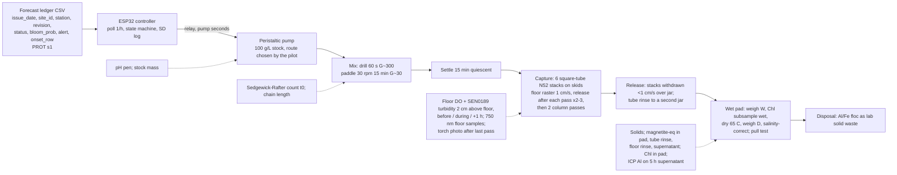

# Forecast-triggered magnetic clay flocculation with magnetic retrieval: design v5

Source keys: [RET] = notes/CLAY_RETRIEVAL_RESEARCH.md, [CLAY] = notes/CLAY_FLOCCULATION_RESEARCH.md, [AER] = notes/AERATION_RESEARCH.md, [PROT] = hab-bloom-predictor-narragansett/notes/PROSPECTIVE_PROTOCOL.md s1, s5, s7 plus `LEDGER_COLS` in `src/deploy/prospective_forecast.py`, [R1]/[R2]/[R3] = review1/2/3.md, [V] = verification.md (scientist verification of v4) and its sources, **[A]** = my assumption or calculation. Prices are [R1]/[R2]/[R3] where verified, otherwise **[A]**.

## 0. Changelog from v4

| Verifier section, finding [V] | What changed |
|---|---|
| V1 seawater-aged stock under-flocculates (Yu 2016; EPA "baseball aggregates") | Stock-preparation pilot added: three stocks (DI-aged and DI-held, seawater-aged as v4, PAC pre-diluted 20 min before plain clay + magnetite), n = 2, six jars, 1e4 cells/mL, 0.2 g/L, 5 h counts; clay-only floc-size precursor in week 1; decision rule (>15 points) and date (culture-gated, decide by Oct 30, before the Nov 6 freeze). Two 40 g half-blends made (DI-aged, seawater-aged). |
| V2, V3 raster resuspends its floor; misses unattributed | Floor DO and turbidity logged 2 cm above the floor before, during and 1 h after the raster (DO meter tip; SEN0189 relative log; 750 nm samples); resuspension index = tank T51 count / jar 5 h count; every recovery miss attributed by torch photo of the floor, tube rinse, tank-floor rinse and supernatant pull tests; a closed mass balance reported. |
| V8 pull-test drift | Daily calibration line (20/50/100/200 mg), r^2 >= 0.99 required, magnet-only zero before and after, <= 2 mg drift, CSV log; readings discarded on a failed day. |
| V8 risk 3, H11a reading | Pre-registered reading added: mean >= 70% with CI lower bound in 40-50% reads "consistent, underpowered", not failed. |
| V3 dissolved Al; Al kit unsupported | Partner-lab ICP-OES aluminum on one 5 h supernatant per arm plus a seawater blank (4 samples), sampling and cost stated; LaMotte kit demoted to indicative screening only. |
| V2 natural magnetite in LIS bed | Pre-dose sled baseline on every transect, 63 um wet-sieve to separate 0.2 um pigment from detrital grains; concept only. |
| V5, V6 field sequence inconsistent with tidal timing; permits | Section 5 rewritten around the two consistent versions: (a) closed-bottom mesocosm, (b) capture during flocculation by pumping the cell through the drum; slack-window arithmetic redone for each; bed-vacuum-at-flood version dropped; permit path per V6; still "concept, not performed". |
| V8 board sentences | Sentence 1 split into jar removal and tank trigger; sentence 2 qualified to "no HAB clay study"; "predicts blooms" and "removes aluminium" added to the reject list. |
| V7 trigger wastes doses | Wasted-dose arithmetic added to section 4; the gate is described as a p75-exceedance trigger, never as bloom prediction. |
| Self-audit | BOM re-summed ($696 buy-everything; $449 with six borrows; $533 with four; ICP +$0-120 conditional); count table (~60 counts, ~35 h); clay demand (~31 g of 80 g); seawater (~200 L); dates checked against the 2026 calendar (Thanksgiving Thu Nov 26); ISEF order restated. |
| New | Section 13 "Open issues". |

Earlier changelogs (collapsed)

v3 to v4 [R3]: pull test at 30-40 mm gap with >= 100 g holder and 20-200 mg calibration (B1); pigment-magnetite blend primary, co-precipitation stretch with 2 M teacher-prepared NaOH (B2); square acrylic tube stacks with skids and per-pass release (B3); DRV5055A4 (B4); wet/dry pad workup with salinity correction, Chl subsample wet (B5); MVP adopted, full program to summer 2027 (C); minors B7-B15; board text, H11a-c and failure tree carried verbatim (D, E, F).

v2 to v3 [R2]: settle-raster-column sequence and 1 in sleeves (1); matched jar vessels and draw table (2); half-log dose series, n = 3, logistic and bootstrap D90 (3); NaOH titration, detachment test, calibrated pull test, acid digest (4); riser pull test, Hall 10-40 mm (5); PAC solids basis (6); bands dropped, lockout by issue_date, VERIFY, enclosed-cell paragraph (7); one-slack cell, bed sled, Rhodamine (8); counting budget (9); ISEF, Chl limit, raster first, borosilicate/HDPE (10-13).

v1 to v2 [R1]: pipe dropped for sleeved rods (1); Sedgewick-Rafter counts and extracted Chl (2); low-water cell and floating curtain (3); 1,500 Oe frame dropped (4); NaOH, one batch (5); PAC pilot, magnetite Plan B (6); G stated, drill rapid mix (7); three control arms (8); ledger keys, onset_row gate, feed states (9); BOM, timeline, dose basis, safety, weaknesses (10-15).

## 1. Design decision: blended magnetic PAC-kaolinite + in-tank magnetic rake (no flotation)

**Choice.** A blend of pigment-grade magnetite (Pigment Black 11, ~0.2 um, Fe3O4 > 96.8%, not classified hazardous [V1; R3]), EPK kaolin and PAC powder, 40 : 50 : 18 by mass (~45 wt% magnetite, PAC 5:1 on the mineral solids [CLAY s1; R3 C]); dosed by a controller-driven pump; flocculated by paddle mixing; settled; captured by square-tube NdFeB stacks rastered along the tank floor with release after each pass, then water-column passes. **Stock preparation is now an experimental variable** (section 3): the two best sources on PAC-clay in seawater say that a stock aged and held in seawater aggregates clay-to-clay and makes smaller flocs (Yu 2016: +5.9 mV, "larger flocs ... when PAC-MC suspension prepared by deionized water was added"; EPA/WHOI: PAC-pretreated clay formed "baseball-sized aggregates" that sank leaving cells behind, while diluting PAC first gave a 2-5x RE gain) [V1], which is the 0.6 vs 0.2 g/L factor in [CLAY s2]. v4's seawater-aged stock was chosen to buffer acid attack on magnetite [R1 finding 6] without examining that trade.

**Why a blend, not co-precipitation.** The co-precipitated product is a kaolinite-magnetite mixture bridged by PAC either way [R2 finding 4]; the blend has an exactly known magnetite mass and no hot chemistry [R3 B2]. Industrial precedent for magnetite enmeshed in a hydroxide floc and recovered by magnet is the CoMag ballasted-clarification process (> 99% ballast recovery, freshwater) [V2]; marine beaker analogues are Cerff 2012, Hu 2013 and Fe3O4@SiO2@PAC seeds in ballast water [V2; RET s1]. In seawater 0.2 um magnetite coagulates with a perikinetic half-life of ~40 s, so during the drill mix it hetero-coagulates into whatever is present [V2]; the detachment test is the gate.

**Why not DAF flotation + skim.** The only saline harvest trial (AECOM IRL, 19-20 ppt) fell to 21% Chl-a and 0% TN because "high salinity reduces air saturation as well as the mobility of bubbles and flocs" and waves carried the float blanket into the effluent [RET s2].

**Why not plain PAC-kaolinite that sinks.** Korea/China/Mote practice [CLAY s3] deposits Al- and toxin-bearing floc on the bed [RET s5]; "no permitting document distinguishes removal from deposition" [RET s8]. Kept as the comparison arm and the magnetic-specificity control.

**What retrieval does and does not change [V3].** "Retrieved is better for benthos" is unsupported: no study compares sunk against retrieved floc, sedimented clay was benign to juvenile clams while clay kept suspended cut growth ~90%, and the documented harm is resuspension. Dissolved Al (5.1 mg/L Al added at 0.2 g/L, residual set by PAC dose and pH, likely above the 24 ug/L marine guideline for hours) is independent of retrieval. So the MVP measures what retrieval actually does: it removes particulate floc from the floor, and it may resuspend some of it doing so. Both are logged (section 3).

**Why magnetic retrieval is still the right risk.** No HAB clay study has measured the recovered fraction in seawater [RET s9 items 1-2, 7; V8]. Flocculation at 1e4 cells/mL is above the EPA/WHOI ~1,000 cells/mL threshold, sweep-floc collisions give ~80 encounters per cell in the 15 min slow mix, and the only Skeletonema-in-seawater number (> 81% at 0.10 g/L + 4 ppm PAC, Corpus Christi mesocosms) is favourable [V1]. The force budget for capture holds for floc-bound magnetite; free 0.2 um fines are not captured by a moving raster, so magnetite-equivalent recovery measures floc incorporation, which is the quantity wanted [V2].

**Headline.** Recovery fraction of dosed magnetite-equivalent (with total dry product and the attributed misses beside it), paired with removal at the same dose [R3 C].

## 2. System diagram

## 3. Bench prototype: the January MVP

**Vessels.** (a) Device tank: 10 gal glass aquarium at 20 L (16 cm depth, 50 x 25 cm floor), device metrics only [R2 finding 2]. (b) Jar rig: 2 L glass jars filled to 1.8 L, three at a time on a three-station rig of identical 12 V 60 rpm gearmotors on one rail with identical 6 x 2 cm paddles; jar P/V is 0.86x the tank's (G ~33 vs ~35 s-1) [R3 A]. Water: LIS seawater from Milford or Stratford [CLAY s7] through a 5 um cartridge. **Seawater logistics** [R3 B12; self-audit]: MVP demand ~200 L (stock pilot 11 L, 18 three-arm and dose-screen jar fills 32 L, five tank fills 100 L, culture make-up 40 L, floor rinses and pilots 15 L); 40-50 L per week in two 20 L carboys over five collection weeks, dark cold shelf (<= 10 C **[A]**), used within two weeks; salinity S and pH per batch.

**Culture.** CCMP1332 *Skeletonema marinoi*: Milford CT isolate, f/2 [CLAY s7], non-toxic; chain diatoms floc readily [CLAY s2; V1]; 18-20 C under a cool LED [R1 finding 11]; 250 mL -> 2 L -> 20 L over ~3 weeks [R1]; two carboys staggered; target >= 5e5 cells/mL in 20 L by Mon Oct 26 [R3 F]. Mean chain length logged with every count [R3 B13].

**Clay preparation (blend, primary).** Two 40 g half-blends, each 15 g magnetite pigment + 18.5 g EPK kaolin + 6.5 g PAC powder (28-30% Al2O3), dry-mixed: **route S** pasted in 150 mL filtered seawater, aged 24 h, held as a 100 g/L seawater stock (v4); **route D** pasted in 150 mL DI water, aged 24 h, held as a 100 g/L DI stock and pumped into seawater only at dosing (the IOCAS practice of modifying in fresh water and dispersing at dosing [V1; CLAY s1]; the 40 mL of DI in 20 L freshens the tank by 0.2%, negligible **[A]**). **Route P** (PAC-first): PAC powder dissolved and pre-diluted into the jar 20 min before plain kaolin + magnetite (35 : 15 by mass) is added [V1, EPA/WHOI 2-5x gain]. Pull test before and after ageing on both blends (acid attack on magnetite in the DI paste, pH ~3-4 for 24 h [R1 finding 6]). **Dose = total dry blend mass** [R1 finding 12; R2 finding 6]: 0.2 g/L = 4 g per 20 L, 0.36 g per 1.8 L jar. Plain-clay arm: 25 g EPK + 5 g PAC powder, same route as the winner. **Demand** [R3 B8; self-audit]: week-1 clay-only stock trials 3 g, stock pilot 2.9 g, two clay-only blanks 8 g, three tank runs 12 g, three-arm magnetic jars 1.1 g, dose screen 1.9 g, detachment tests 2 g: ~31 g, drawn from the winning 40 g half-blend plus the loser for clay-only work; plain arm ~3 g of 30 g.

**Co-precipitation (stretch only, with Designated Supervisor sign-off)** [R3 B2]. Two 25 g half-batches of the PJOES recipe [RET s1] in 4 L beakers on hot-plate stirrers with a thermometer: 25 g kaolin in 2.5 L distilled water; 49 g FeCl3·6H2O + 22.5 g FeCl2·4H2O; 2 M NaOH (385 mL per half-batch) prepared by the teacher the day before in an ice bath, added over 10 min and titrated by pH pen to 11.0; 60 C for 3 h; magnet-settle, decant, wash 3x, dry 65 C. Side panel only.

**Stock-preparation pilot [V1] (required edit a).** Purpose: decide the stock route before the Nov 6 freeze. Week 1 (Mon Oct 5-Fri Oct 9), clay only: routes S, D and P at 0.2 g/L in 1.8 L filtered seawater on the jar rig, floc size by ruler-slide photo at 15 min, detachment test on each. Culture-gated pilot: as soon as the 2 L culture reaches >= 1e5 cells/mL (target Mon Oct 26), one afternoon: six jars at 1e4 cells/mL, 0.2 g/L, routes S, D and P, n = 2, drill 60 s, 60 rpm 15 min, 5 h Sedgewick-Rafter counts, one batch t0 count, control-normalised against the untreated clay-only week (no untreated jar here; the three-arm batches supply that later, so the pilot compares routes against each other, not absolute RE **[A]**). **Decision rule**: if route D or P beats route S by > 15 RE points (mean of two), that route becomes the recipe for every later run; if within 15 points, route S stays (it is the unattended-dosing-friendly one); decide by Fri Oct 30. If the culture is late, the pilot runs on Nov 9 with batch 1 and the freeze slips to Nov 13. Route P is only adoptable at the bench (two pump channels would be needed for unattended dosing; noted in section 13).

**Material characterisation (week 1).** (1) **Pull test** [R3 B1]: vial glued into a >= 100 g holder on a 10 cm plastic riser on the pan; an N52 block on a lab stand above at a fixed 30-40 mm gap (0.02-0.03 T, ~1.5 T/m; 0.2 gf on 0.1 g magnetite, ~3 gf on 2 g). **Drift protocol [V8]**: every day the test is used, the 20, 50, 100 and 200 mg magnetite standards are read first and a linear fit made; the day's readings are accepted only if r^2 >= 0.99 and the magnet-only zero, read before and after each sample, drifts <= 2 mg; date, slope, intercept, r^2, zero-before, zero-after go to a CSV; a failed day's readings are discarded and repeated. (2) **Seawater detachment test** [R2 finding 4a]: 1 g blend in 1 L filtered seawater at 60 rpm for 15 min, held on a magnet 10 min, decanted; non-magnetic residue dried and weighed; before and after ageing, both routes. (3) Acid digest dropped; ICP Al replaces it (below). (4) Gate: > 30% pull loss or > 30% non-magnetic residue on the winning route means the blend goes to 50 wt% magnetite and is re-tested [R3 F].

**Dosing.** 12 V peristaltic pump, ~60 mL/min **[A]**: 40 mL of 100 g/L stock in 40 s for 4 g; the stock reservoir (seawater or DI per the pilot) is kept suspended with an air stone.

**Mixing.** Rapid: school cordless drill with a paint paddle, 60 s at ~300 rpm (G ~300 s-1 **[A]**). Slow: 12 V 30 rpm gearmotor, 15 cm paddle, 15 min, G ~25-35 s-1, Gt ~2-3e4 [R1 finding 7]; encounter rate is not limiting at this G (~80 clay collisions per cell in 15 min; sweep by ~3e9 flocs/m3 covers 5-6 tank volumes) [V1].

**Capture: stacks, capacity, sequence** [R3 B3]. Six stacks of four N52 blocks 40x20x10 mm (16 cm) in capped 1-1/4 in square acrylic tube, 1/8 in wall (ID 25.4 mm), one pole face flat against a wall, capture surface 3.2 mm from the block (~0.32 T [R1]); locking frame at 33 mm centres with 3 mm skids. Strong pole-face area 192 cm2 per pass; a 4 g dose is 40-80 mL of pad, so each raster pass carries <= 2 mm and the stacks are released after every pass. Sequence: T16-T31 settle; T31-T46 floor raster at ~1 cm/s in overlapping 3 cm lanes, release after each pass, two to three passes until the floor shows no floc under a torch; T46-T51 two water-column passes, then release; withdrawal < 1 cm/s. Known gaps [V2]: 13 mm lanes between faces are covered only by the overlap; settled floc sits 6-8 mm from the pole (skid + wall), at the outer edge of the 8-14 mm holding shell; column passes cannot rescue a floor shortfall. **Hall check** [R3 B4]: DRV5055A4 spot-reads 5, 10, 20 mm from a tube face before the first run. **Gating test**: clay-only blank x2 (4 g in 20 L filtered seawater, full sequence, with the attribution below) must recover >= 70% of dosed solids and >= 80% of magnetite-equivalent **[A]** before any culture is dosed; failing that, +2 stacks, then the flat tray [R1 finding 1]; frozen Fri Nov 6 whatever the number [R3 F].

**Floor DO and turbidity, and miss attribution [V2, V3] (required edit b).** In every tank run and blank: the school DO meter tip and a DFRobot SEN0189 turbidity probe (qualitative, relative [R1 finding 2]) are fixed 2 cm above the floor at the tank centre; DO and SEN0189 voltage are logged by the ESP32 every 10 s from T30 (before), through the raster and column passes (during), to T111 (1 h after); 10 mL floor samples drawn by syringe 2 cm above the floor at T30, after the first raster pass, at T51 and at T111 are read at 750 nm in a cuvette as a quantitative turbidity proxy. **Resuspension index** = tank count at T51 / mean jar count at 5 h for the same batch and dose (> 1 means the raster returned cells to the water) [V3]. **Attribution of every recovery miss** (dosed magnetite-equivalent = pad + stranded + left on floor + never in floc + unaccounted): (i) *stranded on tube*: after each release the tubes are rinsed with 100 mL seawater into a second jar, settled, pull-tested; (ii) *left on floor*: a torch photo of the floor on a 5 cm grid after the last pass (floc area fraction by ImageJ **[A]**), then after draining the tank the floor is rinsed with 500 mL seawater, collected, settled on a magnet, pull-tested; (iii) *never in floc*: 1 L of the T51 supernatant is settled 24 h on a magnet and the magnetic solids pull-tested (free fines and unflocculated magnetite); (iv) *unaccounted* = remainder. The board shows the four fractions beside the headline so total-solids and magnetite-equivalent recovery cannot disagree "for no stated reason" [V8 risk 2].

**Pad workup** [R3 B5]. Released pad settled in a tared beaker, supernatant decanted onto the magnet to check for loss, wet pad weighed (W); wet subsample by mass fraction for Chl (acetone extraction, 664/750 nm [R1 finding 2]); rest dried 65 C, weighed (D); solids = (D - S·W)/(1 - S) with batch salinity S; no DI rinse; dried pad pull-tested.

**Instruments.** Sedgewick-Rafter 1 mL chamber with Lugol [R1 finding 2]: cells, chain length logged; >= 400 cells where density allows, capped at 200 cells or 500 grids at low density with the Poisson CI (+/-14% at 200 cells [V8]). Extracted Chl-a at t0 and 5 h (250 mL, 47 mm GF/F), reportable only for RE <= ~70% at 1e4 [R2 finding 11]. School balance, DO meter, spectrophotometer; SEN0189; DRV5055A4; pH pen. **Aluminum [V3]**: the LaMotte 3569-01 ECR kit is Fe-interfered and cannot resolve the residual; it is used only as an indicative screen. The real number is a **partner-lab ICP-OES total dissolved Al** on one 5 h supernatant per arm (untreated, plain, magnetic) from batch 2 plus a filtered-seawater blank: four 50 mL samples, 0.45 um syringe-filtered into trace-metal-clean HDPE bottles, acidified to pH < 2 with the partner's trace-metal HNO3 (or unacidified and delivered within 24 h), refrigerated. How to get it: ask the DEEP/UConn partner in the Sept 28 nudge for four ICP-OES Al determinations (UConn CESE or the partner's own instrument); if the partner cannot, a commercial environmental lab at ~$25-30 per sample [A], $100-120 total, plus $8 of bottles. Reported with the marine guideline (24 ug/L, Golding 2015) and the 5.1 mg/L Al added [V3]. The API Fe kit stays indicative.

**Three-arm comparison (jar rig, matched vessels).** Untreated, plain PAC-kaolinite, magnetic blend, at 0.2 g/L and 1e4 cells/mL, n = 3, one replicate of each arm per weekly batch, three batches. Per-vessel draws (1,800 mL working volume) [R3 B7]: 5 h count 5 mL; 5 h Chl 250 mL; Fe/Al screen 50 mL (treated arms) and, in batch 2, the 50 mL ICP sample; 24 h count 5 mL; regrowth aliquot 200 mL at 24 h; per-vessel total 510 mL (560 mL in batch 2 for the ICP arm). t0 count and Chl from the batch bottle. DO and pH in situ; draws 2 cm below the surface [CLAY s7].

**Dose screen (MVP H11c).** Magnetic blend, 1e4 cells/mL, 0.05, 0.1, 0.2 g/L, n = 3 (9 jars, three per weekly batch, second rig round), sharing the three-arm untreated jars. Control-normalised RE [CLAY s7; R1 finding 8]; two-parameter logistic fit; bootstrap CI on the fitted D90; controller dose = lowest screened dose with mean RE >= 70%, default 0.2 g/L.

**Count table** [R3 B9; self-audit]:

| Source | Counts |
|---|---|
| Stock pilot: 6 jars at 5 h + 1 batch t0 | 7 |
| Batch t0 (3 batches) | 3 |
| Three-arm jars, 5 h and 24 h (9 jars) | 18 |
| Dose-screen jars, 5 h (9 jars) | 9 |
| Tank runs, t0, 5 h (T51), 24 h (3 runs) | 9 |
| Regrowth 7 d (9 three-arm jars) | 9 |
| Inter-counter duplicates | 5 |
| **Total** | **60** |

At ~35 min each, ~35 h. Counting spans Mon Oct 26 (pilot) and Mon Nov 9 to Fri Dec 18, six working weeks less the Thanksgiving week (Thu Nov 26) = five, plus the pilot week: one counter at 6 h/week gives 36 h, no margin; the second counter (classmate trained on chains, or the partner lab) is therefore needed, not optional [R3 B6; V8 risk 3].

**Tank run protocol (three runs at 1e4 and 0.2 g/L).** T-24 h age or check stock; T-1 h fill 20 L culture, count, Chl, DO, pH, salinity; probes set 2 cm above the floor. T0 controller reads a test ledger row, pump 40 s. T0-T1 drill. T1-T16 paddle. T16-T31 settle; floor logging from T30. T31-T51 rasters with release, tube rinses, column passes. T51 count, DO, Al screen; floor sample. T111 floor sample, logging ends. 24 h count; pad workup; floor photo, floor rinse and supernatant pull tests; regrowth at 7 d on 1 L [CLAY s7].

**The numbers.** (1) Removal at 5 h, control-normalised, from counts, n = 3 jars, with CI; plain-clay arm beside it. (2) Recovery from the tank runs: magnetite-equivalent in pad / magnetite dosed; total solids / product dosed (salinity-corrected); the four attributed miss fractions; resuspension index; floor DO and turbidity traces. (3) Dose screen: RE vs dose at 1e4 with a fitted D90 and CI; stock-route pilot result.

**Bill of materials (MVP).** School provides at $0: spectrophotometer, cuvettes, 0.001 g balance, hot plate stirrer, oven, fume hood, Buchner + vacuum, drill, DO meter, microscope, 90% acetone, syringes, 4 L beakers and 2 M NaOH if the stretch runs. Cultures excluded.

| Item | $ |
|---|---|
| 10 gal glass aquarium | 25 |
| 6 x 2 L glass jars | 24 |
| Jar rig: 3 x 60 rpm gearmotors, frame, paddles | 28 |
| 2 x 20 L carboys + 5 um cartridge | 25 |
| EPK kaolin 5 lb | 12 |
| PAC powder 1 kg | 15 |
| Magnetite pigment (Pigment Black 11) 500 g | 20 |
| Tank gearmotor + paddle | 18 |
| 1-1/4 in square acrylic tube 1/8 in wall, caps, epoxy, frame with skids | 35 |
| 24 x N52 40x20x10 mm ($4) | 96 |
| 2 x DRV5055A4 + breakout | 6 |
| SEN0189 turbidity probe (floor, relative) | 12 |
| Peristaltic pump | 16 |
| ESP32, 2-ch relay, microSD + card | 22 |
| 12 V 5 A supply, fuse, box, wire | 23 |
| Sedgewick-Rafter chamber | 60 |
| Lugol's 100 mL | 12 |
| GF/F 47 mm, 25 pk | 40 |
| Fe kit / LaMotte Al kit 3569-01 (indicative screens) | 12 / 80 |
| pH pen | 12 |
| PPE | 15 |
| f/2 medium / 20 L jug + LED | 30 / 30 |
| Pull-test holder, vials, stand clamp, riser | 10 |
| 4 x 50 mL trace-metal HDPE bottles, 0.45 um syringe filters | 8 |
| Jars, tubing, ties | 10 |
| **Buy-everything total (MVP)** | **696** |
| Conditional: commercial ICP-OES Al, 4 samples, if the partner cannot run them | +100-120 |
| Stretch only if DS signs off: FeCl3·6H2O 2 x 100 g + FeCl2·4H2O 100 g | +48 |

With six named borrows the purchase total is **$449**: Al kit (-80), Sedgewick-Rafter chamber (-60), f/2 (-30), LED + jug (-30), 12 V brick (-23), 2 L jars (-24). With the four v2 borrows (Al kit, f/2, LED/jug, PSU) it is $533. If the Al kit is dropped outright in favour of partner ICP, the buy-everything total is $616.

## 4. Controller

ESP32 polls hourly an HTTP endpoint on the laptop serving the newest ledger rows for the configured (`site_id`, `station`) [PROT s7; LEDGER_COLS]. Fields: `issue_date`, `site_id`, `station`, `revision`, `status`, `bloom_prob`, `threshold`, `alert`, `onset_row`, `chl_today`, `chl_p75_site`.

**Keying** [R1 finding 9a]: (`issue_date`, `site_id`, `station`), highest `revision` wins; a later revision supersedes the decision but a dose already given is not repeated.

**Decision** on a new key or revision: `status` not `ok` -> HOLD_STATUS [PROT s1]; `alert == True` (`bloom_prob >= threshold`, 0.50 [PROT s1]) AND `onset_row == True` (chl today <= station p75 [PROT s5; R1 finding 9b]) AND not locked out -> DOSE at the screened dose (default 0.2 g/L). Probability is go/no-go only [R1 finding 9d]. **Lockout** = skip the next distinct `issue_date` [R2 finding 7]. **VERIFY**: 24 h count < 0.3 x C0 passes; on fail one further dose is allowed at the next alerting row, then a hard stop pending human review.

**Feed states** [R1 finding 9c]: NO_NEW_ROW green idle; ENDPOINT_UNREACHABLE (three failed polls) red and hold; parse failure holds with the raw line logged; never doses from a cached row. Logging to microSD (`ts, issue_date, site_id, station, revision, status, bloom_prob, alert, onset_row, state, dose_g_L, pump_s, verify`), echoed on serial; a 10-minute timer relay in series guards a stuck relay. Gate: unattended dose from a test ledger row by Fri Dec 4; fallback manual trigger on video [R3 F].

**What the trigger is [V7].** `alert` is P(station chlorophyll exceeds its own 75th percentile within 7 d) >= 0.50; a p75 exceedance is a top-quartile day, not a harmful bloom, so the gate fires on the routine seasonal rise. It is described everywhere as a p75-exceedance trigger, never as bloom prediction. Wasted-dose arithmetic from the locked LIS test set [AER duty cycle; CLAUDE.md table; V7]: ~17 weekly summer rows per station; at threshold 0.60 (7% flagged, precision 0.50) ~1.2 alerts and ~0.6 wasted per station-season; at 0.50 (15% flagged, precision ~0.29) ~2.6 alerts and ~1.8 wasted; A4 at 0.60 ~10 alerts, ~4 wasted; the issue_date lockout halves doses, not the ratio. At the bench a wasted dose is 4 g; in any open cell it is 32-360 kg of product and 0.8-9 kg of Al, so the gate is defensible for January and for a closed mesocosm only.

**Why pre-emption is an enclosed-cell concept.** Regrowth suppression of 30-80 d is a beaker result [CLAY s2]; a slip exchanges its water every tide ("re-anoxifies within one tidal cycle" [AER s4]) and the seed population is replaced from outside [R2 finding 7]. Pre-emption is testable only where exchange is restricted: a closed mesocosm, a salt pond, a sluiced embayment.

## 5. Field concept (concept, not performed)

Two versions are internally consistent with tidal timing [V5]; the v4 "settle, then bed-vacuum during the flood" version is dropped because flocs reach a 2 m bed in 0.5-2 h and a fresh PAC-clay layer resuspends at 0.06-0.09 Pa (Beaulieu 2005), which a 10-20 cm/s ebb or flood (0.03-0.12 Pa) reaches inside a skirt held 0.3-0.6 m off the bed [V2, V5].

**Version A: closed-bottom mesocosm (the student-reachable one).** A bag or cod-end limnocorral of the EPA Sarasota type (2 m diameter, 3 m deep, ~9.4 m3) hung from an existing dock [V5, V6]. No exchange, so tidal timing is irrelevant and pre-emption is testable. Dose 0.2 g/L = 1.9 kg blend (5.7 kg at 3x [CLAY s2]) as 13-38 L of 150 g/L slurry; mix by a 12 V pump recirculating ~2 m3/h for 15 min; capture by drawing the bag through a magnetic pipe or small drum at 2-3 m3/h (a 120 V utility pump) either during flocculation (~3-5 h for one volume) or after settling with a bottom draw; recovery, attribution and floor DO as at the bench; the pen wall and floor are the deposition control (nothing leaves). Disposal: dewatered floc as solid waste; the ~9 m3 of treated water (5 mg/L Al added) cannot go to tidal water without a discharge permit, so it goes to a sanitary connection with marina permission or is trucked **[A; V6]**. Permits: a temporary structure with no discharge, COP or GP under CGS 22a-359 plus USACE GP self-verification, 45-90 days, with the DEEP/UConn partner as applicant [V6; AER s7]. Two treatments (blend, plain) in two pens give the sunk-versus-retrieved comparison that does not exist [RET s9 item 5], with the ICP Al and floor DO already in the protocol.

**Version B: capture during flocculation in an open curtain cell (agency-led, 6-18 months).** The one operational advantage of magnetic capture over settling is that flocs can be pulled out while suspended [V5]. Cell sized so one drum pass finishes inside the suspended window: dosing at slack minus 1 h; flocs form in 15-30 min and stay in the water column ~0.5-2 h [V5]; capture window taken as 1 h; pump 160 m3/h (the IRL barge's 700 gpm [RET s2]) through a low-intensity drum (< 0.3 T, 0.05-0.1 kWh/m3 [RET s1; R2]) with the intake at mid-depth; **cell = 160 m3** (0.008 ha x 2 m at MLW, ~9 x 9 m; two pumps give 320 m3). Dose 32 kg blend (96 kg at 3x), 0.2-0.6 m3 of 150 g/L slurry, ~0.4 t wet floc, ~4 kW-h of pumping plus 8-16 kWh drum **[A, scaled from V5]**. Curtain per DOT practice, skirt 0.3-0.6 m above the bed [R2 finding 8]; what the drum misses settles and leaves on the next tide, so the deposition metric is required: bed-magnet sled on fixed transects inside and outside, **with a pre-dose baseline on every transect** because LIS bed sediment is glacially sourced and carries detrital magnetite [V2]; sled material wet-sieved at 63 um so the ~0.2 um pigment (passes) is separated from magnetic sand grains (retained) **[A]**; metric = fraction of dosed magnetite recovered = (drum sludge) / dosed, with sled excess over baseline inside and outside reported as deposition; uncaptured 0.2 um pigment disperses as a colloid beyond any transect and is not measurable this way [V2]. Rhodamine WT ~10 ppb (1.6 g in 160 m3), borrowed fluorometer, pre-dye background, inside and outside over >= 2 tidal cycles, released only with DEEP sign-off [R2 finding 8]. Permits [V6]: the slurry is a discharge under CGS 22a-430 (no research general permit found), the clay is "soil or other fill material" under CGS 22a-359, and a sled removing bed material is dredging; individual discharge permit plus coastal permit, CWA 401, public notice and USACE authorisation, agency-led; no student can hold them.

**Mass balance, 0.2 g/L, 160 m3 (Version B)** [V4 scaled]: Al added 0.8 kg (2.5 kg at 3x); Fe added 8.6 kg (26 kg); algae 0.08 kg dry at 1e4 cells/mL; N exported ~0.01-0.03 kg. For 600 m3 the v4 figures stand (3.1 kg Al, 32 kg Fe, 0.05-0.1 kg N [V4]): ~30 kg of metal per 0.1 kg N, which is why no nutrient number goes on the board.

## 6. Safety and ISEF

PAC powder is an acidic aluminum coagulant: gloves, goggles, dust mask, Al floc as lab solid waste [CLAY s7]; effluent (5 mg/L Al added) is bleached, diluted and disposed per school drain policy, or collected [R1 finding 14; V3]. Magnetite pigment: not classified hazardous, food-contact listed [V1]; dust mask when weighing. Route D paste is pH ~3-4 for 24 h: gloves. Stretch route only: FeCl3 and FeCl2 corrosive; 2 M NaOH teacher-prepared in an ice bath; 60 C on a hot-plate stirrer with a thermometer, Designated Supervisor present [R3 B2]. ICP samples: HNO3 acidification only by the partner or teacher. Magnets: N52 blocks pinch, shatter and snap together; stacks assembled one at a time in the locking frame; SD card and phones kept away [R1 finding 14]. Electrical: everything touching water is 12 V behind a GFCI; hot plate and drill on a separate bench. Cultures: Skeletonema non-toxic; used culture bleached.

**ISEF paperwork** [R3 B15; self-audit]. Order: (1) the student writes the Research Plan and Form 1A; (2) the Adult Sponsor reviews it and completes Form 1; (3) the Designated Supervisor (school chemistry teacher, named on Forms 1 and 3) and the Adult Sponsor complete and sign Form 3 (Risk Assessment) for hazardous chemicals (PAC; FeCl3 and NaOH if the stretch runs), the home-built electrical device and the protist cultures (Form 3 only, no SRC pre-review); (4) student, parent and Adult Sponsor sign Form 1B (Approval Form); all four before the first bench work on Mon Oct 5; (5) the forms are uploaded at CSEF registration (CSEF is an ISEF affiliate) and the SRC may query. No SRC pre-approval is required for hazardous chemicals or devices.

## 7. Timeline to 2027-01-15 (MVP; dates checked against the 2026 calendar, Thanksgiving Thu Nov 26)

- Mon Sep 21: order CCMP1332 (arrival ~Tue Oct 6 [R1]), kaolin, PAC powder, magnetite pigment, 24 blocks, square tube, DRV5055A4, SEN0189, electronics, sample bottles; book hood and instruments; Forms 1A, 1, 3, 1B drafted; DS asked about the stretch.
- Mon Sep 28: nudge to DEEP/UConn (ICP Al x4, chamber loan, counting help); ESP32 state machine and endpoint; square-tube stacks and frame; jar rig; pull-test holder and first calibration line (r^2 logged); DRV5055 spot map.
- Mon Oct 5: Forms 3 and 1B signed. Week 1: two 40 g half-blends (routes S and D), pull tests before and after ageing, detachment tests, clay-only route trials S/D/P with floc photos; gate Fri Oct 9. Culture arrives Tue Oct 6, 250 mL started.
- Mon Oct 12 and Mon Oct 19: clay-only blank #1 and #2 with full attribution and floor logging (gate Fri Oct 23; retry Fri Oct 30); culture to 2 L; seawater 40-50 L/week begins.
- Mon Oct 26: culture 2 L at >= 1e5 cells/mL, scale to 20 L (target >= 5e5 by Fri Nov 6); **stock-preparation pilot** (six jars) this week, decision Fri Oct 30; design frozen Fri Nov 6.
- Mon Nov 9 and Mon Nov 16: batches 1 and 2 (three-arm round, dose-screen round); ICP samples from batch 2; counts at 5 h and 24 h; regrowth flasks. Fri Nov 20: counting checkpoint (>= 40% done).
- Mon Nov 23-Fri Nov 27: Thanksgiving week, no batch; catch-up counting.
- Mon Nov 30: batch 3. Fri Dec 4: controller gate (unattended dose from a test ledger row).
- Mon Dec 7-Fri Dec 18: tank runs x3 with floor logging and attribution; regrowth reads.
- Mon Dec 21-Fri Jan 8: CIs, logistic fit, inter-counter agreement, mass-balance table, board panels; SCIENTIFIC_METHOD.md Phase 11 outcomes.
- Mon Jan 11-Fri Jan 15: demo dry run; buffer. (CSEF project deadline Mon Feb 15, 2027.)

Board: 60 s tank video (test ledger row, dose, floc, settle, floor raster with release, column pass, magnet withdrawal, floc drop), the recovered-pad jar beside the dosed-blend, tube-rinse and floor-rinse jars, the pull-test calibration line, the floor DO/turbidity trace, and the numbers with n and CI.

## 8. Known weaknesses

1. The stock route is unresolved until the Oct 26-30 pilot; if the culture is late the recipe is chosen on batch 1 and the freeze slips a week [V1].
2. The blend is a physical mixture; kaolin recovery depends on PAC bridging it to magnetite in seawater; the detachment test is the only check [R2 finding 4; V2].
3. The raster resuspends its own floor and strands pad on every release; both are now measured, neither is prevented; the 6-8 mm pole-to-floc gap sits at the edge of the holding shell [V2; R3 B3].
4. At 1e4 cells/mL removal rests on counts capped at 200 cells (+/-14%); with n = 3 the "lower bound > 50%" pass fails on noise if true RE is ~70% [V8 risk 3]; the "consistent, underpowered" reading (section 10) is the hedge.
5. Pull-test readings of 0.2-3 gf sit near the balance's drift floor; the daily r^2 and 2 mg rule are the only protection [R3 B1; V8].
6. The MVP dose screen spans 0.05-0.2 g/L at one density; if RE >= 90% at 0.05 g/L the fitted D90 is a lower bound [R3 E].
7. Dissolved Al (5.1 mg/L added; residual likely above 24 ug/L for hours) is independent of retrieval; four ICP samples give one number per arm, no time course [V3].
8. "Retrieved is better for benthos" remains unsupported; the MVP measures resuspension, not benthic outcome [V3].
9. Both field versions are concepts: Version A needs a partner applicant and a disposal route for ~9 m3 of treated water; Version B is agency-led, and neither the magnetite-ballast resuspension threshold nor the natural-magnetite baseline has been measured [V2, V5, V6].
10. The trigger wastes roughly as many doses as it justifies at test precision, and true alarms are not shown to prevent anything [V7].
11. Counting (~35 h) needs the second counter; seawater (~200 L) and a single chamber are single points of failure [R3 B6, B12].
12. Budget meets $500 only with borrows: $696 buy-everything, $449 with six, $533 with four; ICP +$0-120.

## 9. Board panel text

Review 3 section D as amended per the verifier [V8]; X, Y, Z, W, V filled from the January results.

1. "In 2 L jars of filtered Long Island Sound seawater, a magnetite-kaolinite-PAC clay at 0.2 g/L removed X% [95% CI a-b] of *Skeletonema marinoi* cells within 5 h (n = 3 jars, control-normalised), against Y% for plain PAC-kaolinite. In three 20 L tank runs the same dose was released by a controller reading a test forecast row."
2. "A magnet sweep of the tank floor then recovered Z% [range over n = 3 runs] of the dosed magnetite and W% of the total dry clay; the same sweep recovered under V% of the plain clay. Korean and Chinese practice leaves the floc on the seabed; no HAB clay study had measured the recovered fraction in seawater."
3. "This is a bench result for one non-toxic diatom. It does not show that blooms are prevented, that nitrogen or phosphorus are removed from the Sound, or that bottom habitat is unaffected; those need a permitted mesocosm."

Phrasing a judge should reject: "prevents blooms", "predicts blooms" (the trigger is a p75-exceedance forecast), "removes nutrients/nitrogen", "removes aluminium" (it adds 5 mg/L), "no habitat impact", "90% efficient" without n and CI, "field-ready", "scalable to LIS", "toxin-free", any nutrient-credit number from s5.

## 10. Pre-registered hypotheses (for SCIENTIFIC_METHOD.md Phase 11)

Carried verbatim from review 3 section E, with one amendment [V8] after H11a; to be entered before Mon Oct 19.

**H11a (removal).** Magnetic PAC-kaolinite at 0.2 g/L (product basis, seawater make-up) removes *S. marinoi* at 1e4 cells/mL by **70-95%** at 5 h (control-normalised Sedgewick-Rafter counts), and within **+/-15 points** of plain PAC-kaolinite at the same dose. Basis: kaolinite-PAC 100% at 0.1-0.3 g/L on *A. minutum* at 1e4 [CLAY s2]; MCII 91% on *Karenia* at 0.2 g/L, 5 h [RET s5]; seawater make-up needs ~3x dose and ionic strength cuts magnetic-flocculant efficiency [CLAY s2; RET s1]. Pass: mean RE >= 70% with the n = 3 CI lower bound > 50%, and |magnetic - plain| <= 15 points. Fail below 50%: rerun at 0.6 g/L and report both.

*Amendment [V8 risk 3]:* mean RE >= 70% with the CI lower bound between 40% and 50% reads **"consistent, underpowered"**, not failed, and is reported as such with n; the 0.6 g/L rerun is triggered only by a mean below 50%. The stock route chosen by the pilot is recorded with the hypothesis before batch 1; "seawater make-up" in the basis refers to the dosing medium, not the stock.

**H11b (recovery).** The settle-raster-column sequence recovers **75-95%** of dosed magnetite-equivalent and **>= 70%** of total dry product in the clay-only blank, **60-90% / 50-85%** with culture, and **<= 10%** of plain PAC-kaolinite (magnetic specificity control). Basis: freshwater magnetic-flocculant particle recovery 84-97.5% [RET s1]; composite Ms as low as 6 emu/g and free-magnetite detachment [R2#4]. Pass: mean magnetite-equivalent >= 70% over n = 3 runs, each >= 60%; total >= 50%; plain <= 10%. A blank below 70/80 is a design failure, not a hypothesis failure (F).

**H11c (dose-density).** Full version (summer 2027): D90(1e5)/D90(1e4) in **1.5-4x**; pass if the bootstrap 95% CI lower bound > 1.0 with D90(1e4) resolved inside the series (>= 0.025 g/L); if D90(1e4) is below the series, report a lower bound and record H11c as "not testable", not failed. MVP version (January): RE at 1e4 rises monotonically over 0.05-0.2 g/L and D90 lies in **0.05-0.2 g/L**; pass if the fitted D90 CI sits within 0.025-0.4 g/L. Basis: removal falls with initial density [CLAY s2, Yu 2017]; *A. pacificum* ~75% at 0.2 to ~99% at 1 g/L.

## 11. Gates and fallbacks

Review 3 section F, with the stock-route gate added [V1].

| Gate | Decide by | Pass | Fallback | Board shows if it fails there |
|---|---|---|---|---|
| Forms 1/1A/1B/3 signed; DS accepts chemistry | Oct 5 | Signed | DS refuses synthesis: blend route (C); refuses hot Fe/NaOH only: teacher prepares reagents | Unchanged |
| Week-1 chemistry (PAC pilot, pull, detachment) | Oct 9 | < 30% pull loss, < 30% non-magnetic residue | Blend route becomes the only route | Unchanged |
| Batch yield (if synthesis run) | Oct 16 | >= 60 g product, pull >= 50% of magnetite-limited expectation | Blend route | "Blend used; synthesis result as a side panel" |
| Culture scale-up | Oct 26 (>= 5e5 cells/mL in 20 L) | Density met | Re-order (2 wk) or partner culture; if none by Nov 16, run clay-only work | Recovery number only; removal cited from literature and labelled "not measured here" |
| Clay-only blank | Oct 23; retry Oct 30 | >= 70% total, >= 80% magnetite-eq | Square tube, skids, +2 stacks, then tray; freeze design Nov 6 whatever the number | The measured recovery, however low, as the finding ("magnetic retrieval recovered X% under these conditions") |
| Stock route [V1] | Oct 30 (or batch 1, Nov 13) | Route chosen by the > 15-point rule | Route S stays if within 15 points; route P bench-only | Route named on the panel with the pilot result |
| Counting checkpoint | Nov 20 | >= 40% of planned counts done | Apply cut order; MVP already cut | Fewer n, CIs wider, stated |
| Tank runs | Dec 18 | 3 runs complete | Report n = 2 | n on the panel |
| Controller | Dec 4 | Doses from a test ledger row unattended | Manual trigger from the printed row; video shows the row | "Trigger demonstrated manually" |

## 12. Summer 2027 program (deferred from the January build)

1. Two-density D90 program (0.025-0.8 g/L half-log, 1e4 and 1e5, n = 3, 78 jars, ~126 counts, ~260 L seawater; H11c full version) [R2 finding 3; R3 B12].
2. Co-precipitated clay vs blend at equal magnetite-equivalent [R3 B2].
3. Heterosigma (CCMP452) [CLAY s2].
4. 30 d regrowth [CLAY s2, s7].
5. Full Hall map 5-40 mm [R3 B4].
6. 1e5 Chl series [R2 finding 11].
7. Field Version A (closed mesocosm, two pens, sunk vs retrieved, partner as applicant) [V5, V6]; Version B remains agency-led.
8. Magnetite-ballast resuspension threshold (Beaulieu-style flume or annular cell) and the natural-magnetite baseline at a candidate site [V2].

## 13. Open issues (cannot be resolved without data)

1. Whether a seawater-aged, DI-aged or PAC-first stock flocculates best at 0.2 g/L in this matrix [V1]: the Oct 26-30 pilot.
2. Ms and coercivity of the pigment grade actually bought (50-91 emu/g across the class) [V1]: does not affect the headline (same powder calibrates the pull test) but sets the absolute force budget.
3. The effect of ~37-45 wt% magnetite on floc formation, unverified anywhere [V1].
4. Whether a hand raster at 6-8 mm pole-to-floc can reach 70% from a 16 cm floor, and how much it resuspends [V2]: the two clay-only blanks.
5. Whether route D's DI stock pumps and disperses reliably for unattended dosing, and whether route P can be automated at all (two pump channels) **[A]**.
6. Residual dissolved Al at pH ~8 in this matrix and its time course [V3]: four ICP samples give one point per arm.
7. Whether magnetite ballast raises the Beaulieu resuspension threshold of a PAC-clay layer [V2]: no measurement exists.
8. Natural detrital magnetite abundance on any candidate bed, and whether 63 um sieving separates pigment from grains in practice [V2] **[A]**.
9. Chain-length dependence of removal and count bias from flocculation [V1; R3 B13]: logged, not controlled.
10. Copepod and bivalve-larva bycatch in floc, sunk or captured: not measurable in the MVP [V3].
11. The DEEP general-permit category, if any, for a research discharge, and whether the partner will act as applicant for Version A [V6].
12. Whether the partner lab can run ICP-OES Al and lend a Sedgewick-Rafter chamber and counting time: reply pending (nudge Mon Sep 28).
13. Milford Harbor's N load and whether any embayment is enclosed enough to test pre-emption [V4, V7].
