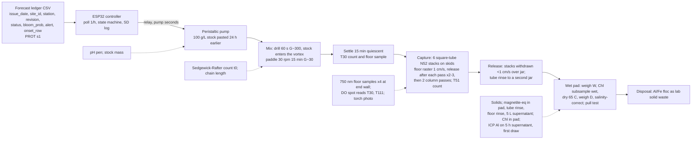

# Forecast-triggered magnetic clay flocculation with magnetic retrieval: design v6

Source keys: [RET] = notes/CLAY_RETRIEVAL_RESEARCH.md, [CLAY] = notes/CLAY_FLOCCULATION_RESEARCH.md, [AER] = notes/AERATION_RESEARCH.md, [PROT] = hab-bloom-predictor-narragansett/notes/PROSPECTIVE_PROTOCOL.md s1, s5, s7 plus `LEDGER_COLS` in `src/deploy/prospective_forecast.py`, [R1]-[R4] = review1-4.md, [V] = verification.md, **[A]** = my assumption or calculation. Prices are reviewer-verified where tagged, otherwise **[A]**.

## 0. Changelog from v5

| Finding [R4] | What changed |
|---|---|
| B1 resuspension index uncomputable | Within-tank index: 10 mL counts 2 cm below the surface at T30 (settled, pre-raster) and T51 (post-raster), index = T51/T30; a true 5 h tank count added; T is minutes throughout. |
| B2 route decided after the gate; no plain-clay tank run | Blank #1 route S (Mon Oct 12), blank #2 route D (Mon Oct 19), gate Fri Oct 23 on whichever route the pilot picks (n = 1 each); one plain-clay tank blank (Wed Oct 21, 4 g, total-solids recovery only) so V% and the H11b plain criterion have a run behind them. |
| B3 stock age uncontrolled | Blends kept dry; 4-5 g pasted 24 h before each use in 15-40 mL of the chosen water; "T-24 h paste stock" is one instruction. |
| B4 pilot eats the inoculum | Two 2 L carboys started together; carboy A scaled to 20 L on Oct 26; carboy B supplies the six pilot jars on Wed Oct 28 and regrows as the backup. |
| B5, B7, D1 probes in the raster; DO null; SEN0189 | SEN0189 and 10 s logging dropped; four 750 nm syringe samples 2 cm above the floor at an end wall outside the raster lanes; DO spot-read at T30 and T111 with the probe swirled, stated as a protocol control for the mesocosm, not a bench result. |
| B6 detection floor of fraction (iii) | 5 L of supernatant settled on the magnet; 5 and 10 mg standards added; floor (0.5% of dosed magnetite, calibrated above 1.4%) printed beside the number. |
| B8 ICP details | ICP draw first at 5 h before the Chl draw; ICP-MS requested, ICP-OES reporting limit (~5-20 ug/L in diluted seawater) printed beside the number; filter blank; EPA 200.8 preservation. |
| B9 field arithmetic | Version A mixing by a ~40 m3/h submersible pump (one turnover in 15 min) or air lift; Version B collapsed to five lines with the 63% single-pass cap and the 3.6 kW basis. |
| B10-B15 | Pilot blocked as two rounds with one replicate of each route per round; 5 g un-PAC'd kaolin + magnetite for route P (week-1 clay-only trial only); stock added into the running rapid mix in every vessel; detachment budget 4 g; tank run 3 by Dec 14; third 40 g dry mix budgeted. |
| D2-D4, D6 simplicity | LaMotte Al and API Fe kits dropped (BOM $592 buy-everything, $425 with five borrows); ImageJ dropped (photo stays a photo); 7 d regrowth dropped; Version B five lines. |
| Audit rows | Count table 57 (~33 h) with regrowth removed and T30/T51/5 h tank counts added; Thanksgiving week excluded from the hours budget and carries no batch; seawater ~220 L; clay ~32 g blend of 120 g dry mix. |
| s13 | Six open issues added; H11a route line noted as an amendment by design. |

Earlier changelogs (collapsed)

v4 to v5 [V]: stock-route pilot; floor DO/turbidity and four-fraction miss attribution; pull-test drift protocol; "consistent, underpowered" reading; partner ICP Al; natural-magnetite baseline; field Versions A and B; board sentences split and qualified; wasted-dose arithmetic; section 13.
v3 to v4 [R3]: 30-40 mm pull test; pigment blend primary; square tube with skids and per-pass release; DRV5055A4; wet/dry pad workup; MVP adopted; board text, H11a-c, failure tree.
v2 to v3 [R2]: settle-raster-column; matched jars; half-log series with logistic D90; NaOH titration and detachment test; PAC solids basis; controller bands dropped; one-slack cell; counting budget; ISEF.
v1 to v2 [R1]: sleeved rods; Sedgewick-Rafter and extracted Chl; low-water cell; NaOH; magnetite Plan B; G stated; three arms; ledger keys and onset gate; BOM.

## 1. Design decision: blended magnetic PAC-kaolinite + in-tank magnetic rake (no flotation)

**Choice.** A dry blend of pigment magnetite (Pigment Black 11, ~0.2 um, not classified hazardous [V1; R3]), EPK kaolin and PAC powder, 40 : 50 : 18 by mass (PAC 5:1 on the mineral solids [CLAY s1; R3 C]), pasted 24 h before use in the water the pilot selects, dosed by a controller-driven pump into a running rapid mix, flocculated by paddle, settled, captured by square-tube NdFeB stacks rastered along the tank floor with release after each pass, then water-column passes.

**Why a blend.** The co-precipitated product is a kaolinite-magnetite mixture bridged by PAC either way [R2 finding 4]; the blend has an exactly known magnetite mass and no hot chemistry [R3 B2]. Precedent: CoMag (> 99% magnetite-ballast recovery from hydroxide floc, freshwater) and marine beaker analogues Cerff 2012, Hu 2013, Fe3O4@SiO2@PAC seeds [V2; RET s1]; in seawater 0.2 um magnetite hetero-coagulates within ~40 s [V2].

**Why not DAF or sunk clay.** The only saline DAF harvest (IRL, 19-20 ppt) fell to 21% Chl-a because salinity cut bubble mobility and waves broke the float blanket [RET s2]. Sunk clay deposits Al- and toxin-bearing floc [RET s5] and "no permitting document distinguishes removal from deposition" [RET s8]; it is the comparison arm.

**Stock preparation is a variable.** Yu 2016 and the EPA/WHOI report show PAC-clay aged in seawater aggregates clay-to-clay and makes smaller flocs (the 0.6 vs 0.2 g/L factor in [CLAY s2]) and that PAC diluted first gives a 2-5x gain [V1]: hence the route pilot and dry storage [R4 B3].

**What retrieval does and does not change [V3].** "Retrieved is better for benthos" is unsupported (no sunk-vs-retrieved comparison exists; sedimented clay was benign to clams, suspended clay was not) and dissolved Al (5.1 mg/L added) is independent of retrieval. The MVP measures what retrieval does: it removes floc from the floor and may resuspend some of it; both are logged. No HAB clay study has measured the recovered fraction in seawater [RET s9; V8]; flocculation at 1e4 cells/mL is 10x above the EPA/WHOI threshold and the only Skeletonema-in-seawater number (> 81% at 0.10 g/L + PAC) is favourable [V1]; free fines are not captured by a moving raster, so magnetite-equivalent recovery measures floc incorporation [V2].

**Headline.** Recovery fraction of dosed magnetite-equivalent, with total solids and the attributed misses beside it, paired with removal at the same dose [R3 C].

## 2. System diagram

## 3. Bench prototype: the January MVP

**Vessels and water.** Device tank: 10 gal glass aquarium at 20 L (16 cm depth, 50 x 25 cm floor), device metrics only. Jar rig: 2 L glass jars at 1.8 L, three at a time on three identical 12 V 60 rpm gearmotors with identical 6 x 2 cm paddles (jar P/V 0.86x the tank's, G ~33 vs ~35 s-1 [R3 A]). Water: LIS seawater from Milford or Stratford [CLAY s7] through a 5 um cartridge; ~220 L over the project (pilot 11 L, 18 jar fills 32 L, six tank fills 120 L, culture 40 L, rinses and trials 17 L); 40-50 L per week in two 20 L carboys, dark cold shelf (<= 10 C **[A]**), used within two weeks; salinity S and pH per batch.

**Culture.** CCMP1332 *Skeletonema marinoi* (Milford CT isolate, f/2, non-toxic, chains floc readily [CLAY s2, s7; V1]) at 18-20 C under a cool LED; ~1 division/day [R4]. The 250 mL arrives Tue Oct 6 and is split into two 2 L carboys on Tue Oct 13; **carboy A** is scaled to 20 L on Mon Oct 26 (target >= 5e5 cells/mL by Fri Nov 6); **carboy B** supplies the six pilot jars on Wed Oct 28 (1.1 L at 1e5 cells/mL) and regrows as the backup [R4 B4]. Mean chain length logged with every count [R3 B13].

**Clay (dry blend, primary).** Three 40 g dry mixes (15 g magnetite + 18.5 g EPK kaolin + 6.5 g PAC powder, 28-30% Al2O3), kept dry; the third covers a 50 wt% re-blend if the week-1 gate demands it [R4 B15]. **Stock is pasted 24 h before each use** [R4 B3]: tank, 4 g in 40 mL; jar batch, 1.1 g in 11 mL; in filtered seawater (**route S**) or DI water (**route D**, the IOCAS practice of modifying in fresh water and dispersing at dosing [V1; CLAY s1]; 40 mL DI in 20 L is 0.2% freshening **[A]**). **Route P** (PAC dissolved in the vessel 20 min before plain kaolin + magnetite 35 : 15 [V1]) uses 5 g of un-PAC'd dry mix and stays in the week-1 clay-only trial unless its floc photo beats S and D [R4 B11; D5]. Plain-clay arm and plain tank blank: 30 g dry mix of 25 g EPK + 5 g PAC, same route as the winner. **Dose = total dry blend** [R1 finding 12]: 0.2 g/L = 4 g per 20 L, 0.36 g per jar. **Demand**: week-1 trials 3 g, detachment tests 4 g [R4 B13], pilot 1.5 g, blanks S and D 8 g, tanks 12 g, jars 3 g, contingency: ~32 g of 120 g; plain ~5 g of 30 g.

**Co-precipitation (stretch, DS sign-off only)** [R3 B2]: two 25 g half-batches of the PJOES recipe [RET s1] in 4 L beakers on hot-plate stirrers, 2 M NaOH teacher-prepared in an ice bath, titrated to pH 11.0, 60 C 3 h; side panel only.

**Stock-route pilot [V1; R4].** Week 1 (Oct 5-9), clay only: routes S, D and P at 0.2 g/L in 1.8 L filtered seawater on the rig, floc size by ruler-slide photo at 15 min, detachment test on S and D. Culture pilot, Wed Oct 28, carboy B: six jars at 1e4 cells/mL and 0.2 g/L, routes S and D (P only if promoted), n = 2, run as two rig rounds ~16 min apart with one replicate of each route per round [R4 B10]; stock pipetted into the vortex during the 60 s rapid mix [R4 B12]; 5 h Sedgewick-Rafter counts plus one t0; raw RE = 1 - Ct/C0, a route-versus-route comparison, not absolute removal (no untreated jar; the three-arm batches supply that) [R4 A]. **Decision rule**: the route that wins by > 15 RE points (mean of two) becomes the recipe; within 15 points, route S stays (unattended-dosing friendly); decide Fri Oct 30. If the culture is late the pilot runs with batch 1 on Nov 9 and the freeze slips to Fri Nov 13.

**Characterisation (week 1).** (1) **Pull test** [R3 B1]: vial glued into a >= 100 g holder on a 10 cm riser; N52 block on a stand at a fixed 30-40 mm gap (0.02-0.03 T, ~1.5 T/m). Daily: 5, 10, 20, 50, 100, 200 mg magnetite standards read first, linear fit, readings accepted only if r^2 >= 0.99 and the magnet-only zero (before and after each sample) drifts <= 2 mg; CSV log; a failed day is repeated [V8; R4 B6]. (2) **Seawater detachment test** [R2 finding 4a]: 1 g stock in 1 L filtered seawater at 60 rpm 15 min, held on a magnet 10 min, decanted, non-magnetic residue dried and weighed; S and D, before and after 24 h ageing (4 g). (3) Gate: > 30% pull loss or > 30% non-magnetic residue on the winning route means the blend goes to 50 wt% magnetite and is re-tested [R3 F].

**Dosing and mixing.** 12 V peristaltic pump, ~60 mL/min **[A]**: 40 mL in 40 s, delivered during the first 40 s of the rapid mix; jars: 3.6 mL pipetted into the vortex in the first 10 s [R4 B12]. Rapid mix: school cordless drill with a paint paddle (tank) or a small paddle (jars), 60 s at ~300 rpm (G ~300 s-1 **[A]**). Slow: 30 rpm, 15 cm paddle, 15 min, G ~25-35 s-1 [R1 finding 7]; encounter rate is not limiting at this G [V1].

**Capture** [R3 B3]. Six stacks of four N52 40x20x10 mm blocks in capped 1-1/4 in square acrylic tube (1/8 in wall, ID 25.4 mm), one pole face flat to a wall (capture surface 3.2 mm from the block, ~0.32 T [R1]); locking frame at 33 mm centres, 3 mm skids; frame width 198 mm on a 250 mm floor, so lanes are offset 3 cm per pass. Strong pole-face area 192 cm2 per pass; a 4 g dose is 40-80 mL of pad, so each raster pass carries <= 2 mm and the stacks are released after every pass. **T is minutes from dosing.** T0-T1 drill; T1-T16 paddle; T16-T31 settle; T31-T46 floor raster at ~1 cm/s in overlapping 3 cm lanes, release after each pass, two to three passes until the floor shows no floc under a torch; T46-T51 two water-column passes, release; withdrawal < 1 cm/s. Settled floc sits 6-8 mm from the pole, at the edge of the 8-14 mm holding shell [V2]. **Hall check** [R3 B4]: DRV5055A4 spot-reads at 5, 10, 20 mm before the first run.

**Gating blanks [R4 B2].** Blank #1 (Mon Oct 12): 4 g route S in 20 L filtered seawater, full sequence and attribution. Blank #2 (Mon Oct 19): 4 g route D, same. Plain-clay blank (Wed Oct 21): 4 g plain PAC-kaolin, total-solids recovery by the same sweep, no counts: this is the V% on the board and the "<= 10%" in H11b. Gate (Fri Oct 23): the blank on the route the pilot later picks must show >= 70% of dosed solids and >= 80% of magnetite-equivalent **[A]**; if neither route passes, +2 stacks, then the flat tray [R1 finding 1], retry Fri Oct 30; design frozen Fri Nov 6 whatever the number [R3 F]. n = 1 per route is the honest count.

**Resuspension and floor measurements [R4 B1, B5, B7].** In every tank run and blank: (a) 10 mL counts 2 cm below the surface at T30 (settled, pre-raster) and T51 (post-raster), same spot; **resuspension index = T51 count / T30 count** (> 1 means the raster returned cells to the water); (b) a true 5 h tank count for comparability with the jars; (c) four 10 mL syringe samples 2 cm above the floor at an end wall outside the raster lanes, at T30, after the first raster pass, T51 and T111, read at 750 nm as the turbidity measure; (d) DO spot-read at T30 and T111 with the school probe swirled; expected change at bench scale is < 0.01 mg/L (0.01 g algal dry mass in 20 L), so DO here is a protocol control for the mesocosm, not a result; (e) a torch photo of the floor on a 5 cm grid after the last pass, kept as a photo.

**Attribution of every recovery miss** (dosed magnetite-equivalent = pad + stranded + left on floor + never in floc + unaccounted) [V2; R4 B6]: (i) *stranded on tube*: tubes rinsed after each release with 100 mL seawater into a second jar, settled, pull-tested; (ii) *left on floor*: after draining, the floor is rinsed with 500 mL seawater, collected, settled on a magnet, pull-tested; (iii) *never in floc*: 5 L of the 5 h supernatant (25% of the tank) settled 24 h on a magnet, magnetic solids pull-tested; **detection floor printed beside the number**: 2 mg drift x 4 = 8 mg = 0.5% of the 1.48 g magnetite dosed, calibrated above the 5 mg standard x 4 = 1.4%; (iv) *unaccounted* = remainder. The four fractions go on the board beside the headline.

**Pad workup** [R3 B5]. Released pad settled in a tared beaker, supernatant decanted onto the magnet; wet pad weighed (W); wet subsample by mass fraction for Chl (acetone, 664/750 nm [R1 finding 2]); rest dried 65 C, weighed (D); solids = (D - S·W)/(1 - S); no DI rinse; dried pad pull-tested.

**Instruments.** Sedgewick-Rafter 1 mL chamber with Lugol: cells and chain length; >= 400 cells where density allows, capped at 200 cells or 500 grids at low density with the Poisson CI (+/-14% at 200 cells [V8]). Extracted Chl-a at t0 and 5 h (250 mL, 47 mm GF/F), reportable only for RE <= ~70% at 1e4 [R2 finding 11]. School balance, DO meter (type recorded: optical or membrane [R4 B7]), spectrophotometer; DRV5055A4; pH pen; the Al and Fe kits are dropped [R4 D2]. **Aluminum [V3; R4 B8]**: partner-lab **ICP-MS if available, else ICP-OES**, total dissolved Al on one 5 h supernatant per arm from batch 2 plus a filtered-seawater blank and a **filter blank** (DI through the same syringe filter): 50 mL drawn **first** at 5 h, 0.45 um syringe-filtered on site into trace-metal-clean HDPE, acidified to pH < 2 with the partner's HNO3 (or on receipt with a 16 h hold; EPA 200.8 / 40 CFR 136), refrigerated. The **reporting limit is printed beside the number** (ICP-OES in a 5-10x diluted seawater matrix is ~5-20 ug/L, at or near the 24 ug/L marine guideline, Golding 2015). Requested in the Mon Sep 28 nudge; commercial fallback ~$25-30 per sample **[A]**, five samples $125-150.

**Three-arm comparison (jars).** Untreated, plain PAC-kaolinite, magnetic blend, 0.2 g/L, 1e4 cells/mL, n = 3, one replicate of each arm per weekly batch, three batches. Per-vessel draws (1,800 mL): ICP 50 mL first at 5 h (batch 2 only); 5 h count 5 mL; 5 h Chl 250 mL; 24 h count 5 mL; total 260 mL (310 mL in batch 2). t0 count and Chl from the batch bottle; DO and pH in situ; draws 2 cm below the surface [CLAY s7]. No regrowth arm [R4 D4].

**Dose screen (MVP H11c).** Magnetic blend, 1e4 cells/mL, 0.05, 0.1, 0.2 g/L, n = 3 (9 jars, three per batch, second rig round), sharing the three-arm untreated jars; control-normalised RE = (1 - (Ct/C0)/(Ct,ctl/C0,ctl)) x 100 [CLAY s7]; two-parameter logistic fit; bootstrap CI on D90; controller dose = lowest screened dose with mean RE >= 70%, default 0.2 g/L.

**Count table** [R4 audit]:

| Source | Counts |
|---|---|
| Stock pilot: 6 jars at 5 h + 1 t0 | 7 |
| Batch t0 (3 batches) | 3 |
| Three-arm jars, 5 h and 24 h (9 jars) | 18 |
| Dose-screen jars, 5 h (9 jars) | 9 |
| Tank runs: t0, T30, T51, 5 h, 24 h (3 runs) | 15 |
| Inter-counter duplicates | 5 |
| **Total** | **57** |

At ~35 min each, ~33 h, between Wed Oct 28 and Fri Dec 18 excluding the Thanksgiving week (Mon Nov 23-Fri Nov 27, which also carries no batch): six counting weeks; one counter at 6 h/week is 36 h, so the second counter (a classmate trained on chains, or the partner lab) is required, not optional [R3 B6; V8].

**Tank run protocol (three runs, 1e4 cells/mL, 0.2 g/L; blanks identical without culture and without counts).** T-24 h paste stock. T-1 h fill 20 L culture, t0 count, Chl, DO, pH, salinity. T0 controller reads a test ledger row, pump 40 s into the running drill. T1-T16 paddle. T16-T31 settle; T30 count, floor sample, DO. T31-T51 rasters with release and tube rinses, column passes; floor sample after pass 1 and at T51; T51 count. T111 floor sample, DO. 5 h: ICP draw not needed in tanks; 5 h count, Chl. 24 h count. Pad workup; floor rinse and 5 L supernatant pull tests.

**The numbers.** (1) Removal at 5 h, control-normalised, n = 3 jars, with CI; plain-clay arm beside it. (2) Recovery from the tank runs: magnetite-equivalent in pad / dosed; total solids / dosed (salinity-corrected); the four attributed miss fractions with the fraction (iii) floor; resuspension index; 750 nm floor trace; plain-clay blank recovery. (3) Dose screen: RE vs dose at 1e4 with fitted D90 and CI; pilot result and route.

**Bill of materials (MVP).** School provides at $0: spectrophotometer, cuvettes, 0.001 g balance, hot plate stirrer, oven, fume hood, Buchner + vacuum, drill, DO meter, microscope, 90% acetone, syringes, 4 L beakers and 2 M NaOH if the stretch runs. Cultures excluded.

| Item | $ |
|---|---|
| 10 gal glass aquarium | 25 |
| 6 x 2 L glass jars | 24 |
| Jar rig: 3 x 60 rpm gearmotors, frame, paddles | 28 |
| 2 x 20 L carboys + 5 um cartridge | 25 |
| EPK kaolin 5 lb / PAC powder 1 kg / magnetite pigment 500 g | 12 / 15 / 20 |
| Tank gearmotor + paddle | 18 |
| 1-1/4 in square acrylic tube, caps, epoxy, frame with skids | 35 |
| 24 x N52 40x20x10 mm ($4) | 96 |
| 2 x DRV5055A4 + breakout | 6 |
| Peristaltic pump | 16 |
| ESP32, 2-ch relay, microSD + card | 22 |
| 12 V 5 A supply, fuse, box, wire | 23 |
| Sedgewick-Rafter chamber | 60 |
| Lugol's 100 mL | 12 |
| GF/F 47 mm, 25 pk | 40 |
| pH pen | 12 |
| PPE | 15 |
| f/2 medium / 20 L jug + LED | 30 / 30 |
| Pull-test holder, vials, stand clamp, riser | 10 |
| 5 x 50 mL trace-metal HDPE bottles, 0.45 um syringe filters | 8 |
| Jars, tubing, ties | 10 |
| **Buy-everything total** | **592** |
| Conditional: commercial ICP Al, 5 samples, if the partner cannot | +125-150 |
| Stretch only if DS signs off: FeCl3·6H2O 2 x 100 g + FeCl2·4H2O 100 g | +48 |

With five named borrows the purchase total is **$425**: Sedgewick-Rafter chamber (-60), f/2 (-30), LED + jug (-30), 12 V brick (-23), 2 L jars (-24). With only f/2, LED/jug and PSU borrowed it is $509.

## 4. Controller

ESP32 polls hourly an HTTP endpoint on the laptop serving the newest ledger rows for the configured (`site_id`, `station`) [PROT s7; LEDGER_COLS]; fields `issue_date`, `site_id`, `station`, `revision`, `status`, `bloom_prob`, `threshold`, `alert`, `onset_row`. **Keying**: (`issue_date`, `site_id`, `station`), highest `revision` wins; a dose already given is not repeated [R1 finding 9a]. **Decision**: `status` not `ok` -> HOLD_STATUS [PROT s1]; `alert == True` (`bloom_prob >= threshold`, 0.50) AND `onset_row == True` (chl today <= station p75 [PROT s5]) AND not locked out -> DOSE at the screened dose (default 0.2 g/L); probability is go/no-go only. **Lockout** = skip the next distinct `issue_date` [R2 finding 7]. **VERIFY**: 24 h count < 0.3 x C0 passes; on fail one further dose at the next alerting row, then a hard stop pending human review. **Feed states**: NO_NEW_ROW green idle; ENDPOINT_UNREACHABLE (three failed polls) red and hold; parse failure holds with the raw line logged; never doses from a cached row [R1 finding 9c]. Logging to microSD (`ts, issue_date, site_id, station, revision, status, bloom_prob, alert, onset_row, state, dose_g_L, pump_s, verify`) and serial; a 10-minute timer relay in series guards a stuck relay. Gate: unattended dose from a test ledger row by Fri Dec 4; fallback manual trigger on video [R3 F].

**What the trigger is [V7].** `alert` is P(station chlorophyll exceeds its own 75th percentile within 7 d) >= 0.50: a p75-exceedance trigger on the routine seasonal rise, never "bloom prediction". From the locked LIS test set [AER duty cycle; CLAUDE.md table]: at threshold 0.60 ~1.2 alerts and ~0.6 wasted per station-season; at 0.50 ~2.6 and ~1.8 wasted; A4 at 0.60 ~10 and ~4 wasted; the lockout halves doses, not the ratio. A wasted bench dose is 4 g; in an open cell it is 32-360 kg of product and 0.8-9 kg of Al, so the gate is defensible for January and a closed mesocosm only, where exchange is restricted (regrowth suppression is a beaker result [CLAY s2]; a slip is replaced every tide [AER s4; R2 finding 7]).

## 5. Field concept (concept, not performed)

The v4 "settle, then bed-vacuum during the flood" version is dropped: flocs reach a 2 m bed in 0.5-2 h and a fresh PAC-clay layer resuspends at 0.06-0.09 Pa (Beaulieu 2005), which a 10-20 cm/s tide reaches under a skirt held 0.3-0.6 m off the bed [V2, V5].

**Version A: closed-bottom mesocosm (student-reachable, summer 2027).** A bag or cod-end limnocorral of the EPA Sarasota type (2 m diameter, 3 m deep, ~9.4 m3) hung from an existing dock [V5, V6]; no exchange, so pre-emption is testable. Dose 1.9 kg blend (5.7 kg at 3x [CLAY s2]) as 13-38 L of 150 g/L slurry; **mixing by a submersible pump giving one turnover in 15 min (~40 m3/h) or an air lift** [R4 B9]; capture through a magnetic pipe or small drum at 2-3 m3/h, during flocculation (~3-5 h per volume) or after settling with a bottom draw; recovery, attribution and floor measurements as at the bench; the pen is the deposition control. Treated water (5 mg/L Al added) goes to a sanitary connection or is trucked, never to tidal water without a discharge permit **[A; V6]**. Permits: temporary structure, no discharge, COP or GP under CGS 22a-359 plus USACE GP self-verification, 45-90 days, DEEP/UConn partner as applicant [V6; AER s7]. Two pens (blend, plain) give the sunk-versus-retrieved comparison that does not exist [RET s9 item 5].

**Version B: capture during flocculation in an open curtain cell (agency-led, 6-18 months).** Dose at slack minus 1 h; pump a 160 m3 cell (0.008 ha x 2 m at MLW) at 160 m3/h through a low-intensity drum with a mid-depth intake while flocs are suspended (0.5-2 h [V5]); ~3.6 kW at 5 m head [R4 B9]. If the drum effluent returns inside the curtain, one hour captures at most 1 - e^-1 = 63% at perfect drum efficiency; once-through discharge outside the cell approaches one full pass but is the discharge that needs an individual permit under CGS 22a-430, plus coastal permit, CWA 401, public notice and USACE authorisation [V6; R4 B9]. Bed-magnet sled on fixed transects inside and outside with a pre-dose baseline (LIS bed carries detrital magnetite; 63 um wet-sieve separates pigment from grains **[A]**) [V2]; Rhodamine WT ~10 ppb only with DEEP sign-off [R2 finding 8]. Mass balance at 0.2 g/L: 32 kg blend, 0.8 kg Al, 8.6 kg Fe, ~0.01-0.03 kg N exported [V4 scaled]; no nutrient number goes on the board.

## 6. Safety and ISEF

PAC powder is an acidic aluminum coagulant: gloves, goggles, dust mask, Al floc as lab solid waste [CLAY s7]; effluent (5 mg/L Al added) bleached, diluted and disposed per school drain policy, or collected [R1 finding 14; V3]. Magnetite pigment not classified hazardous [V1]; dust mask when weighing. Route D paste is pH ~3-4: gloves. Stretch route: FeCl3/FeCl2 corrosive, 2 M NaOH teacher-prepared, 60 C on a hot-plate stirrer, Designated Supervisor present [R3 B2]. HNO3 acidification by the partner or teacher only. Magnets: N52 blocks pinch, shatter and snap together; stacks assembled one at a time in the locking frame; SD card and phones kept away. Electrical: everything touching water is 12 V behind a GFCI; hot plate and drill on a separate bench. Cultures: non-toxic; used culture bleached.

**ISEF paperwork** [R3 B15]. (1) Student writes the Research Plan and Form 1A; (2) Adult Sponsor reviews and completes Form 1; (3) Designated Supervisor (school chemistry teacher, named on Forms 1 and 3) and Adult Sponsor sign Form 3 (Risk Assessment) for hazardous chemicals (PAC; FeCl3 and NaOH if the stretch runs), the home-built electrical device and the protist cultures (Form 3 only, no SRC pre-review); (4) student, parent and Adult Sponsor sign Form 1B; all before the first bench work on Mon Oct 5; (5) forms uploaded at CSEF registration (an ISEF affiliate); the SRC may query. No SRC pre-approval is required for hazardous chemicals or devices.

## 7. Timeline to 2027-01-15 (2026 calendar; Thanksgiving Thu Nov 26)

- Mon Sep 21: order CCMP1332 (arrival ~Tue Oct 6), kaolin, PAC powder, magnetite pigment, 24 blocks, square tube, DRV5055A4, electronics, sample bottles; book hood and instruments; Forms 1A, 1, 3, 1B drafted; DS asked about the stretch.
- Mon Sep 28: nudge to DEEP/UConn (ICP-MS/OES Al x5, chamber loan, counting help); ESP32 and endpoint; stacks and frame; jar rig; pull-test holder and calibration line; DRV5055 spot map.
- Mon Oct 5: Forms 3 and 1B signed. Week 1: three 40 g dry mixes and the plain mix; S and D stocks pasted; pull and detachment tests; clay-only route trials S/D/P with floc photos; gate Fri Oct 9. Culture arrives Tue Oct 6.
- Mon Oct 12: blank #1 (route S). Tue Oct 13: split culture into carboys A and B. Mon Oct 19: blank #2 (route D). Wed Oct 21: plain-clay blank. Fri Oct 23: recovery gate (retry Fri Oct 30). Seawater 40-50 L/week from Oct 12.
- Mon Oct 26: carboy A to 20 L. Wed Oct 28: stock-route pilot from carboy B. Fri Oct 30: route decision. Fri Nov 6: design frozen; 20 L at >= 5e5 cells/mL.
- Mon Nov 9, Mon Nov 16: batches 1 and 2 (three-arm round, dose-screen round); ICP samples from batch 2 (first draw at 5 h). Fri Nov 20: counting checkpoint (>= 40%).
- Mon Nov 23-Fri Nov 27: Thanksgiving week, no batch, no counting hours budgeted.
- Mon Nov 30: batch 3. Fri Dec 4: controller gate.
- Mon Dec 7, Wed Dec 9, Fri Dec 11: tank runs 1-3 (run 3 no later than Mon Dec 14 [R4 B14]); Dec 14-18 pad workups, attribution, buffer.
- Mon Dec 21-Fri Jan 8: CIs, logistic fit, inter-counter agreement, mass-balance table, board panels; SCIENTIFIC_METHOD.md Phase 11 outcomes.
- Mon Jan 11-Fri Jan 15: demo dry run; buffer. CSEF deadline Mon Feb 15, 2027.

Board: 60 s tank video (test ledger row, dose into the drill vortex, floc, settle, floor raster with release, column pass, magnet withdrawal, floc drop); recovered-pad jar beside the dosed-blend, tube-rinse, floor-rinse and plain-clay-blank jars; pull-test calibration line; 750 nm floor trace; the numbers with n and CI.

## 8. Known weaknesses

1. The stock route is decided Oct 30 on a two-replicate route-versus-route pilot; the recovery gate covers each route with n = 1 blank [R4 B2].
2. The blend is a physical mixture; kaolin recovery depends on PAC bridging it to magnetite; the detachment test is the only check [R2 finding 4; V2].
3. The raster resuspends its own floor and strands pad on every release; both are measured, neither prevented; settled floc sits at the edge of the holding shell [V2; R3 B3].
4. Removal at 1e4 rests on counts capped at 200 cells (+/-14%); at n = 3 a true RE of ~70% can fail the lower-bound test on noise; the "consistent, underpowered" reading is the hedge [V8].
5. Pull-test readings of 0.2-3 gf sit near the balance drift floor; fraction (iii) is quantitative only above 0.5% of the dose [R4 B6].
6. The dose screen spans 0.05-0.2 g/L at one density; if RE >= 90% at 0.05 the fitted D90 is a lower bound [R3 E].
7. Dissolved Al is independent of retrieval; five ICP samples give one point per arm, and ICP-OES may not resolve the 24 ug/L guideline in a seawater matrix [V3; R4 B8].
8. "Retrieved is better for benthos" is unsupported; bench floor DO is a null measurement [V3; R4 B7].
9. Both field versions are concepts; Version A needs a partner applicant and a disposal route; Version B is agency-led and capped at 63% per pass if the effluent returns [V5, V6; R4 B9].
10. The trigger wastes roughly as many doses as it justifies at test precision [V7].
11. Counting (~33 h) needs the second counter; seawater (~220 L) and a single chamber are single points of failure.
12. Budget meets $500 only with borrows: $592 buy-everything, $425 with five, $509 with three; ICP +$0-150.

## 9. Board panel text

Review 3 section D as amended per [V8]; X, Y, Z, W, V from the January results.

1. "In 2 L jars of filtered Long Island Sound seawater, a magnetite-kaolinite-PAC clay at 0.2 g/L removed X% [95% CI a-b] of *Skeletonema marinoi* cells within 5 h (n = 3 jars, control-normalised), against Y% for plain PAC-kaolinite. In three 20 L tank runs the same dose was released by a controller reading a test forecast row."
2. "A magnet sweep of the tank floor then recovered Z% [range over n = 3 runs] of the dosed magnetite and W% of the total dry clay; the same sweep recovered under V% of the plain clay (one blank). Korean and Chinese practice leaves the floc on the seabed; no HAB clay study had measured the recovered fraction in seawater."
3. "This is a bench result for one non-toxic diatom. It does not show that blooms are prevented, that nitrogen or phosphorus are removed from the Sound, or that bottom habitat is unaffected; those need a permitted mesocosm."

Phrasing a judge should reject: "prevents blooms", "predicts blooms" (the trigger is a p75-exceedance forecast), "removes nutrients/nitrogen", "removes aluminium" (it adds 5 mg/L), "no habitat impact", "90% efficient" without n and CI, "field-ready", "scalable to LIS", "toxin-free", any nutrient-credit number from s5.

## 10. Pre-registered hypotheses (for SCIENTIFIC_METHOD.md Phase 11)

Review 3 section E verbatim, with the [V8] amendment; entered before Mon Oct 19. **By design the entry precedes the route decision (Fri Oct 30): the route line is added as a dated amendment, and SCIENTIFIC_METHOD.md says so** [R4 A].

**H11a (removal).** Magnetic PAC-kaolinite at 0.2 g/L (product basis, seawater make-up) removes *S. marinoi* at 1e4 cells/mL by **70-95%** at 5 h (control-normalised Sedgewick-Rafter counts), and within **+/-15 points** of plain PAC-kaolinite at the same dose. Basis: kaolinite-PAC 100% at 0.1-0.3 g/L on *A. minutum* at 1e4 [CLAY s2]; MCII 91% on *Karenia* at 0.2 g/L, 5 h [RET s5]; seawater make-up needs ~3x dose and ionic strength cuts magnetic-flocculant efficiency [CLAY s2; RET s1]. Pass: mean RE >= 70% with the n = 3 CI lower bound > 50%, and |magnetic - plain| <= 15 points. Fail below 50%: rerun at 0.6 g/L and report both.

*Amendment [V8 risk 3]:* mean RE >= 70% with the CI lower bound between 40% and 50% reads **"consistent, underpowered"**, not failed; the 0.6 g/L rerun is triggered only by a mean below 50%. "Seawater make-up" refers to the dosing medium; the stock route is the dated amendment above.

**H11b (recovery).** The settle-raster-column sequence recovers **75-95%** of dosed magnetite-equivalent and **>= 70%** of total dry product in the clay-only blank, **60-90% / 50-85%** with culture, and **<= 10%** of plain PAC-kaolinite (magnetic specificity control). Basis: freshwater magnetic-flocculant particle recovery 84-97.5% [RET s1]; composite Ms as low as 6 emu/g and free-magnetite detachment [R2#4]. Pass: mean magnetite-equivalent >= 70% over n = 3 runs, each >= 60%; total >= 50%; plain <= 10%. A blank below 70/80 is a design failure, not a hypothesis failure (F).

**H11c (dose-density).** Full version (summer 2027): D90(1e5)/D90(1e4) in **1.5-4x**; pass if the bootstrap 95% CI lower bound > 1.0 with D90(1e4) resolved inside the series (>= 0.025 g/L); if D90(1e4) is below the series, report a lower bound and record H11c as "not testable", not failed. MVP version (January): RE at 1e4 rises monotonically over 0.05-0.2 g/L and D90 lies in **0.05-0.2 g/L**; pass if the fitted D90 CI sits within 0.025-0.4 g/L. Basis: removal falls with initial density [CLAY s2, Yu 2017]; *A. pacificum* ~75% at 0.2 to ~99% at 1 g/L.

## 11. Gates and fallbacks

Review 3 section F, with the route and plain-blank gates [V1; R4 B2].

| Gate | Decide by | Pass | Fallback | Board shows if it fails there |
|---|---|---|---|---|
| Forms 1/1A/1B/3 signed; DS accepts chemistry | Oct 5 | Signed | DS refuses synthesis: blend route; refuses hot Fe/NaOH only: teacher prepares reagents | Unchanged |
| Week-1 chemistry (pull, detachment, floc photos) | Oct 9 | < 30% pull loss, < 30% non-magnetic residue | 50 wt% re-blend from the third dry mix | Unchanged |
| Batch yield (if synthesis run) | Oct 16 | >= 60 g product, pull >= 50% of expectation | Blend route | "Blend used; synthesis as a side panel" |
| Clay-only blanks, routes S and D; plain blank | Oct 23; retry Oct 30 | >= 70% total, >= 80% magnetite-eq on the route later chosen; plain blank run | +2 stacks, then tray; freeze Nov 6 whatever the number | The measured recovery, however low ("magnetic retrieval recovered X% under these conditions") |
| Culture scale-up | Nov 6 (>= 5e5 cells/mL in 20 L) | Density met | Carboy B; re-order (2 wk) or partner culture; if none by Nov 16, clay-only work | Recovery only; removal cited from literature, "not measured here" |
| Stock route | Oct 30 (or batch 1, Nov 13) | Route by the > 15-point rule | Route S stays within 15 points | Route named with the pilot result |
| Counting checkpoint | Nov 20 | >= 40% of counts done | Cut order: dose screen n = 2, then tank run 3 | Fewer n, CIs wider, stated |
| Tank runs | Dec 14 | 3 runs complete | Report n = 2 | n on the panel |
| Controller | Dec 4 | Unattended dose from a test ledger row | Manual trigger from the printed row; video shows the row | "Trigger demonstrated manually" |

## 12. Summer 2027 program (deferred)

1. Two-density D90 program (0.025-0.8 g/L half-log, 1e4 and 1e5, n = 3, 78 jars, ~126 counts, ~260 L seawater; H11c full) [R2 finding 3; R3 B12].
2. Co-precipitated clay vs blend at equal magnetite-equivalent [R3 B2].
3. Heterosigma (CCMP452) [CLAY s2].
4. 30 d regrowth, dropped from the MVP with the 7 d reads [CLAY s2; R4 D4].
5. Full Hall map 5-40 mm [R3 B4]. 6. 1e5 Chl series [R2 finding 11].
7. Field Version A (two pens, sunk vs retrieved, partner as applicant) [V5, V6]; Version B stays agency-led.
8. Magnetite-ballast resuspension threshold and the natural-magnetite baseline at a candidate site [V2].

## 13. Open issues (cannot be resolved without data)

1. Which stock route flocculates best at 0.2 g/L in this matrix [V1]: the Oct 28 pilot.
2. Stock age: 24 h pasting removes the 3-10 week variable [R4 B3]; 24 h-aged versus freshly pasted is untested.
3. Ms and coercivity of the pigment grade bought (50-91 emu/g across the class) [V1]; the same powder calibrates the pull test, so the headline is unaffected.
4. The effect of ~37-45 wt% magnetite on floc formation, unverified anywhere [V1].
5. Whether a hand raster at 6-8 mm pole-to-floc reaches 70% from a 16 cm floor, and how much it resuspends [V2]: blanks #1 and #2.
6. The plain-clay tank recovery rests on one blank [R4 B2].
7. Whether route D's DI stock pumps reliably unattended; route P cannot be automated **[A]**.
8. Residual dissolved Al at pH ~8 and its time course; whether the partner has ICP-MS, since ICP-OES may not resolve 24 ug/L in seawater [V3; R4 B8].
9. Whether the school DO meter is optical or membrane; bench DO is a null measurement either way [R4 B7].
10. Whether magnetite ballast raises the Beaulieu resuspension threshold; natural detrital magnetite on any candidate bed; whether 63 um sieving separates pigment from grains [V2].
11. Chain-length dependence of removal and count bias: logged, not controlled [V1; R3 B13].
12. Copepod and larval bycatch, sunk or captured: not measurable in the MVP [V3].
13. The DEEP permit category for a research discharge, and whether the partner will act as applicant for Version A [V6].
14. Whether the partner lab can run ICP and lend a chamber and counting time: reply pending (nudge Mon Sep 28).
15. Milford Harbor's N load and whether any embayment is enclosed enough to test pre-emption [V4, V7].
16. H11a is pre-registered Oct 19 and the route decided Oct 30: the route line is an amendment by design, logged with its date [R4 A].
17. The pilot inoculum comes from carboy B; if B lags, the pilot moves to batch 1 and the freeze to Nov 13 [R4 B4].
