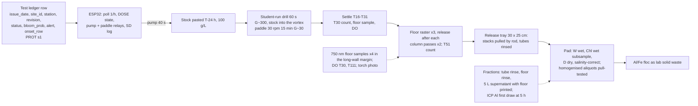

# Ledger-triggered magnetic clay flocculation with magnetic retrieval: design v7

Source keys: [RET] = notes/CLAY_RETRIEVAL_RESEARCH.md, [CLAY] = notes/CLAY_FLOCCULATION_RESEARCH.md, [AER] = notes/AERATION_RESEARCH.md, [PROT] = hab-bloom-predictor-narragansett/notes/PROSPECTIVE_PROTOCOL.md s1, s5, s7 plus `LEDGER_COLS` in `src/deploy/prospective_forecast.py`, [SM11] = notes/SCIENTIFIC_METHOD.md Phase 11 (lines 536-600), [R1]-[R5] = review1-5.md, [V] = verification.md, **[A]** = my assumption or calculation. Prices are reviewer-verified where tagged, otherwise **[A]**.

## 0. Changelog from v6

| Finding [R5] | What changed |
|---|---|
| 1 calendar | No runs on Mondays; T0 = 14:30 (or 10:45 in the research block when booked), 5 h read 19:30 +/- 30 min under a signed after-hours agreement with the DS, 24 h read 14:30 +/- 2 h next day; blanks take fraction (iii) at T111 and 07:30 next morning (no 5 h); Mon Oct 12 (Columbus Day) and Mon Sep 21 (Yom Kippur) carry no school work; section 7a day-by-day Oct 5-23. |
| 2 culture | Order CCMP1332 Wed Sep 16-Fri Sep 18 with the ship date in writing (earliest ship Wed Oct 7, arrival Thu Oct 8; planning date Oct 21+); sterile 2 L medium ready on arrival; transfer at arrival + 1 d; f/2 at 18-20 C is inside the 11-30 C range (recommended L1 at 14 C; axenic). |
| 3 gate inverted | Each route passes or fails on its own blank Fri Oct 23; only survivors enter the Oct 28 pilot; if both fail, +2 stacks (8 contingency blocks now in the BOM) and retry Fri Oct 30 on route S only. |
| 4 pull-test range | Dried pad homogenised and three 150 mg aliquots pull-tested against the 5-200 mg line; one-time 0.5 and 1.0 g magnetite-in-kaolin standards at pad fill height as a linearity check. |
| 5 release mechanics | Same pole down on all six stacks, frame locked against the sideways repulsion; PTFE-lined contact wall; stack on a nylon end-block and rod through a removable top cap, pulled by T-handle; two frame handles; 30 x 25 cm release tray; per-cycle budget ~5 min, three raster cycles in T31-T46, two column cycles in T46-T56. |
| 6 draws and siphons | Every draw and siphon now has tool, position, rate and time (s3 "Draws" block). |
| 7 culture water | Culture water pasteurised (2 L at 75 C, 30 min) or 0.2 um filtered; jar diluent 5 um by gravity filter bag (cartridge and housing dropped). |
| 8 statistics | t-interval on three batch REs (t = 4.30) with "consistent, underpowered" pre-registered as the likely reading; fitted D90 replaced by three means with t-CIs, ordered-means monotonicity and bracketed log-linear interpolation; plain blank n = 1 as description with its solids floor; resuspension index +/-20% Poisson; inter-counter statistic named. |
| 9 unattended dose | "Controller-timed, student-mixed"; Dec 4 gate and board text say so. |
| 10 magnet price | $8 per block; BOM re-summed ($780 buy-everything incl. 8 contingency blocks; $613 with five borrows; $549 if the contingency is not needed). |
| 11-13 | Forms 1B/3 signed Fri Sep 25 before any hands-on; order from home on Sep 16; instruments booked Tue Sep 22; 11 mm long-wall margins assigned to fraction (ii) and used as the sample spot; first seawater Sat-Sun Oct 3-4 with a driver. |
| 14 pre-registration | Section 10 rewritten as a diff against SM11 with exact replacements and the dated commit log. |
| 15 overclaims | Title and s1 "ledger-triggered (test row)"; sentence 2 "magnetite-equivalent by pull test"; sentence 3 "were not tested". |

Earlier changelogs (collapsed)

v5 to v6 [R4]: within-tank resuspension index; route blanks S and D plus plain blank; dry blends pasted at T-24 h; carboy B pilot; SEN0189/DO logging, kits, ImageJ, regrowth cut; fraction (iii) floor; ICP first draw, ICP-MS, filter blank; Version A mixing and Version B cap.
v4 to v5 [V]: stock-route pilot; floor measurements and four-fraction attribution; pull-test drift; partner ICP Al; field Versions A/B; board sentences; wasted-dose arithmetic; open issues.
v3 to v4 [R3]: 30-40 mm pull test; pigment blend; square tube, skids, per-pass release; DRV5055A4; pad workup; MVP; board text, H11a-c, gates.
v2 to v3 [R2]: settle-raster-column; matched jars; logistic D90; NaOH titration; PAC solids basis; controller bands dropped; counting budget.
v1 to v2 [R1]: sleeved rods; Sedgewick-Rafter and extracted Chl; NaOH; magnetite Plan B; G stated; three arms; ledger keys.

## 1. Design decision

**Choice.** A dry blend of pigment magnetite (Pigment Black 11, ~0.2 um, not classified hazardous [V1; R3]), EPK kaolin and PAC powder, 40 : 50 : 18 by mass (PAC 5:1 on mineral solids [CLAY s1; R3 C]), pasted 24 h before use in the water the pilot selects, dosed by a controller-timed pump into a student-run rapid mix, flocculated by paddle, settled, captured by square-tube NdFeB stacks rastered along the tank floor with release after every pass, then water-column passes. At the bench the trigger is a **test ledger row** ("ledger-triggered (test row)"), not a live forecast [R5 15].

**Why a blend.** The co-precipitated product is a kaolinite-magnetite mixture bridged by PAC either way [R2 finding 4]; the blend has an exactly known magnetite mass and no hot chemistry [R3 B2]. Precedent: CoMag (> 99% magnetite-ballast recovery, freshwater), Cerff 2012, Hu 2013, Fe3O4@SiO2@PAC seeds [V2; RET s1].

**Why not DAF or sunk clay.** The only saline DAF harvest (IRL, 19-20 ppt) fell to 21% Chl-a [RET s2]. Sunk clay deposits Al- and toxin-bearing floc [RET s5] and "no permitting document distinguishes removal from deposition" [RET s8]; it is the comparison arm.

**Stock preparation is a variable.** Yu 2016 and the EPA/WHOI report show PAC-clay aged in seawater makes smaller flocs (the 0.6 vs 0.2 g/L factor in [CLAY s2]) and PAC diluted first gives a 2-5x gain [V1]: hence the route pilot and dry storage [R4 B3].

**What retrieval does and does not change [V3].** "Retrieved is better for benthos" is unsupported and dissolved Al (5.1 mg/L added) is independent of retrieval; the MVP measures what retrieval does: it removes floc from the floor and may resuspend some of it. No HAB clay study has measured the recovered fraction in seawater [RET s9; V8]; flocculation at 1e4 cells/mL is 10x above the EPA/WHOI threshold [V1]; free fines are not captured by a moving raster, so magnetite-equivalent recovery measures floc incorporation [V2].

**Headline.** Recovery fraction of dosed magnetite-equivalent by pull test, with total solids and the attributed misses beside it, paired with removal at the same dose [R3 C].

## 2. System diagram

## 3. Bench prototype: the January MVP

**Clock.** T is minutes from dosing. **T0 = 14:30** on a run day (Tue-Fri), DS present; hands-on to T56; T111 at 16:21; **5 h reads at 19:30 +/- 30 min** under a signed after-hours agreement (student, parent, DS, principal) **[A]**; **24 h reads at 14:30 +/- 2 h next day**. When the research block is booked, T0 = 10:45 puts 5 h at 15:45 and 24 h at 10:45. Blanks have no cells: fraction (iii) is drawn at T111 and again at 07:30 next morning [R5 1].

**Vessels and water.** Device tank: 10 gal glass aquarium at 20 L (16 cm depth, 50 x 25 cm floor), device metrics only. Jar rig: 2 L glass jars at 1.8 L, three at a time on three identical 12 V 60 rpm gearmotors with 6 x 2 cm paddles (jar P/V 0.86x the tank's, G ~33 vs ~35 s-1 [R3 A]). Seawater: LIS water from Milford or Stratford [CLAY s7], ~220 L over the project, first 40 L collected **Sat-Sun Oct 3-4** with a parent driver, then 40-50 L on alternate weekends; **jar and tank diluent** through a 5 um filter bag by gravity into the carboy; **culture water** additionally pasteurised (2 L at 75 C for 30 min in the school water bath) or 0.2 um filtered, because wild < 5 um cells would otherwise grow through the four-week scale-up and appear in Chl and the untreated jar [R5 7]; dark cold shelf (<= 10 C **[A]**), used within two weeks; salinity S and pH per batch.

**Culture.** CCMP1332 *Skeletonema marinoi* (Milford CT isolate; axenic; NCMA recommends L1 at 14 C, range 11-30 C, so f/2 at 18-20 C is inside range [R5 2; CLAY s7]); ~1 division/day. **Ordered Wed Sep 16-Fri Sep 18 from home with the ship date in writing**: live cultures ship Wednesdays, at least two weeks out, so the earliest arrival is Thu Oct 8 and the honest planning date is Oct 21+ (grown to order) [R5 2]. Sterile 2 L f/2 in two carboys is ready before Oct 8; on arrival the tube stabilises 12 h, then half the biomass goes into fresh medium at arrival + 1 d; **carboy A** is scaled to 20 L when it reaches >= 1e6 cells/mL (target >= 5e5 cells/mL in 20 L one week later); **carboy B** supplies the pilot (1.1 L at 1e5 cells/mL) and regrows as backup [R4 B4]. Mean chain length logged with every count [R3 B13].

**Clay (dry blend).** Three 40 g dry mixes (15 g magnetite + 18.5 g EPK + 6.5 g PAC powder, 28-30% Al2O3); the third covers a 50 wt% re-blend [R4 B15]. Stock pasted **24 h before each use** on a school day (never a Sunday): tank 4 g in 40 mL, jar batch 1.1 g in 11 mL, in filtered seawater (**route S**) or DI (**route D**, IOCAS practice [V1; CLAY s1]). **Route P** (PAC dissolved in the vessel 20 min before 5 g of un-PAC'd kaolin + magnetite 35 : 15) stays in the week-1 clay-only trial unless its floc photo beats S and D [R4 B11]. Plain arm and plain blank: 30 g dry mix of 25 g EPK + 5 g PAC, same route as the winner. **Dose = total dry blend**: 0.2 g/L = 4 g per 20 L, 0.36 g per jar. Demand ~32 g blend of 120 g; plain ~5 g of 30 g.

**Co-precipitation (stretch, DS sign-off only)** [R3 B2]: two 25 g half-batches of the PJOES recipe [RET s1], 2 M NaOH teacher-prepared, titrated to pH 11.0; side panel only.

**Stock-route pilot [V1; R4].** Week 1 clay-only: routes S, D, P at 0.2 g/L in 1.8 L filtered seawater, floc photo at 15 min, detachment test on S and D. Culture pilot **Wed Oct 28** (or the first Tue-Thu after carboy B reaches 1e5 cells/mL): six jars, 1e4 cells/mL, 0.2 g/L, the routes that survived the Oct 23 recovery gate (S and/or D; P only if promoted), n = 2, two rig rounds ~16 min apart with one replicate of each route per round [R4 B10]; 3.6 mL stock pipetted into the vortex in the first 10 s of the 60 s rapid mix; 5 h counts at 19:30 plus one t0; raw RE = 1 - Ct/C0, route versus route. **Decision rule**: a route that wins by > 15 RE points (mean of two) becomes the recipe; within 15 points route S stays; decide **Fri Oct 30** and log the six counts that day. If the culture is late the pilot runs on the batch-1 day and the freeze slips one week.

**Characterisation (week 1).** (1) **Pull test** [R3 B1; R5 4]: vial glued into a >= 100 g holder on a 10 cm riser; N52 block on a stand at a fixed 30-40 mm gap. Daily 5, 10, 20, 50, 100, 200 mg magnetite standards, linear fit, accepted only if r^2 >= 0.99 and the magnet-only zero drifts <= 2 mg; CSV log. **Pads are homogenised** (dried pad ground in a mortar) and **three 150 mg aliquots** are pull-tested inside the line (a 45 wt% aliquot holds ~70 mg magnetite); one-time 0.5 and 1.0 g magnetite-in-kaolin standards at pad fill height check linearity at scale; the method reported is the aliquot mean. (2) **Seawater detachment test** [R2 finding 4a]: 1 g stock in 1 L filtered seawater at 60 rpm 15 min, held on a magnet 10 min, decanted, residue dried and weighed; S and D, fresh and 24 h-aged (4 g). (3) Gate Fri Oct 9: > 30% pull loss or > 30% non-magnetic residue on a route means re-blend at 50 wt% from the third mix.

**Dosing and mixing.** Peristaltic pump ~60 mL/min **[A]**: 40 mL in 40 s during the first 40 s of the rapid mix. **Controller-timed, student-mixed** [R5 9]: on DOSE the ESP32 fires the pump relay and the paddle relay; the student starts the hand-held drill (paint paddle, ~300 rpm, 60 s, G ~300 s-1 **[A]**) at the same moment; an unattended dose into a paddle-only tank would form the EPA "baseball" aggregates [V1; R4 B12]. Slow mix: 30 rpm, 15 cm paddle, 15 min, G ~25-35 s-1 [R1 finding 7].

**Capture hardware** [R3 B3; R5 5]. Six stacks of four N52 40x20x10 mm blocks, **all with the same pole down** (longest reach into the floor; the frame is locked at 33 mm centres against the sideways repulsion), each in a capped 1-1/4 in square acrylic tube (1/8 in wall, ID 25.4 mm) with 0.5 mm PTFE tape on the contact wall, one pole face flat to that wall (capture surface 3.2 mm from the block, ~0.32 T [R1]); foam shim on the far side; 3 mm skids; two handles on the 228 mm frame (the 11 mm long-wall margins are unswept by design and belong to fraction (ii) [R5 12]). Each stack is epoxied to a nylon end-block carrying an 8 mm nylon rod that passes through the **removable top cap**; the bottom cap is fixed. Strong pole-face area 192 cm2 per pass; a 4 g dose is 40-80 mL of pad, so each pass carries <= 2 mm and is released.

**Sequence and per-cycle budget.** T0-T1 drill; T1-T16 paddle; T16-T31 settle. **Raster cycle (~5 min)**: pass along the 50 cm floor at ~1 cm/s (50 s); lift 16 cm at < 1 cm/s (20 s); carry to the **30 x 25 cm release tray** beside the tank (10 s); caps off and each stack pulled up by its rod and T-handle against the frame (~5 kg at mu ~0.2 on PTFE under ~25 kg of pull), pad drops into the tray, six stacks 90 s; tubes rinsed with 100 mL from a wash bottle into the tray (30 s); stacks reinserted and capped (60 s); return (20 s). Three raster cycles T31-T46, lanes offset 3 cm on alternate passes, until the floor shows no floc under a torch. **Column cycle**: stacks vertical, two passes at 2 cm/s (50 s), lift, release as above (~4 min); two cycles T46-T56. T111 at 16:21.

**Draws and siphons (tool, position, rate, time)** [R5 6].
- Count draws (T30, T51, 5 h, 24 h): 10 mL syringe on a 5 cm silicone tube, tip at a 2 cm-below-surface mark on the long-wall margin, 10 s, into a Lugol vial.
- Floor 750 nm samples (T30, after raster 1, T51, T111): 10 mL syringe on a tube taped to the long wall with its tip 2 cm above the floor in the 11 mm margin, 10 s.
- ICP (jars, batch 2, 5 h): 50 mL syringe, first draw, 2 cm below surface, 0.45 um syringe filter into trace-metal HDPE, 2 min.
- Jar count and Chl (5 h): 5 mL pipette 2 cm below surface; then 250 mL by 60 mL syringe in five draws at the same depth, ~2 min.
- Fraction (iii), 5 L supernatant: 6 mm silicone siphon, inlet clipped 3 cm below the surface at an end wall, < 0.5 L/min (~12 min) into a 5 L carboy standing on a spare N52 block (not the pull-test block); tanks at 5 h; blanks at T111 and 07:30 next morning; settle 24 h; decant over the block to 200 mL at < 0.5 L/min; 50 mL DI rinse of the carboy floor; dry 65 C in a tared vial; pull-test.
- Drain and floor rinse: 6 mm siphon to 1 cm depth at < 2 L/min (~10 min); 500 mL seawater and a rubber squeegee into a tared beaker; settle on the block; pull-test.
- Tube rinse: 100 mL wash bottle per cycle over the tray, ~5 cycles into one jar.

**Resuspension and floor measurements.** Resuspension index = T51 count / T30 count at the same spot (> 1 means the raster returned cells); each is a capped Poisson count (200 cells, +/-14%), so the ratio carries ~+/-20% [R5 8d]. A true 5 h tank count for jar comparability. Four 750 nm samples as the turbidity measure. DO spot-read at T30 and T111 with the probe swirled: expected change < 0.01 mg/L, a protocol control for the mesocosm, not a result [R4 B7]. Torch photo of the floor on a 5 cm grid after the last pass.

**Attribution of every recovery miss** (dosed magnetite-equivalent = pad + stranded + left on floor + never in floc + unaccounted): (i) tube rinse; (ii) floor rinse, including the 11 mm margins; (iii) 5 L supernatant, **floor printed beside the number**: 2 mg x 4 = 8 mg = 0.5% of the 1.48 g dosed, calibrated above 5 mg x 4 = 1.4%; (iv) remainder [V2; R4 B6].

**Pad workup** [R3 B5]. Tray contents settled in a tared beaker, supernatant decanted over the block; wet mass W; wet subsample by mass fraction for Chl (acetone, 664/750 nm); rest dried 65 C, mass D; solids = (D - S·W)/(1 - S); no DI rinse; dried pad homogenised and aliquot-pull-tested. The salinity correction sets a **solids floor of ~2-3% of dose** for total-solids recovery [R5 8c].

**Gating blanks [R5 3].** Blank #1 route S (Wed Oct 14), blank #2 route D (Fri Oct 16), plain blank (Tue Oct 20): 4 g in 20 L filtered seawater, full sequence, fraction (iii) at T111 and next morning. **Gate Fri Oct 23, each route on its own blank**: >= 70% of dosed solids and >= 80% of magnetite-equivalent **[A]** passes; a failing route leaves the pilot; if both fail, two contingency stacks (8 blocks) are added and route S is retried Fri Oct 30 (paste Thu Oct 29); design frozen Fri Nov 6 whatever the number [R3 F]. The plain blank is n = 1 and is reported as a description with its solids floor, not an interval [R5 8c].

**Instruments.** Sedgewick-Rafter 1 mL chamber with Lugol: cells and chain length; >= 400 cells where density allows, capped at 200 cells or 500 grids at low density with the Poisson CI. Extracted Chl-a at t0 and 5 h (250 mL, GF/F), reportable only for RE <= ~70% at 1e4 [R2 finding 11]. School balance, DO meter (type recorded), spectrophotometer, water bath; DRV5055A4 spot map at 5, 10, 20 mm; pH pen. **Aluminum** [V3; R4 B8]: partner **ICP-MS if available, else ICP-OES**, total dissolved Al on one 5 h supernatant per arm from batch 2 plus a seawater blank and a filter blank (DI through the same syringe filter); acidified to pH < 2 with the partner's HNO3 or on receipt with a 16 h hold (EPA 200.8 / 40 CFR 136); **reporting limit printed beside the number** (ICP-OES ~5-20 ug/L in diluted seawater against the 24 ug/L guideline, Golding 2015). Requested in the Sep 22 partner email; commercial fallback ~$25-30 per sample **[A]**.

**Three-arm comparison (jars).** Untreated, plain PAC-kaolinite, magnetic blend, 0.2 g/L, 1e4 cells/mL, n = 3, one replicate of each arm per batch, three batches on Tue-Thu run days. Per-vessel draws (1,800 mL): ICP 50 mL first at 5 h (batch 2); 5 h count 5 mL; 5 h Chl 250 mL; 24 h count 5 mL; total 260 mL (310 in batch 2). t0 count and Chl from the batch bottle.

**Dose screen (H11c, MVP).** Magnetic blend, 1e4 cells/mL, 0.05, 0.1, 0.2 g/L, n = 3 (9 jars, three per batch, second rig round), sharing the untreated jars.

**Statistics [R5 8].** Control-normalised RE = (1 - (Ct/C0)/(Ct,ctl/C0,ctl)) x 100 per batch [CLAY s7]. **H11a**: the three batch REs give a **t-interval** (t(2) = 4.30; half-width 12 / 25 / 37 points at SD 5 / 10 / 15), so "lower bound > 50" at a mean of 70 needs SD < 8; the **pre-registered likely reading is "consistent, underpowered"**. The magnetic-minus-plain difference uses the paired batch differences, same t. **H11c**: three dose means with t-CIs; monotonicity by ordered means (mean 0.05 <= mean 0.1 <= mean 0.2); D90 by log-linear interpolation **only when bracketed** by two adjacent means, otherwise reported as "> 0.2 g/L" or "< 0.05 g/L"; no fitted curve, no bootstrap. **H11b**: recovery over the three tank runs as mean and range; plain blank as a description. **Inter-counter agreement**: mean absolute relative difference and Lin's concordance correlation coefficient on the five duplicate pairs.

**Count table.** Pilot 7; batch t0 3; three-arm 18; dose screen 9; tanks (t0, T30, T51, 5 h, 24 h) x 3 = 15; duplicates 5; **57**, ~33 h at ~35 min, between Oct 28 and Dec 18 excluding the Thanksgiving week; the second counter is required [R3 B6].

**Bill of materials.** School provides at $0: spectrophotometer, cuvettes, 0.001 g balance, hot plate stirrer, water bath, oven, fume hood, Buchner, drill, DO meter, microscope, 90% acetone, syringes, 4 L beakers and 2 M NaOH if the stretch runs. Cultures excluded.

| Item | $ |
|---|---|
| 10 gal glass aquarium | 25 |
| 6 x 2 L glass jars | 24 |
| Jar rig: 3 x 60 rpm gearmotors, frame, paddles | 28 |
| 2 x 20 L carboys + 5 um filter bag | 28 |
| EPK kaolin 5 lb / PAC powder 1 kg / magnetite pigment 1 lb | 12 / 15 / 20 |
| Tank gearmotor + paddle | 18 |
| Square acrylic tube 6 ft, caps, epoxy, frame with skids and handles, PTFE tape, nylon rods and end-blocks | 50 |
| 24 x N52 40x20x10 mm at $8 [R5 10] | 192 |
| 8 contingency blocks (bought only if the Oct 23 gate fails) | 64 |
| 2 x DRV5055A4 + breakout | 6 |
| Peristaltic pump | 16 |
| ESP32, 2-ch relay, microSD + card | 22 |
| 12 V 5 A supply, fuse, box, wire | 23 |
| Sedgewick-Rafter chamber | 60 |
| Lugol's 100 mL | 12 |
| GF/F 47 mm, 25 pk | 40 |
| pH pen | 12 |
| PPE | 15 |
| f/2 medium / 20 L jug + LED | 30 / 30 |
| Pull-test holder, vials, stand clamp, riser | 10 |
| 5 x 50 mL trace-metal HDPE bottles, 0.45 um syringe filters | 8 |
| Release tray 30 x 25 cm | 8 |
| Siphon tube, wash bottle, jars, ties | 12 |
| **Buy-everything total** | **780** |
| Conditional: commercial ICP Al, 5 samples | +125-150 |
| Stretch only if DS signs off: FeCl3·6H2O 2 x 100 g + FeCl2·4H2O 100 g | +48 |

With five borrows (chamber -60, f/2 -30, LED + jug -30, PSU -23, jars -24) the purchase total is **$613**; **$549** if the contingency blocks are not needed; at a $6 block quote, $501. The $500 cap is met only with borrows, no gate failure and a magnet quote at or under $6: quote before ordering [R5 10].

## 4. Controller

ESP32 polls hourly an HTTP endpoint on the laptop serving the newest ledger rows for the configured (`site_id`, `station`) [PROT s7; LEDGER_COLS]. **Keying** (`issue_date`, `site_id`, `station`), highest `revision` wins; a dose already given is not repeated [R1 finding 9a]. **Decision**: `status` not `ok` -> HOLD_STATUS [PROT s1]; `alert == True` (`bloom_prob >= threshold`, 0.50) AND `onset_row == True` (chl today <= station p75 [PROT s5]) AND not locked out -> DOSE: pump relay 40 s and paddle relay 15 min, with the student starting the drill on the DOSE indication (**controller-timed, student-mixed** [R5 9]). **Lockout** = skip the next distinct `issue_date` [R2 finding 7]. **VERIFY**: 24 h count < 0.3 x C0 passes; on fail one further dose at the next alerting row, then a hard stop. **Feed states**: NO_NEW_ROW idle; ENDPOINT_UNREACHABLE (three failed polls) hold; parse failure hold with the raw line logged; never doses from a cached row. Logging to microSD (`ts, issue_date, site_id, station, revision, status, bloom_prob, alert, onset_row, state, dose_g_L, pump_s, verify`) and serial; a 10-minute timer relay guards a stuck pump relay. **Gate Fri Dec 4**: pump and paddle relays fire from a test row with the student mixing; the board says "ledger-triggered (test row), controller-timed, student-mixed".

**What the trigger is [V7].** `alert` is P(station chlorophyll exceeds its own 75th percentile within 7 d) >= 0.50: a p75-exceedance trigger on the seasonal rise, never "bloom prediction". From the locked LIS test set [AER duty cycle; CLAUDE.md table]: at 0.60 ~1.2 alerts and ~0.6 wasted per station-season; at 0.50 ~2.6 and ~1.8 wasted; the lockout halves doses, not the ratio. A wasted bench dose is 4 g; in an open cell 32-360 kg and 0.8-9 kg Al, so the gate is defensible for January and a closed mesocosm only [CLAY s2; AER s4; R2 finding 7].

## 5. Field concept (concept, not performed)

The "settle, then bed-vacuum during the flood" version is dropped: flocs reach a 2 m bed in 0.5-2 h and a fresh PAC-clay layer resuspends at 0.06-0.09 Pa (Beaulieu 2005) under a 10-20 cm/s tide [V2, V5].

**Version A: closed-bottom mesocosm (student-reachable, summer 2027).** EPA Sarasota-type limnocorral (2 m diameter, 3 m deep, ~9.4 m3) hung from a dock [V5, V6]; no exchange, so pre-emption is testable. Dose 1.9 kg blend (5.7 kg at 3x [CLAY s2]) as 13-38 L of 150 g/L slurry; mixing by a ~40 m3/h submersible pump (one turnover in 15 min) or an air lift [R4 B9]; capture through a magnetic pipe or small drum at 2-3 m3/h during flocculation (~3-5 h per volume) or after settling; recovery, attribution and floor measurements as at the bench; the pen is the deposition control. Treated water (5 mg/L Al added) to a sanitary connection or trucked, never to tidal water without a discharge permit **[A; V6]**. Permits: temporary structure, no discharge, COP or GP under CGS 22a-359 plus USACE GP self-verification, 45-90 days, DEEP/UConn partner as applicant [V6; AER s7]. Two pens (blend, plain) give the sunk-versus-retrieved comparison that does not exist [RET s9 item 5].

**Version B: capture during flocculation in an open curtain cell (agency-led, 6-18 months).** Dose at slack minus 1 h; pump a 160 m3 cell at 160 m3/h through a low-intensity drum with a mid-depth intake while flocs are suspended (0.5-2 h); ~3.6 kW at 5 m head [R4 B9]. Effluent returned inside the curtain captures at most 1 - e^-1 = 63% per hour; once-through discharge outside needs an individual permit under CGS 22a-430 plus coastal permit, CWA 401, public notice and USACE authorisation [V6]. Bed-magnet sled with a pre-dose baseline and 63 um sieving **[A]** [V2]; Rhodamine WT only with DEEP sign-off [R2 finding 8]. Mass balance at 0.2 g/L: 32 kg blend, 0.8 kg Al, 8.6 kg Fe, ~0.01-0.03 kg N [V4]; no nutrient number goes on the board.

## 6. Safety and ISEF

PAC powder is an acidic aluminum coagulant: gloves, goggles, dust mask, Al floc as lab solid waste [CLAY s7]; effluent (5 mg/L Al added) bleached, diluted and disposed per school drain policy, or collected [R1 finding 14; V3]. Magnetite pigment not classified hazardous [V1]. Route D paste pH ~3-4: gloves. Stretch route: FeCl3/FeCl2 corrosive, 2 M NaOH teacher-prepared, Designated Supervisor present [R3 B2]. HNO3 by the partner or teacher only. Magnets: 25 kg pull per stack; blocks pinch, shatter and snap together; stacks assembled one at a time in the locked frame; SD card and phones kept away. Electrical: everything touching water is 12 V behind a GFCI. After-hours work only under the signed agreement with the DS present. Cultures non-toxic; used culture bleached.

**ISEF paperwork** [R3 B15; R5 11]. (1) Research Plan and Form 1A; (2) Adult Sponsor completes Form 1; (3) Designated Supervisor (school chemistry teacher, named on Forms 1 and 3) and Adult Sponsor sign Form 3 for hazardous chemicals (PAC; FeCl3 and NaOH if the stretch runs), the home-built electrical device and the protist cultures (Form 3 only, no SRC pre-review); (4) student, parent and Adult Sponsor sign Form 1B; **all four by Fri Sep 25, before the first hands-on work on Mon Sep 28**; (5) forms uploaded at CSEF registration; the SRC may query.

## 7. Timeline to 2027-01-15 (2026 calendar; runs Tue-Fri only)

- Wed Sep 16-Fri Sep 18: order CCMP1332 from home with the ship date in writing; order kaolin, PAC powder, magnetite, 24 blocks (quote first), square tube, DRV5055A4, electronics, bottles, filter bag; draft Forms 1A, 1, 3, 1B. Mon Sep 21: Yom Kippur, no school work.
- Tue Sep 22: book hood, water bath, spectrophotometer, balance; partner email (ICP-MS/OES Al x5, chamber loan, counting help; DEEP/UConn nudge due Sep 28 folds in). Fri Sep 25: Forms 3 and 1B signed.
- Mon Sep 28-Fri Oct 2: ESP32 and endpoint; stacks, frame, tray; jar rig; pull-test holder and calibration line; DRV5055 spot map; sterile 2 L f/2 x2 prepared. Sat-Sun Oct 3-4: first 40 L seawater (driver); jar diluent bag-filtered; culture water pasteurised.
- Mon Oct 5-Fri Oct 23: section 7a.
- Tue Oct 27: carboy A to 20 L (if arrived Oct 8). Wed Oct 28: stock-route pilot from carboy B (survivor routes). Fri Oct 30: route decision and pilot counts logged; blank retry on S if both routes failed. Fri Nov 6: freeze; 20 L at >= 5e5 cells/mL.
- If the culture arrives Oct 21: transfer Oct 22; pilot Tue Nov 10; decision Fri Nov 13 (freeze); batch 1 Tue Nov 17.
- Thu Nov 12 (paste Wed Nov 11) or Tue Nov 17: batch 1. Thu Nov 19: batch 2 with ICP samples (first draw at 5 h). Fri Nov 20: counting checkpoint (>= 40%). Mon Nov 23-Fri Nov 27: no batch, no counting hours.
- Tue Dec 1 or Thu Dec 3: batch 3. Fri Dec 4: controller gate (pump + paddle from a test row, student mixing).
- Tue Dec 8, Thu Dec 10, Tue Dec 15: tank runs 1-3 (paste Mon, Wed, Mon); 24 h reads next day 14:30; pad workups Dec 16-18.
- Mon Dec 21-Fri Jan 8: t-intervals, dose-screen means, inter-counter statistic, mass-balance table, board panels; SM11 outcome entries. Mon Jan 11-Fri Jan 15: demo dry run; buffer. CSEF deadline Mon Feb 15, 2027.

## 7a. Day-by-day, Oct 5-23 (school 7:30-14:15; lab 14:30-17:00 with the DS; 5 h reads under the after-hours agreement)

| Day | Planned | h | Needs |
|---|---|---|---|
| Mon Oct 5 | Three 40 g dry mixes + plain mix + 5 g un-PAC'd mix; paste S and D (1 g each for tests) | 2.5 | DS, hood |
| Tue Oct 6 | Clay-only S/D/P rig round, floc photos at 15 min | 1.5 | rig |
| Wed Oct 7 | Detachment S, D fresh; pull calibration incl. 0.5 and 1.0 g pad-height standards; residues to oven; paste S, D for the aged test | 2.5 | oven overnight (DS-approved) |
| Thu Oct 8 | Aged detachment; weigh residues; earliest culture arrival: stabilise 12 h | 2.5 | sterile medium ready |
| Fri Oct 9 | Week-1 chemistry gate; culture transfer to carboys A and B (arrival + 1 d) | 2 | DS |
| Sat-Sun Oct 10-11 | Seawater 40 L (driver); no school work | 1 | driver |
| Mon Oct 12 | Columbus Day: no school work | 0 | |
| Tue Oct 13 | Paste route S (4 g in 40 mL); ESP32 endpoint test | 1.5 | |
| Wed Oct 14 | **Blank #1 (S)**: T0 14:30, cycles to 15:26, T111 16:21 with fraction (iii) siphon to 16:35; pad W; tube and floor rinses settle | 3 | DS |
| Thu Oct 15 | 07:30 second (iii) siphon; pad D weigh; paste route D | 2 | |
| Fri Oct 16 | **Blank #2 (D)**: same clock | 3 | DS |
| Sat-Sun Oct 17-18 | Seawater 40 L (driver) | 1 | driver |
| Mon Oct 19 | 07:30 (iii) for #2; #1 and #2 pull tests (aliquots, rinses, supernatants); paste plain | 2.5 | |
| Tue Oct 20 | **Plain blank**: T0 14:30, sweep, drain, rinse; pad W | 3 | DS |
| Wed Oct 21 | Plain pad D weigh and aliquots; #2 rinse pull tests | 1.5 | |
| Thu Oct 22 | Hall spot map; buffer; culture check (arrival if Oct 21) | 1.5 | |
| Fri Oct 23 | **Recovery gate**, each route on its own blank; contingency blocks ordered if both fail | 1 | DS |

Load: 1.5-3 h on weekdays, three 3 h run days, no Sunday pasting, no holiday work; every 5 h read falls on a blank-free day or under the agreement.

## 8. Known weaknesses

1. The stock route is decided on a two-replicate pilot; each route's recovery gate is n = 1 [R5 3].
2. The blend is a physical mixture; kaolin recovery depends on PAC bridging; the detachment test is the only check [R2 finding 4; V2].
3. The raster resuspends its own floor and strands pad on every release; measured, not prevented [V2; R3 B3].
4. With three batches the H11a interval is a t(2) interval; the likely reading is "consistent, underpowered" [R5 8a].
5. Pull-test readings sit near the balance drift floor; homogenised aliquots keep them inside the line but add a grinding step [R5 4].
6. The dose screen gives three means; D90 is reported only if bracketed [R5 8b].
7. Dissolved Al is independent of retrieval; one ICP point per arm; ICP-OES may not resolve 24 ug/L [V3; R4 B8].
8. "Retrieved is better for benthos" is unsupported; bench DO is a null measurement [V3].
9. Both field versions are concepts [V5, V6].
10. The trigger wastes roughly as many doses as it justifies at test precision [V7].
11. The culture arrival date (Oct 8 or Oct 21+) sets the whole back half of the calendar; the after-hours agreement and a second counter are prerequisites [R5 1, 2].
12. Budget: $780 buy-everything, $613 with five borrows, $549 without the contingency, $501 only at a $6 block quote [R5 10].

## 9. Board panel text

1. "In 2 L jars of filtered Long Island Sound seawater, a magnetite-kaolinite-PAC clay at 0.2 g/L removed X% [95% t-interval a-b, n = 3 batches] of *Skeletonema marinoi* cells within 5 h (control-normalised), against Y% for plain PAC-kaolinite. In three 20 L tank runs the same dose was ledger-triggered (test row), controller-timed and student-mixed."
2. "A magnet sweep of the tank floor then recovered Z% [range over n = 3 runs] of the dosed magnetite-equivalent by pull test and W% of the total dry clay; the same sweep recovered under V% of the plain clay (one blank; solids floor ~2-3%). Korean and Chinese practice leaves the floc on the seabed; no HAB clay study had measured the recovered fraction in seawater."
3. "This is a bench result for one non-toxic diatom. Bloom prevention, nitrogen or phosphorus removal from the Sound, and effects on bottom habitat were not tested."

Reject: "prevents blooms", "predicts blooms" (p75-exceedance forecast), "forecast-triggered" without "(test row)", "removes nutrients/nitrogen", "removes aluminium" (it adds 5 mg/L), "no habitat impact", "90% efficient" without n and CI, "field-ready", "scalable to LIS", "toxin-free", any nutrient-credit number.

## 10. Pre-registration: diff against SCIENTIFIC_METHOD.md Phase 11 [SM11; R5 14]

Phase 11 was entered 2026-09-15. The following exact replacements bring it to v7; bands do not move, and every later change is a dated amendment.

1. "Frozen design: notes/DEVICE_PROTOTYPE.md (v4)" -> "Frozen design: notes/DEVICE_PROTOTYPE.md (v7; frozen Fri Nov 6, 2026, or Nov 13 if the culture arrives after Oct 8)".
2. "dosed when the forecast ledger alerts" (Question) -> "dosed when a test ledger row alerts (bench: ledger-triggered, controller-timed, student-mixed)".
3. H11a: after "reads 'consistent, underpowered', not failed (verifier risk 3)" add "; the interval is a t-interval on three batch REs (t = 4.30), and 'consistent, underpowered' is the pre-registered likely reading. The stock route (S or D) is logged as a dated amendment on Fri Oct 30 from the six pilot counts, before batch 1; decision rule: a route that wins by > 15 RE points (mean of two) becomes the recipe, a tie within 15 points keeps route S, route P enters the pilot only if its week-1 floc photo beats S and D."
4. H11b: "<= 10% of plain PAC-kaolin (magnetic-specificity control)" -> "<= 10% of plain PAC-kaolin (one plain tank blank, n = 1, reported as a description with its ~2-3% solids floor)"; "recovers 75-95% of dosed magnetite-equivalent" -> "recovers 75-95% of dosed magnetite-equivalent by pull test on homogenised pad aliquots".
5. H11c (MVP): "rises monotonically over 0.05, 0.1, 0.2 g/L and the fitted D90 lies in 0.05-0.2 g/L; pass if the D90 CI sits within 0.025-0.4 g/L; if RE >= 90% already at 0.05 g/L, D90 is a lower bound and H11c reads 'not testable'" -> "rises monotonically by ordered means over 0.05, 0.1, 0.2 g/L (three means with t-intervals); D90 by log-linear interpolation only when bracketed by two adjacent means, otherwise reported as '> 0.2 g/L' or '< 0.05 g/L' and H11c reads 'not testable'".
6. "Two edits the verifier requires" (1): "Week-1 stock-preparation pilot ... on one 1e4 culture, n = 2, six jars, one afternoon; if DI-aged wins by > 15 points the recipe changes before the Nov 6 freeze" -> "Week-1 clay-only trial of routes S, D and P (floc photo, detachment test); culture pilot on the first Tue-Thu after carboy B reaches 1e5 cells/mL (target Wed Oct 28) with the routes that passed the Oct 23 recovery gate, n = 2, six jars in two blocked rig rounds; decision Fri Oct 30 by the rule in H11a".
7. "Two edits" (2): "Tank runs log DO and turbidity 2 cm above the floor before, during and 1 h after the raster, and every recovery miss is attributed (left on floor, stranded on tube, never in floc) by torch photo and a pull test of the tank rinse" -> "Tank runs take DO spot reads at T30 and T111 (protocol control), four 750 nm floor samples in the long-wall margin, T30 and T51 counts for a within-tank resuspension index (+/-20%), and every recovery miss is attributed by tube rinse, floor rinse and a 5 L supernatant pull test with its 0.5% detection floor".
8. Gates: "culture >= 5e5 cells/mL in 20 L by Oct 26; clay-only blank >= 70% solids and >= 80% magnetite-equivalent by Oct 23 (retry Oct 30), design frozen Nov 6 whatever the number; counting checkpoint Nov 20; controller unattended dose Dec 4; three tank runs by Dec 18" -> "Forms 1B/3 signed by Sep 25; week-1 chemistry by Oct 9; route blanks S (Oct 14) and D (Oct 16) and a plain blank (Oct 20), each route passing or failing on its own blank Oct 23, retry Oct 30 on S with two contingency stacks; culture >= 5e5 cells/mL in 20 L by Nov 6; freeze Nov 6 (Nov 13 if the culture arrives after Oct 8); counting checkpoint Nov 20; controller gate Dec 4 (pump and paddle from a test row, student mixing); three tank runs by Dec 15".
9. "board sentences ... with the verifier's two qualifications" -> add "and reviewer 5's three: 'ledger-triggered (test row)', 'magnetite-equivalent by pull test', 'were not tested'".

**Dated commit log (each a git commit on the notes, count sheets photographed the day counted):** 2026-09-15 pre-registration (entered); by Sep 25 this diff applied; Oct 9 week-1 gate result; Oct 23 three blank results and gate decision; Oct 30 route amendment with the six pilot counts; Nov 6 (or 13) freeze; each batch's count sheets the day counted; Dec 4 controller gate; Dec 15 tank run 3; Jan 8 outcome entries against the bands.

## 11. Gates and fallbacks

| Gate | Decide by | Pass | Fallback | Board shows if it fails there |
|---|---|---|---|---|
| Forms 1/1A/1B/3 signed | Fri Sep 25 | Signed | No hands-on until signed | Unchanged |
| Culture ordered with ship date | Fri Sep 18 | Written date | Planning date Oct 21; back half of calendar shifts one week | Unchanged |
| Week-1 chemistry (pull, detachment, floc photos) | Fri Oct 9 | < 30% pull loss, < 30% residue | 50 wt% re-blend from the third mix | Unchanged |
| Route blanks S and D; plain blank | Fri Oct 23 | >= 70% solids, >= 80% magnetite-eq per route; plain blank run | Failing route leaves the pilot; both fail: +2 stacks, retry S Oct 30; freeze Nov 6 whatever the number | The measured recovery, however low |
| Stock route | Fri Oct 30 (or Nov 13) | Route by the > 15-point rule | Tie keeps S | Route named with the pilot counts |
| Culture scale-up | Fri Nov 6 (>= 5e5 cells/mL in 20 L) | Density met | Carboy B; partner culture; if none by Nov 16, clay-only work | Recovery only; removal "not measured here" |
| Counting checkpoint | Fri Nov 20 | >= 40% of counts | Dose screen n = 2, then tank run 3 | Fewer n, wider intervals |
| Controller | Fri Dec 4 | Pump + paddle from a test row, student mixing | Manual trigger from the printed row on video | "Trigger demonstrated manually" |
| Tank runs | Tue Dec 15 | 3 runs | Report n = 2 | n on the panel |

## 12. Summer 2027 program (deferred)

1. Two-density D90 program (0.025-0.8 g/L half-log, 1e4 and 1e5, n = 3, 78 jars, ~126 counts; H11c full) [R2 finding 3]. 2. Co-precipitated clay vs blend [R3 B2]. 3. Heterosigma (CCMP452) [CLAY s2]. 4. 30 d regrowth [CLAY s2]. 5. Full Hall map [R3 B4]. 6. 1e5 Chl series [R2 finding 11]. 7. Field Version A, two pens, partner as applicant [V5, V6]. 8. Magnetite-ballast resuspension threshold and natural-magnetite baseline [V2].

## 13. Open issues (cannot be resolved without data)

1. Which stock route flocculates best at 0.2 g/L in this matrix [V1]: the pilot.
2. 24 h-aged versus freshly pasted stock: untested [R4 B3].
3. Ms and coercivity of the pigment grade bought [V1]; the same powder calibrates the pull test.
4. The effect of ~37-45 wt% magnetite on floc formation [V1].
5. Whether a hand raster at 6-8 mm pole-to-floc reaches 70% and how much it resuspends [V2]: blanks #1 and #2.
6. Plain-clay tank recovery rests on one blank [R4 B2].
7. Whether the pull-test line holds for homogenised pad aliquots and the pad-height standards [R5 4].
8. Whether the rod-and-T-handle release works at ~25 kg of pull on PTFE; a stuck stack costs the cycle budget [R5 5].
9. Route D's DI stock under controller timing; route P cannot be automated **[A]**.
10. Residual dissolved Al at pH ~8 and whether the partner has ICP-MS [V3; R4 B8].
11. The school DO meter type; bench DO is a null measurement either way [R4 B7].
12. Magnetite-ballast resuspension threshold; natural magnetite on any candidate bed; 63 um sieving [V2].
13. Chain-length dependence of removal and count bias [V1; R3 B13].
14. Copepod and larval bycatch [V3].
15. DEEP permit category for a research discharge; partner as applicant for Version A [V6].
16. Partner reply (ICP, chamber, counting): pending; NCMA ship date: pending until ordered.
17. Milford Harbor N load and any enclosed embayment for pre-emption [V4, V7].
18. The after-hours agreement and the research-block T0 option: not yet granted.
19. Magnet quote ($6-12 per block) and whether the contingency blocks are needed [R5 10].
