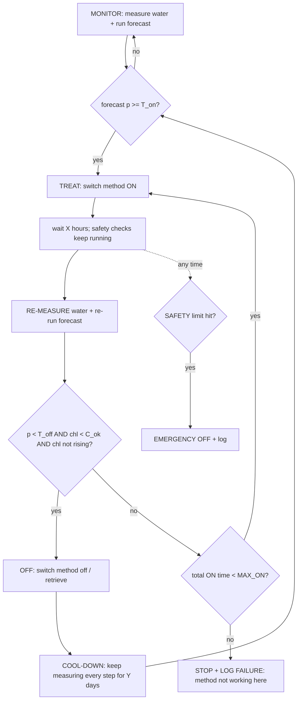

# Forecast-triggered bloom disruption: the shared control loop

Written 2026-09-24. Every method file in this folder (01-05) plugs into this loop. Only the
"treatment" block and the numbers change. Evidence for each method is in
`notes/HAB_MITIGATION_LITERATURE.md` (Part 3) and `notes/snowball/*.md`.

## The idea in one sentence
The model predicts a bloom → the treatment switches **on** for **X** hours → the water is
**re-measured** and the model re-run → the treatment switches **off** if a bloom is no longer
predicted; otherwise it runs for another X.

## The loop

## States and rules (the same for every method)

| State | What happens | Leaves when |
|---|---|---|
| **MONITOR** | Measure chlorophyll, DO, pH and temperature on the normal schedule; run the forecast | Forecast probability `p ≥ T_on` → TREAT |
| **TREAT** | Method ON for `X` hours (method-specific); safety sensors checked every measurement step | `X` elapsed → RE-MEASURE; any safety limit → EMERGENCY OFF |
| **RE-MEASURE** | Full measurement set, plus the forecast re-run on the new readings | OFF rule met → OFF; otherwise run another `X` (up to `MAX_ON`) |
| **OFF** | Switch off, or pull the device out of the water | Straight into COOL-DOWN |
| **COOL-DOWN** | Keep measuring for `Y` days, because blooms rebounded within 1-2 weeks in the peroxide studies | `p ≥ T_on` again → TREAT; `Y` elapsed → MONITOR |

**OFF rule (all three must hold):**
1. The forecast has dropped: `p < T_off`, where `T_off = 0.8 × T_on`. The gap (hysteresis) stops the system flicking on and off around one threshold.
2. Chlorophyll is low: `chl < C_ok`.
3. Chlorophyll is not rising: the slope over the last two re-measurements is ≤ 0.

**Parameters (fixed before any run; these are the defaults):**

| Symbol | Meaning | Default | Why |
|---|---|---|---|
| `T_on` | forecast probability that switches treatment on | **0.50** (the Narragansett model's frozen threshold, saved inside `release/narragansett_bloom_model.joblib`) | the operating point the model was evaluated at (precision 0.70 at home) |
| `T_off` | forecast probability needed to switch off | 0.8 × `T_on` | hysteresis |
| `C_ok` | chlorophyll that counts as "no bloom" | 5 µg/L in the field (half the 10 µg/L bloom line); in the bench, 50% of the untreated control's peak | leaves a margin under the bloom threshold |
| `X` | treatment ON time before re-measuring | **per method** (see 01-05) | set from the literature, then tuned on the bench |
| `MAX_ON` | the most total ON time for one event | 4 × `X` | if it hasn't worked by then, it isn't working |
| `Y` | cool-down monitoring after OFF | 14 days (field), 5 days (bench) | rebound time seen in the literature |

## Where the forecast comes from: the Narragansett sensor model

**Decision (2026-09-24):** the trigger is the **frozen Narragansett model**, not the Long Island
Sound model.
- **Why:** Layer 1 (`LAYER1_RESULTS.md`) showed that a loop re-checking only at boat visits (~17 days apart, the Long Island Sound model's cadence) caught 27-35% of bloom starts, was 91-93% false alarms, and was no better than random timing.
- With daily sensor data (Narragansett) the loop was ON for about 80% of bloom starts, switched on a median 3 days early, and beat random timing.
- The Long Island Sound model stays the project's regional *forecasting* study.

**The model:** the fork's `release/narragansett_bloom_model.joblib`, run through the fork's
`predict_anywhere.py`.
- Gradient boosting on 23 features: chlorophyll lags, rolling means, trend, anomaly and site climatology; dissolved oxygen, temperature and salinity with lags; month.
- It predicts whether daily-mean chlorophyll will exceed the bloom level **within the next 7 days**. It updates **once per day**.
- Home skill: AUC 0.839, precision 0.70, lift 2.00 (Narragansett, 2023). On 74 sites it had never seen: median lift 1.58, median AUC 0.74.

**Inputs it needs from our sensors:**

| Input | Required? | Our sensor |
|---|---|---|
| Chlorophyll (any fluorometer units) | **required** | DIY fluorometer |
| Temperature | optional, but improves skill | DS18B20 |
| Salinity | optional | refractometer reading or a conductivity probe |
| Dissolved oxygen | optional | DO probe or kit |

Readings are averaged to one value per day. Any cadence works (the controller logs every few
minutes; `--min-readings` sets how many readings make a valid day).

**Three constraints that shape the bench timeline:**
1. **21-day warm-up.** The rolling features need 21 days of history before they exist, and scores in the first 21 days are unreliable. Every tank therefore runs a **baseline period of at least 21 days** (low nutrients, no bloom) before nutrients are added.
2. **Putting chlorophyll on the model's scale.** The model rescales each site's chlorophyll onto its own training scale by quantile matching; without this, it never alerts on outside data. The rescaling expects about **60 days** of data.
   - A tank won't have 60 days, so the DIY fluorometer is **calibrated to µg/L** (dilution series and, if possible, extracted chlorophyll).
   - The model is then run with `--no-rescale`. The Narragansett sondes read about 1.3-1.6× the lab, so there is a known offset. Record it as a limitation, and test both options (rescaled on the warm-up data vs `--no-rescale`) in the Layer-2 pilot.
3. **Month is an input.** The bench runs in autumn or winter, when Narragansett blooms are rarer, so the model's month term pulls probabilities down. Run it with the real date, and note it.

**In a tank the model is a demonstration of the system, not a valid forecast.** A tank is
not a bay: its bloom is driven by the nutrients we add. So the loop runs **both triggers side by
side** and logs both:
- **Model trigger (the system):** `p` from the Narragansett model on the tank's daily sensor means. This drives arm B.
- **Rule trigger (the backup and comparison):** fixed in advance. It fires when the tank's chlorophyll has risen on 2 consecutive days and passed 2× its warm-up mean. The log shows whether the model fired earlier, later or not at all compared with the rule.

A **false-alarm tank** (arm D) is triggered on purpose without a real bloom coming. This measures
the cost of a wrong alert: 24-29% of Layer-1 episodes were false alarms at Narragansett, and more
should be expected at a site with rarer blooms.

**Field (future):** the same model on a real enclosed site's buoy or fluorometer, as the fork's
prospective season already does for the WLIS and EXRX buoys (live-season rules in
`LABEL_REBUILD_PREREG.md` §15; nothing is issued before Form 1A is signed).

## What gets measured (every method)

| Measure | Tool | Every |
|---|---|---|
| Chlorophyll (main) | Low-cost fluorometer (470 nm LED + photodiode behind a red filter), calibrated against acetone-extracted chlorophyll or a known dilution series | measurement step |
| Cell count | Hemocytometer or Sedgwick-Rafter chamber + microscope | each RE-MEASURE |
| Dissolved oxygen | DO test kit or probe | measurement step (safety) |
| pH, temperature | pH probe, DS18B20 sensor | measurement step (safety; temperature is also a model input) |
| Salinity | refractometer or conductivity probe | daily (model input) |
| Non-target health | Brine shrimp (*Artemia*, marine) or *Daphnia* (freshwater) 24-h survival in treated water | each RE-MEASURE |

**Safety limits (EMERGENCY OFF at any time):** DO < 4 mg/L; pH outside the method's range (marine 7.6-8.6); non-target survival more than 20 percentage points below control; any method-specific limit in its file.

## Bench experiment design (the same for every method)

Four arms, **n = 3 tanks each**, with the same culture and nutrients, differing only in treatment
timing:

| Arm | What it is | What it tests |
|---|---|---|
| **A: untreated** | no treatment | the natural bloom curve |
| **B: forecast-triggered loop** | the full loop above | the main hypothesis |
| **C: late treatment** | treatment starts only after chlorophyll peaks | whether early beats late |
| **D: false alarm** | loop triggered on a tank with no added nutrients (no real bloom) | what a wrong alert costs (non-target harm, material, energy) |

**Timeline per run:**
1. Sensor calibration and a dry run of the controller: about 1 week.
2. **Warm-up: at least 21 days** (low nutrients, all sensors logging; the model's rolling features fill in).
3. Nutrients added to arms A-C (not D): bloom phase with the loop running, about 2-3 weeks.
4. Cool-down watch: 5 days.

That's **about 6-7 weeks** in total, so the run has to start by early December to be analysed
before the February deadline.

**Pre-registered hypothesis (H1):** arm B's peak chlorophyll is at least 50% lower than arm A's,
using **less total treatment** (hours ON, or grams or mg dosed) than arm C.
**H2:** arm D shows no loss of non-target survival compared with arm A.

**Outcome measures:** peak chlorophyll; area under the chlorophyll curve; days above `C_ok`;
total ON time or dose; non-target survival; number of ON/OFF cycles.

**Statistics:** mean ± 95% t-interval across the 3 replicate tanks (t = 4.30 for n = 3), the same
convention as `src/lab/analyze_lab.py`. With n = 3 a result can be "consistent but underpowered";
report it that way rather than over-claiming.

## Organisms (non-toxic stand-ins)
- **Dinoflagellate:** *Prorocentrum micans* (used as the non-toxic control in Mardones et al. 2023).
- **Diatom:** *Phaeodactylum tricornutum* or *Thalassiosira*. Long Island Sound blooms are mostly diatoms.
- **Source:** the National Center for Marine Algae and Microbiota (NCMA, Bigelow Laboratory, Maine) sells cultures.
- **Do not use *Scrippsiella*:** Northwest Atlantic strains harm shellfish larvae.
- Never culture toxic *Alexandrium*, *Karenia*, *Margalefidinium* or *Microcystis*.

## Hardware that makes it a system, not a jar test
- **Controller:** an ESP32 microcontroller reads the sensors, runs the state machine above, and logs every reading and state change to a CSV (and optionally a dashboard).
- **Actuators by method:**
  - relay → air pump (bubbles)
  - servo or winch → lowers and raises a seaweed panel or peroxide bag
  - peristaltic pump → curcumin dosing
- **Forecast input:** the ESP32 logs readings to a CSV. Once a day a laptop runs the fork's `predict_anywhere.py` on that CSV and sends `p` back to the controller over Wi-Fi or USB. The rule trigger runs on the ESP32 itself as a backup if the laptop link fails.
- **Keep a design log from day one:** version, what failed, the measured improvement. Engineering judges score documented iteration.

## Methods in this folder

| File | Method | Where it could really work | Retrievable? | `X` (ON time) |
|---|---|---|---|---|
| `01_BUBBLES.md` | coarse-bubble aeration | fish or shellfish pens, tanks, marinas | yes (switch off) | 48 h |
| `02_SEAWEED.md` | seaweed panels (*Ulva*, sugar kelp) | shellfish and kelp farms, small bays | yes (lift out) | 72 h |
| `03_PEROXIDE_BAG.md` | calcium peroxide in a fabric bag | ponds, enclosed basins | yes (lift out) | 24 h |
| `04_CURCUMIN.md` | curcumin dosing | enclosed canals, tanks | no (dosed into the water) | 24 h |
| `05_SHELLFISH.md` | clam or oyster bags | shellfish farms, small bays | yes (lift out) | 7 days |

**Left out:**
- Barley straw needs 2-8 weeks to become active and has weak marine evidence.
- Ultrasound failed all four independent field tests.
- Clay and alum stay in the environment (the counselor's objection).

## Never claim
- That it prevents blooms in the open Sound. The scale is tanks and enclosed sites.
- That it is safe without the non-target data from arm D.
- Any result before it's measured. Pre-register first, then run.
