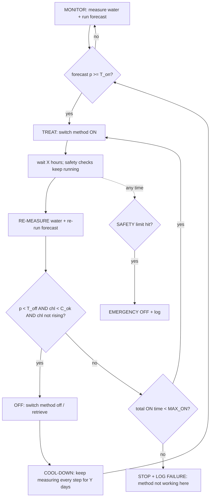

# Forecast-triggered bloom disruption: the shared control loop

Written 2026-09-24. Every method file in this folder (01-05) plugs into this loop. Only the
"treatment" block and the numbers change. **Since 2026-10-01 the plan uses two methods only:
aeration (`01_BUBBLES.md`) and peroxide (`03_PEROXIDE_BAG.md`).** Seaweed, curcumin and shellfish
were dropped because the device must run fully autonomously (switchable by relay or pump, no living
stock, weeks with at most a refill); reasons in `EXECUTION_PLAN.md` ("Plan change 2026-10-01"). Evidence for each method is in
`notes/HAB_MITIGATION_LITERATURE.md` (Part 3) and `notes/snowball/*.md`.

## The idea in one sentence
The model predicts a bloom → the treatment switches **on** for **X** hours → the water is
**re-measured** and the model re-run → the treatment switches **off** if a bloom is no longer
predicted; otherwise it runs for another X.

## The loop

```mermaid
flowchart TD
    A[MONITOR: measure water + run forecast] --> B{forecast p >= T_on?}
    B -- no --> A
    B -- yes --> C[TREAT: switch method ON]
    C --> D[wait X hours; safety checks keep running]
    D --> E[RE-MEASURE water + re-run forecast]
    E --> F{p < T_off AND chl < C_ok AND chl not rising?}
    F -- yes --> G[OFF: switch method off / retrieve]
    G --> H[COOL-DOWN: keep measuring every step for Y days]
    H --> B
    F -- no --> I{total ON time < MAX_ON?}
    I -- yes --> C
    I -- no --> J[STOP + LOG FAILURE: method not working here]
    D -. any time .-> S{SAFETY limit hit?}
    S -- yes --> K[EMERGENCY OFF + log]
```

## States and rules (the same for every method)

| State | What happens | Leaves when |
|---|---|---|
| **MONITOR** | Measure chlorophyll, DO, pH and temperature on the normal schedule; run the forecast | Forecast probability `p ≥ T_on` → TREAT |
| **TREAT** | Method ON for `X` hours (method-specific); safety sensors checked every measurement step | `X` elapsed → RE-MEASURE; any safety limit → EMERGENCY OFF |
| **RE-MEASURE** | Full measurement set, plus the forecast re-run on the new readings | OFF rule met → OFF; otherwise run another `X` (up to `MAX_ON`) |
| **OFF** | Switch off, or pull the device out of the water | Straight into COOL-DOWN |
| **COOL-DOWN** | Keep measuring for `Y` days, because blooms rebounded within 1-2 weeks in the peroxide studies | `p ≥ T_on` again → TREAT; `Y` elapsed → MONITOR |

**OFF rule (all three must hold):**
1. The forecast has dropped: `p < T_off`, where `T_off = 0.8 × T_on`. The gap (hysteresis) stops the system flicking on and off around one threshold.
2. Chlorophyll is low: `chl < C_ok`.
3. Chlorophyll is not rising: the slope over the last two re-measurements is ≤ 0.

**Parameters (fixed before any run; these are the defaults):**

| Symbol | Meaning | Default | Why |
|---|---|---|---|
| `T_on` | forecast probability that switches treatment on | **0.50** (the Narragansett model's frozen threshold, saved inside `release/narragansett_bloom_model.joblib`) | the operating point the model was evaluated at (precision 0.70 at home) |
| `T_off` | forecast probability needed to switch off | 0.8 × `T_on` | hysteresis |
| `C_ok` | chlorophyll that counts as "no bloom" | 5 µg/L in the field (half the 10 µg/L bloom line); in the bench, **50% of the pilot bloom run's untreated peak** (known before nutrients go in) | leaves a margin under the bloom threshold |
| `X` | treatment ON time before re-measuring | **per method** (see 01-05) | set from the literature, then tuned on the bench |
| `MAX_ON` | the most total ON time for one event | 4 × `X`; peroxide counts pulses (3) | if it hasn't worked by then, it isn't working |
| `Y` | cool-down monitoring after OFF | 14 days (field), 5 days (bench) | rebound time seen in the literature |

## Where the forecast comes from: the Narragansett sensor model

**Decision (2026-09-24):** the trigger is the **frozen Narragansett model**, not the Long Island
Sound model.
- **Why:** Layer 1 (`LAYER1_RESULTS.md`) showed that a loop re-checking only at boat visits (~17 days apart, the Long Island Sound model's cadence) caught 27-35% of bloom starts, was 91-93% false alarms, and was no better than random timing.
- With daily sensor data (Narragansett) the loop was ON for about 80% of bloom starts, switched on a median 3 days early, and beat random timing.
- The Long Island Sound model stays the project's regional *forecasting* study.

**The model:** the fork's `release/narragansett_bloom_model.joblib`, run through the fork's
`predict_anywhere.py`.
- Gradient boosting on 23 features: chlorophyll lags, rolling means, trend, anomaly and site climatology; dissolved oxygen, temperature and salinity with lags; month.
- It predicts whether daily-mean chlorophyll will exceed the bloom level **within the next 7 days**. It updates **once per day**.
- Home skill (after the 2026-09-28 fork audit, model v2): onset AUC 0.829, precision 0.68, lift 1.94 (Narragansett, 2023). It beats a past-years calendar on bloom starts in 9 of 9 years (pooled +0.060 AUC, p < 0.0001, pre-registered). On 74 sites it had never seen, with leak-free scoring: median lift 1.51, median AUC 0.74.

**Inputs it needs from our sensors:**

| Input | Required? | Our sensor |
|---|---|---|
| Chlorophyll (any fluorometer units) | **required** | DIY fluorometer |
| Temperature | optional, but improves skill | DS18B20 |
| Salinity | optional | refractometer reading or a conductivity probe |
| Dissolved oxygen | optional | DO probe or kit |

Readings are averaged to one value per day. Any cadence works (the controller logs every few
minutes; `--min-readings` sets how many readings make a valid day).

**Three constraints that shape the bench timeline:**
1. **21-day warm-up.** The rolling features need 21 days of history before they exist, and scores in the first 21 days are unreliable. Every tank therefore runs a **baseline period of at least 21 days** (low nutrients, no bloom) before nutrients are added.
2. **Putting chlorophyll on the model's scale.** The model rescales each site's chlorophyll onto its own training scale by quantile matching; without this, it never alerts on outside data. The rescaling expects about **60 days** of data.
   - A tank won't have 60 days, so the DIY fluorometer is **calibrated to µg/L** (dilution series and, if possible, extracted chlorophyll).
   - The model is then run with `--no-rescale`. The Narragansett sondes read about 1.3-1.6× the lab, so there is a known offset. Record it as a limitation, and test both options (rescaled on the warm-up data vs `--no-rescale`) in the Layer-2 pilot.
3. **Month is an input.** The bench runs in autumn or winter, when Narragansett blooms are rarer, so the model's month term pulls probabilities down. Run it with the real date, and note it.

**What a tank can feed the model, measured (2026-09-28; fork finding 29,
`src/models/tank_feature_check.py`).** A tank supplies chlorophyll and temperature automatically, and
DO and salinity by kit. It has no site climatology. On real Narragansett data (test 2023, onset rows):

| Inputs | Onset AUC |
|---|---|
| Full model | 0.829 |
| Tank + kits | 0.820 |
| Tank sensors only, deployed through the real tool path (one-season record) | 0.804 |
| Retrained on chlorophyll + temperature | 0.805 |

So the tank trigger behaves like a forecast about 0.025 AUC weaker than the field model, and no
special tank model is needed. Report it that way: the tank tests the loop, and forecast skill comes
from field data, discounted by the measured 0.025.

**In a tank the model is a demonstration of the system, not a valid forecast.** A tank is
not a bay: its bloom is driven by the nutrients we add. So the loop runs **both triggers side by
side** and logs both:
- **Model trigger (the system):** `p` from the Narragansett model on the tank's daily sensor means. This drives arm B.
- **Rule trigger (the backup and comparison):** fixed in advance. It fires when the tank's chlorophyll has risen on 2 consecutive days and passed 2× its warm-up mean. The log shows whether the model fired earlier, later or not at all compared with the rule.
- **Handover rule (added 2026-09-28; pre-register it, don't decide mid-run):** if the rule trigger has fired in a B tank and the model still hasn't fired **2 days later**, the rule takes over for that tank. The log records which trigger switched each tank ON. The model's skill is argued from the historical replays (Layer 1), not from the tanks, because a tank bloom is driven by the nutrients we add.

A **false-alarm tank** (arm D) is triggered on purpose without a real bloom coming. This measures
the cost of a wrong alert: 24-29% of Layer-1 episodes were false alarms at Narragansett, and more
should be expected at a site with rarer blooms.

**Field (future):** the same model on a real enclosed site's buoy or fluorometer, as the fork's
prospective season already does for the WLIS and EXRX buoys (live-season rules in
`LABEL_REBUILD_PREREG.md` §15; nothing is issued before Form 1A is signed).

## What gets measured (every method)

| Measure | Tool | Every |
|---|---|---|
| Chlorophyll (main) | Low-cost fluorometer (470 nm LED + photodiode behind a red filter), calibrated against acetone-extracted chlorophyll or a known dilution series | measurement step |
| Cell count | Hemocytometer or Sedgwick-Rafter chamber + microscope | each RE-MEASURE |
| Dissolved oxygen | DO test kit or probe | measurement step (safety) |
| pH, temperature | pH probe, DS18B20 sensor | measurement step (safety; temperature is also a model input) |
| Salinity | refractometer or conductivity probe | daily (model input) |
| Non-target health | Brine shrimp (*Artemia*, marine) or *Daphnia* (freshwater) 24-h survival in treated water | each RE-MEASURE |

**Sampling rules for the fluorometer (added 2026-09-28).** The fluorometer measures glow, not
cells. Glow per cell changes with time of day (light history) and with treatments that damage
photosynthesis or bleach cells (peroxide), so a fake drop could trigger OFF.
- Sample every tank at the **same time each day**.
- **Keep each sample in the dark for 15 min** before reading it.
- Cell counts are the ground truth: report **glow per cell** at each count, and the OFF rule uses counts for peroxide (it bleaches cells). For the ~2 µm algae, counts are hemocytometer counts at 400×, which are hard at school; the fluorometer is their main measure and the counts are a check (2026-10-01).
- Counting workload: 28 tanks × ~10 min is too much daily. Photograph the counting chamber through the microscope with a phone and count later (ImageJ); count every 2 days, and daily only around trigger and OFF; split the work between both team members.

**Safety limits (EMERGENCY OFF at any time):** DO < 4 mg/L; pH outside the method's range (marine 7.6-8.6); non-target survival more than 20 percentage points below control; any method-specific limit in its file.

## Bench experiment design (the same for every method)

Four arms, **n = 3 tanks each**, with the same culture and nutrients, differing only in treatment
timing:

| Arm | What it is | What it tests |
|---|---|---|
| **A: untreated** | no treatment | the natural bloom curve |
| **B: forecast-triggered loop** | the full loop above | the main hypothesis |
| **C: reactive ("visible bloom") treatment** | treatment starts when chlorophyll passes **50% of the expected untreated peak** (the pilot bloom run sets the expected peak); same X, OFF rule and MAX_ON as B | whether early beats what a real manager would do |
| **D: false alarm** | loop triggered on a tank with no added nutrients (no real bloom) | what a wrong alert costs (non-target harm, material, energy) |

**Timeline per run:**
1. Sensor calibration and a dry run of the controller: about 1 week.
2. **Warm-up: at least 21 days** (low nutrients, all sensors logging; the model's rolling features fill in).
3. Nutrients added to arms A-C (not D): bloom phase with the loop running, about 2-3 weeks.
4. Cool-down watch: 5 days.

That's **about 6-7 weeks** in total, so the run has to start by early December to be analysed
before the February deadline.

**Why arm C changed (2026-09-28):** "after the peak" starts C when the bloom is already crashing,
so it does 0-4% by construction (Layer 2) and a judge can call it a strawman. Starting C at 50%
of the expected peak is the reactive strategy a lake or bay manager actually uses, so B beating
it is a real test of "early matters". The Layer 2 simulation was re-run with this arm C (and the
floor, handover and pilot-based C_ok) on 2026-09-28: C starts about 3 days after B and cuts the
peak 14-24%, against B's 72-81% for seaweed, shellfish and peroxide (`LAYER2_SIM_RESULTS.md`;
seaweed and shellfish were dropped on 2026-10-01, the numbers are kept as a record).

**Pilot bloom run (added 2026-09-28):** on about **day 7** of the warm-up, 2 spare tanks get the
bloom pulse with no treatment. They confirm the culture actually blooms in our tanks (if arm A doesn't
bloom, every hypothesis fails), and give the expected peak height and timing that arm C's start
and `C_ok` are set from. Keep backup culture flasks going through the run.

**Aeration is judged on delay, not peak cut (written down 2026-10-01, before any tank data).**
- **H1-delay (aeration primary):** arm B spends more days below `C_ok` than arm A, counted from nutrients-in to the end of the bloom phase (3-tank means; Welch 95% interval of B − A above 0). Reported with it: total **hours ON** and the **number of ON episodes** (reruns: a new forecast alert after OFF starts a new episode). The same comparison is made for B vs C.
- **Secondary for aeration:** H1a and H1b below (≥ 50% peak cut; B beats C on peak cut).
- *Why:* in real water, tides flush nutrients and conditions change, so holding a bloom back lets its window pass, and the device simply re-runs when the forecast fires again. Layer 2 already predicts bubbles mostly delay the bloom (25% peak cut, B hits `MAX_ON` in 99% of runs). H3 (below) tells how often reruns are needed.

**Pre-registered hypothesis (H1), revised 2026-09-26 after the Layer 2 simulation** (primary for
peroxide; secondary for aeration since 2026-10-01):
- **H1a:** arm B's peak chlorophyll is at least 50% lower than arm A's.
- **H1b:** arm B's peak cut is larger than arm C's (reactive treatment, started at 50% of the expected peak).
- Total treatment (hours ON, or grams or mg dosed) is reported for B and C, plus treatment per percent of peak cut.
- *Why it changed:* the original H1 also required B to use **less treatment than C**. The simulation (`LAYER2_SIM_RESULTS.md`) showed that late treatment starts when the bloom is already crashing, so it's short and does almost nothing. "Less treatment than C" then fails even when B works.
**H2:** arm D shows no loss of non-target survival compared with arm A.
**H3 (reported, no pass mark; added from the evidence reviews):** after B's last OFF, record the days
until chlorophyll is back above `C_ok`. Bubble effects stop when the treatment is removed,
so regrowth is expected, and measuring it is part of the result. For aeration it sets how often the
device has to re-run.
**H5 (secondary, screens; added 2026-10-01): peroxide sensitivity falls with cell size.** On the
species panel, the percent cut at each dose is largest in the ~2 µm algae (*Micromonas pusilla*,
*Nannochloropsis*) and smaller in *Skeletonema*, *T. weissflogii* and *P. micans*; the larger cells
and the arm-D non-target check are spared at 0.8 mg/L, as Randhawa et al. 2012 reported (peroxide-03,
where *Micromonas* was eradicated). *Nannochloropsis* is untested in our papers.
**H4 (added 2026-09-28): trim the bloom, don't remove the algae.** Diatoms at normal levels make
oxygen and feed the food web, so the loop must cut the *peak*, not push the algae below normal.
- **Pass:** in arm B, the 3-tank mean chlorophyll (and cell count) never falls below **80% of the warm-up mean** (the normal, pre-bloom level), from nutrients-in to the end of the cool-down.
- **Also logged:** daytime DO in B stays at or above its warm-up level, showing that the treated tanks still make oxygen.
- **Floor OFF rule (bench):** if a treated tank reads below 80% of its warm-up mean on **2 days in a row**, the treatment switches OFF (logged like a safety stop). Two days, so that one noisy reading doesn't trip it. Arm D runs its fixed false-alarm episode without this rule, so it still measures a full wrong alert.
- The Layer 2 simulation can't predict this: it has no nutrient recycling from dead cells, so its treated tanks drift below normal weeks after OFF. The bench measures it directly.
- **Source:** Sink et al. 2022, *Managing and Controlling Algae in Ponds* (Texas A&M AgriLife Extension, RWFM-PU-154, [PDF](https://extension.rwfm.tamu.edu/wp-content/uploads/sites/7/2023/06/Managing-and-controlling-algae-in-ponds.pdf)). It's written for freshwater ponds, but its points are general:
  - planktonic algae are "the good" kind, essential to the food chain and to oxygen;
  - rapid die-off after algaecide treatment or a bloom crash causes oxygen depletion and fish kills;
  - so dense ponds should be treated only 20-25% at a time, with 7-10 days between treatments.

  That is the same logic as H4 and as treating early and small. See also Texas A&M AquaPlant, [filamentous algae](https://aquaplant.tamu.edu/management-options/filamentous-algae/), which warns that post-treatment oxygen depletion is the main danger of any chemical control.

**Outcome measures:** peak chlorophyll; area under the chlorophyll curve; days above `C_ok`
(equivalently days held below it, the aeration primary outcome); total ON time (hours) or dose;
non-target survival; number of ON episodes (reruns) and ON/OFF cycles.

**Statistics:** H1a compares B with A using both arms' tank-to-tank spread: Welch t-interval on the
log peaks (B vs A), reported as a percent cut with its 95% interval. Single-arm summaries use mean ±
95% t-interval (t = 4.30 for n = 3), as in `src/lab/analyze_lab.py`. With n = 3 a result can be
"consistent but underpowered" (the re-run simulation gives a 64-80% chance that the honest interval
clears 50% with 3 tanks, 78-92% with 4); report it that way rather than over-claiming, and use 4 tanks
per arm if space allows.

## Organisms (non-toxic stand-ins)

**Species panel for both screens (added 2026-10-01), smallest to largest:**
- ***Micromonas pusilla*** (~2 µm), from NCMA; eradicated by peroxide in Randhawa et al. 2012 (peroxide-03).
- ***Nannochloropsis*** (2-3 µm), sold live as reef-aquarium food; harmless; its peroxide sensitivity is untested in our papers. Check it under the microscope and keep a clean sub-culture (NCMA as backup).
- the diatom ***Skeletonema*** (and *T. weissflogii* in the peroxide screen);
- the dinoflagellate already in each screen: *Akashiwo sanguinea* (backup *P. triestinum*) for bubbles; *P. micans* for peroxide.

The ~2 µm cells are measured by the fluorometer plus hemocytometer counts at 400×; that is stated
in the write-up as a limitation.

**Loop cultures (2026-10-01):** aeration runs on the dinoflagellate its screen shows is slowed;
peroxide runs on the small alga its screen shows is cut, mixed with *Skeletonema*. If the cultures
differ, each method gets its own arm A and pilot tanks (28 tanks in all; `EXECUTION_PLAN.md` §7).
- **Dinoflagellate:** *Prorocentrum micans* (used as the non-toxic control in Mardones et al. 2023). **Not as the main test organism for bubbles:** bubbling *promoted* *Prorocentrum* in Sung & Gobler 2026, so for bubbles it's only an "expected to resist" comparison (see `01_BUBBLES.md`).
- **Diatom:** ***Skeletonema*** first (added 2026-09-28: the dominant diatom of Long Island Sound blooms, so the most relevant stand-in), then *Thalassiosira*. *Phaeodactylum tricornutum* is a very hardy lab species and may under-respond to seaweed; keep it only as a backup. Long Island Sound blooms are mostly diatoms.
- **Source:** the National Center for Marine Algae and Microbiota (NCMA, Bigelow Laboratory, Maine) sells cultures.
- **Do not use *Scrippsiella*:** Northwest Atlantic strains harm shellfish larvae.
- Never culture toxic *Alexandrium*, *Karenia*, *Margalefidinium* or *Microcystis*.

## Hardware that makes it a system, not a jar test
- **Controller:** the Arduino Uno alerter (`hardware/alerter_uno/`) reads the sensors, runs the state machine above (including the floor OFF rule and the handover, `mode H`), and the laptop link (`alerter_link.py`) logs every reading and state change to a CSV.
- **Actuators by method:**
  - relay → air pump (bubbles)
  - relay → peristaltic dosing pump (12 V; 3% H₂O₂ from a reservoir, peroxide)
  - *(servo, `USE_SERVO`, D11: was for the seaweed panel or shellfish bag; not used since 2026-10-01)*
- **Forecast input:** once a day the laptop runs the fork's `predict_anywhere.py` on the logged readings and sends `p` to the Uno over USB. The rule trigger runs on the Uno itself, so it still works if the laptop link fails.
- **Keep a design log from day one:** version, what failed, the measured improvement. Engineering judges score documented iteration.

## Methods in this folder

| File | Method | Where it could really work | Retrievable? | `X` (ON time) |
|---|---|---|---|---|
| `01_BUBBLES.md` | coarse-bubble aeration | fish or shellfish pens, tanks, marinas | yes (switch off) | 48 h |
| `02_SEAWEED.md` | *dropped 2026-10-01:* seaweed panels (*Ulva*, sugar kelp) | - | - | - |
| `03_PEROXIDE_BAG.md` | liquid H₂O₂ pumped in pulses (sodium percarbonate as the comparison) | ponds, enclosed basins | no, but it breaks down to water and oxygen in 1-2 days | 24 h |
| `04_CURCUMIN.md` | *dropped 2026-10-01:* curcumin dosing | - | - | - |
| `05_SHELLFISH.md` | *dropped 2026-10-01:* clam or oyster bags | - | - | - |

**Left out:**
- Barley straw needs 2-8 weeks to become active and has weak marine evidence.
- Ultrasound failed all four independent field tests.
- Clay and alum stay in the environment (the counselor's objection).
- **Dropped 2026-10-01 (not autonomous):** seaweed (live stock in a cold holding tank, swapped; sugar kelp dies back above ~18-20 °C, the summer bloom season); shellfish (always filtering, so not switchable; live animals; permits; feeding stops in dense blooms); curcumin (its yellow colour absorbs the ~470 nm excitation light and blinds the device's fluorometer, giving a false "bloom gone" and an early OFF; effective dose ≥ 3 mg/L overlaps the zebrafish larval LD50 of 1.8-2.8 mg/L; one organism tested, no diatom or field data).

## Never claim
- That it prevents blooms in the open Sound. The scale is tanks; the target is enclosed or semi-enclosed water (harbors, shellfish beds, aquaculture pens, coastal ponds).
- That the device is field-ready.
- That it is safe without the non-target data from arm D.
- Any result before it's measured. Pre-register first, then run.
